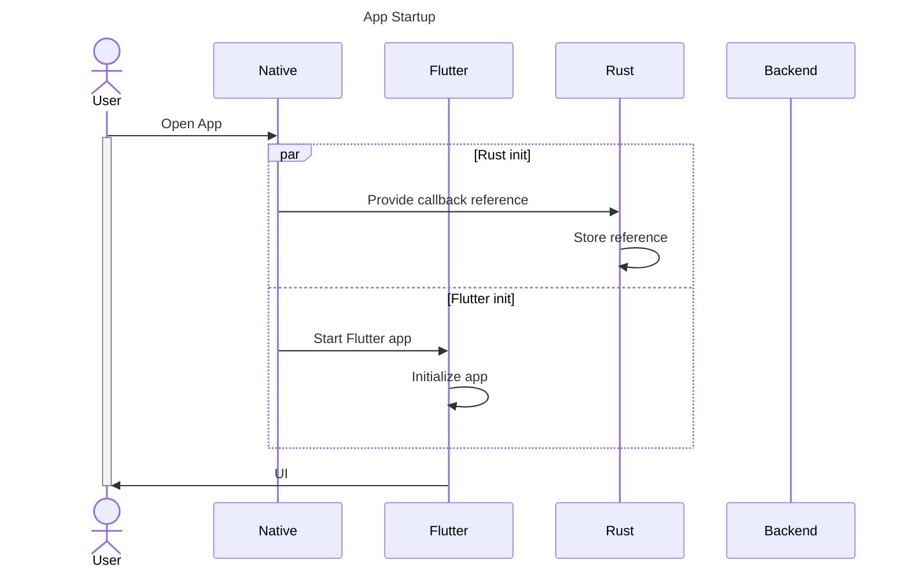
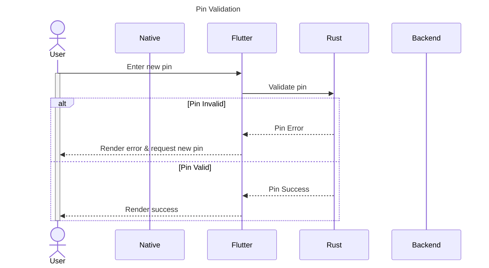
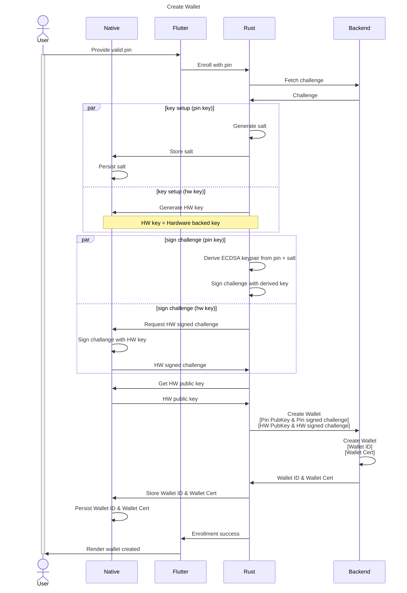

The intention of this readme is to provide insight into the communication that happens between the different layers of the app.

# Sequence Diagrams

## Participants
A brief summary of the participants used in diagrams found below.

| Participant | Description                                                                                                       |
|---|-------------------------------------------------------------------------------------------------------------------|
| User | The end-user that downloads, installs and uses the application.                                                   |
| Native | The platform specific native layer, referring to iOS (Swift) or Android (Kotlin), depending on the host platform. |
| Flutter | The Flutter application code (i.e. Dart).                                                                         |
| Rust Core | The core business logic, built using Rust.                                                                        |
| Backend | The backend, its business logic is mostly kept out of scope. Often referred to as the Wallet Provider.           |

## App Startup

This diagram captures the communication between the different app layers which occurs when the app is started (cold start). Notably, besides the start of the Flutter app the `Rust Core` is initiated and given a reference so that it can call into the native iOS & Android world on its own merit.

## Pin Validation

This diagram illustrates the local validation that happens when the user selects a new pin.

## Create Wallet

The diagram below illustrates the Wallet creation process. Including certificate generation and registration with the backend.

