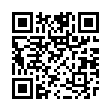
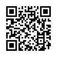
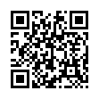
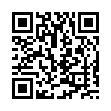

# Demo

Home of QR codes; which trigger (mocked) demo scenarios.

## Table of Contents

1. [Card issuance](#card-issuance)
2. [Verification requests](#verification-requests)
3. [Signing requests](#signing-requests)

## Card issuance

Requests to trigger the 'issuance' flow.

### How to use issuance QRs

1. Open app on physical device
2. Enter pin
3. Navigate to `QR` via bottom navigation
4. Allow camera permissions (if needed)
5. Scan one of the QR codes below:

| #1                                                 | #2                                | #3                                                                |
|----------------------------------------------------|-----------------------------------|-------------------------------------------------------------------|
|   |  |  |

| #4                                                  | #5                        | #6                                            |  
|-----------------------------------------------------|---------------------------|-----------------------------------------------|
|  |  |  |

## Verification requests

Request to trigger the 'disclosure' flow.

### How to use disclosure QRs

1. Open app on physical device
2. Enter pin
3. Navigate to `QR` via bottom navigation
4. Allow camera permissions (if needed)
5. Scan one of the QR codes below:

| #1                                                  | #2                          | #3                                                      |
|-----------------------------------------------------|-----------------------------|---------------------------------------------------------|
|  |  |  |

| #4                                        | #5                                      | #6                                                  |
|-------------------------------------------|-----------------------------------------|-----------------------------------------------------|
|  |  |  |

## Signing requests

Requests to trigger the 'sign' flow.

### How to use signing QRs

1. Open app on physical device
2. Enter pin
3. Navigate to `QR` via bottom navigation
4. Allow camera permissions (if needed)
5. Scan one of the QR codes below:

| #1                                                      |
|---------------------------------------------------------|
|  |
