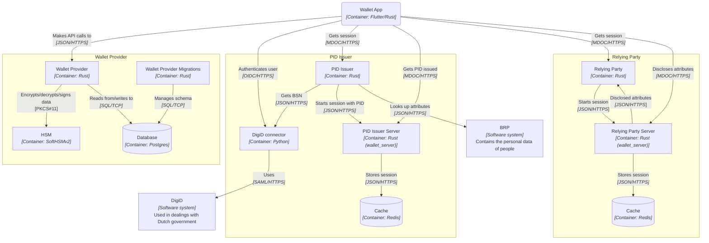

# Components overview

The diagram below shows a global overview of how the components interact with each other. It contains some details about the application layer protocols and technologies used, but leaves out exact (data) flow and detailed steps. Arrow directions indicate which party initiated the interaction and not the flow of data.

