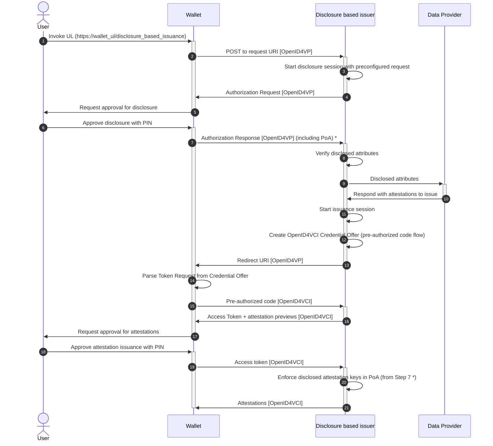

# Disclosure based issuance

This diagram shows how we compose OpenID4VP with OpenID4VCI in the pre-authorized code flow to issue attestations based on the contents of other attestations.

The flow starts with the user scanning a QR code or tapping a UL that contains the URL to the disclosure based issuer. When the wallet contacts the issuer using this URL, it starts a disclosure session requesting some preconfigured set of attributes that will allow it to determine the attributes that it wants to issue. For example, suppose the issuer wishes to issue academic degrees based on the user's BSN, then it would preconfigure an Authorization Request that requests the BSN from the PID.

After the user has disclosed the requested attributes, the issuer sends those to an internal endpoint that responds with the attestations to be issued. In the earlier mentioned example, this would be a database containing academic degrees indexed by BSNs.

Finally, the issuer issues the attestations using OpenID4VCI in the pre-authorized code flow.

During OpenID4VCI, the issuer requires the wallet to include the keys of the attestations that it disclosed earlier in its Proof of Association (PoA) when it sends its Proofs of Possession (PoPs) for the keys of the attestation (copies). This enforces that the newly issued attestations are bound to the same WSCD as the one that disclosed the attestations in the first part of the protocol.

