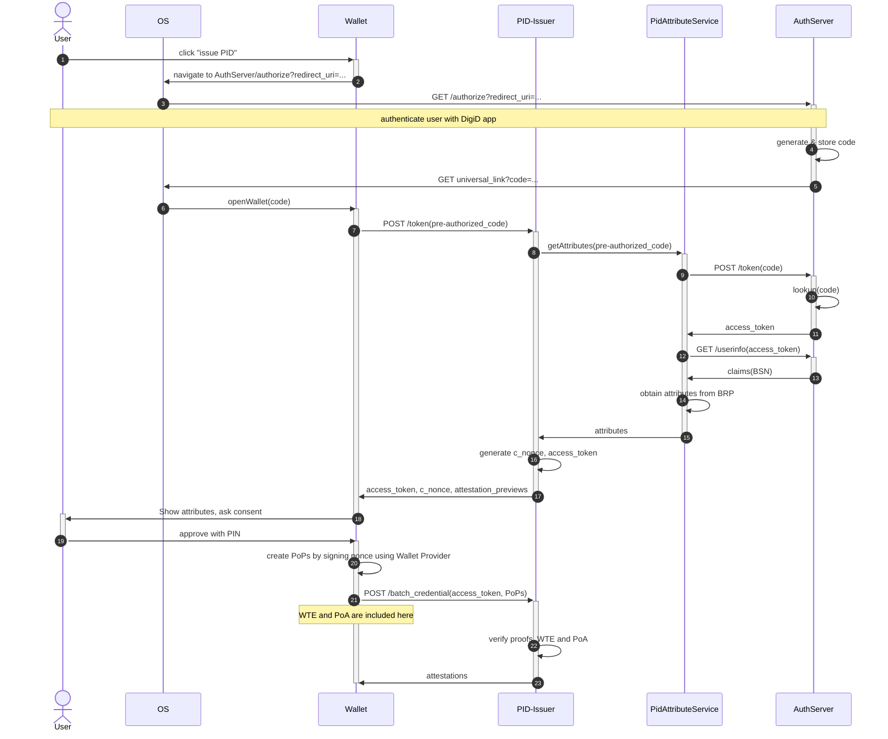
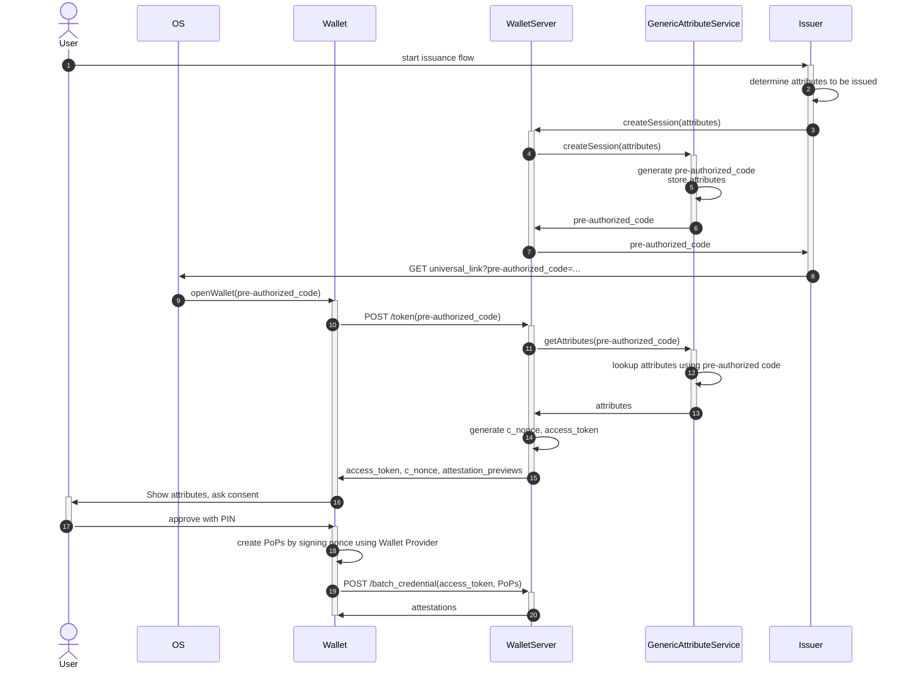

# Issuance with OpenID4VCI

## PID issuance

This diagram shows how we use OpenID4VCI in the pre-authorized code flow to issue the PID.

In this protocol, the wallet starts a normal OpenID Connect session at the AuthServer (DigiD/`nl-rdo-max`), obtaining an authorization code. Next, the wallet uses this code to start the OpenID4VCI issuance protocol in the pre-authorized code flow with the Wallet Server. The Wallet Server finishes the OpenID Connect session with the AuthServer to discover the identity of the wallet user, allowing it to finish issuance.

In the diagram below we introduce an actor called the PidAttributeService, whose responsibility it is to produce the attributes to be issued given the pre-authorized code. In the case of PID issuance it can do this by finishing the OpenID session at the AuthServer that the wallet started. (This actor is a library part of the WalletServer, as opposed to a separate HTTP server; we include it as separate actor here to separate responsibilities.)

In more detail, the protocol works as follows.

- The wallet starts an OpenID Connect session at the AuthServer by sending it an Authorization Request, receiving an authorization code from the AuthServer in response.
- Using the received authorization code, the wallet starts OpenID4VCI issuance in the pre-authorized code flow by POSTing the code as a pre-authorized code in a Token Request to the WalletServer.
- The WalletServer feeds the Token Request with the pre-authorized code to its PidAttributeService component. The PidAttributeService POSTs the Token Request to the AuthServer, transforming only the pre-authorized code in it to a normal authorization code but keeping the other parameters (such as the `state` and the PKCE `code_verifier`) in the Token Request as is, thereby continuing the OpenID Connect session that the wallet previously started.
- Using the resulting `access_token`, the PidAttributeService invokes the `/userinfo` endpoint of the AuthServer to retrieve the BSN, with which it next does a BRP query, resulting in the attributes to be issued that are returned to the WalletServer. The WalletServer then generates the `c_nonce` and an `access_token` of its own, and returns these to the wallet.
- Along with the `access_token` and `c_nonce` we also return a preview of the attestations, as a custom addition to the OpenID4VCI protocol.
- When the wallet accesses the `batch_credential` endpoint with the `access_token` and a valid set of proofs of possession (signatures over the `c_nonce` validating against the public keys that the wallet wants to have in its PID), the WalletServer generates the attestations and returns them.

Notice that from the perspective of the AuthServer, the OS acts as the User Agent normally does in OpenID Connect, and the WalletServer/PidAttributeService combination acts as a normal OpenID Client: the former starts the session by navigating to the AuthServer with an Authorization Request, and the latter resumes the session with Token and User Info Requests.

## Generic issuance

For generic issuance, we can implement the AttributeService as follows:
  * The issuer feeds it a bunch of to-be-issued attestations (e.g. `Vec<UnsignedMdoc>`) and receives a fresh pre-authorized token in return, which it sends to the wallet using a UL or QR;
  * When the WalletServer calls `getAttributes(pre-authorized_code)` on the AttributeService, it looks up the attributes to be issued using the pre-authorized code and returns them.

This would look like the following diagram.

