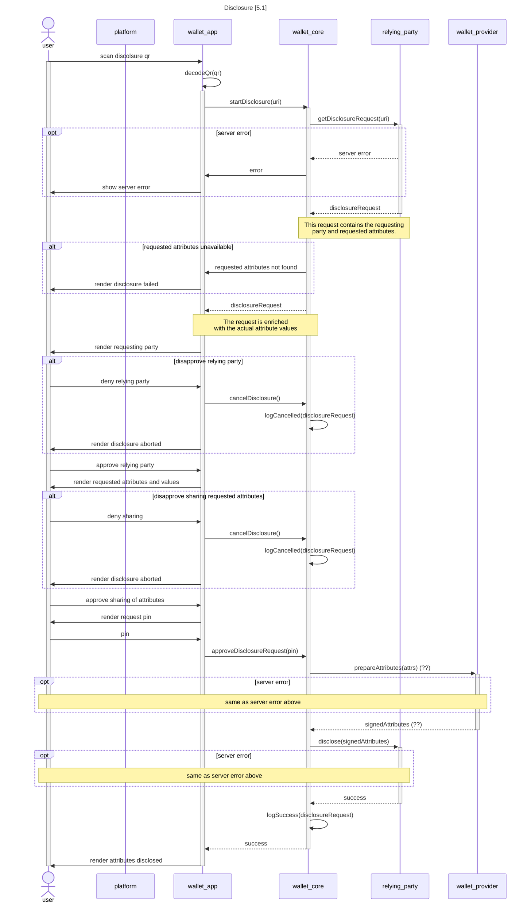

# Disclosure flow

The diagrams here show the interactions that take place when the user discloses information.

## 5.1 Disclosure

Work in progress. Initial interpretation of the disclosure flow.

