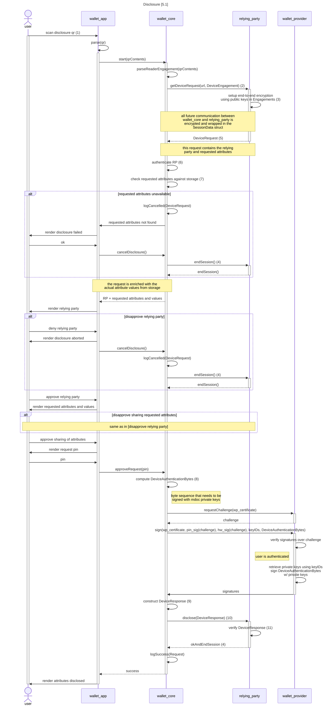

# Disclosure flow

The diagrams here show the interactions that take place when the user discloses information.

## Disclosure

The following diagram shows how all components interact when performing the disclosure flow using the mdoc online disclosure protocol from ISO 23220-4. As can be seen from the diagram this protocol works as follows (c.f. Figure 1 in §5.3 of the standard).

- In the Engagement Phase, the app and RP (or "mdoc App" and "mdoc reader" in the parlance of the standard) establish a session and communication channel as follows.
  1. The RP sends the `ReaderEngagement` data structure to the app, e.g. by embedding it in a QR or universal link. This contains the (session-specific) URL of the RP and the ephemeral (i.e. unique and random per session) encryption public key of the RP.
  2. The app responds by sending to the session URL the `DeviceEngagement` data structure, which contains its own ephemeral encryption public key.
  3. Using these public keys, a shared encryption key is established using the [Diffie-Hellman key exchange mechanism](https://en.wikipedia.org/wiki/Diffie%E2%80%93Hellman_key_exchange), which is used  to end-to-end encrypt all further communication between the app and RP (on top of the encryption provided by TLS). All future protocol messages described below are encrypted and put in the `SessionData` data structure.
  4. Whenever one of the two parties wishes to terminate the session, including when the session has been completed successfully, it can send the `SessionData` struct with its `status` field set to the status code `20`.

- In the Communication Phase the disclosure itself happens as follows.

  5. The RP first sends the `DeviceRequest` data structure to the app. This contains the identity of the RP including a cryptographic proof of that identity, as well as the requested attributes.
  6. The app authenticates the RP by verifying the cryptographic proof in the `DeviceRequest`.
  7. The app checks that it has the requested attributes. (If it does not, then the session is not immediately aborted at the RP, because such an immediate reaction towards the RP would allow the RP to infer that this error case has occured, i.e., it would learn that the user does not possess the requested attributes. Instead the wallet ends the session at the RP only after the user has seen and dismissed the error screen informing them of the problem.)
  8. If the wallet has the requested attributes, and the user agrees to disclose them to the RP, then the app constructs the `DeviceAuthenticationBytes`, which is the CBOR serialization of the `DeviceAuthentication` data structure. This data structure contains among others the session transcript so far and acts as the challenge in a challenge-response mechanism.
  9. The app signs the `DeviceAuthenticationBytes` using the private keys of the mdocs, and puts this along with the mdocs and the disclosed attributes in the `DeviceResponse` data structure.
  10. The app sends the `DeviceResponse` to the RP.
  11. The RP parses the `DeviceResponse`, and computes the `DeviceAuthenticationBytes` that the app should have used. It then uses the issuer signature over the mdocs and the app's signature over the `DeviceAuthenticationBytes` to verify the authenticity of the disclosed attributes. Finally, it matches the received attributes against the `DeviceRequest` to establish that it received the attributes that it requested.

In the diagram below, we refer to the enumerated protocol steps described above with numbers between brackets, e.g. (1).

The following errors might happen that are not displayed in the diagram below for legibility of the diagram. Whenever any of these errors occur the wallet informs the user of the error, and if the error occurs at or after step (2), then the party that encountered the error (wallet or RP) terminates the session at the other party.

- A protocol message sent (using HTTP or a QR code or a universal link) from the wallet to the RP or vice versa fails to parse, or does not contain required or expected data.
- One of the authentication or (signature) verification steps described above fails.
- The RP indicates in an HTTP response to the wallet that it encountered an error (of one of the above two categories or otherwise).
- The wallet fails to setup an HTTP connection to the RP, or does not receive an answer within a specific timeout.
- One of the above error categories happening during the communication between the wallet and the Wallet Provider.
- The user takes too long in agreeing to disclose, so that the session has expired at the RP.
- Attributes or doctypes are requested that are unknown to the wallet, i.e., are not present in the trusted registry listing all known attributes and doctypes.

N.B. The protocol supports repeated successive exchanges of `DeviceRequest`/`DeviceResponse` messages: the RP may, after receiving a `DeviceResponse` respond with another `DeviceRequest` requesting further attributes. For example, if the app does not have some of the requested mdocs then it may skip them in its `DeviceResponse`, and then this repetition mechanism allows the RP to request another set of attributes if it wishes. This diagram does not take that into account and assumes the protocol ends after one `DeviceRequest` and one `DeviceResponse`.
