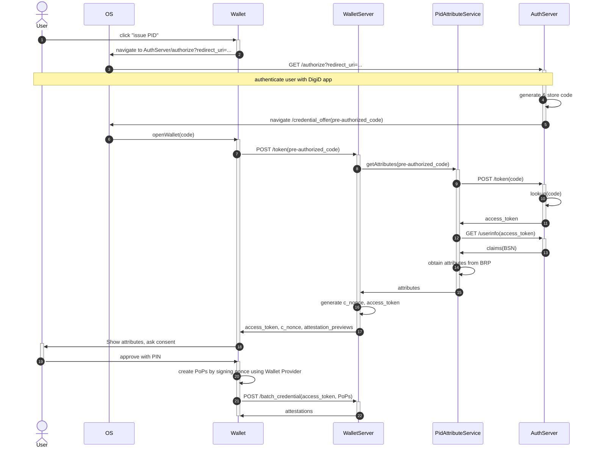
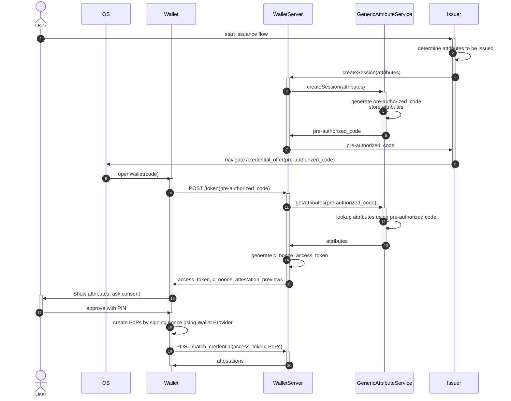

# Issuance with OpenID4VCI

## PID issuance

This diagram shows how we use OpenID4VCI in the pre-authorized code flow to issue the PID.

In this protocol, the wallet receives a (pre-authorized) code from the AuthServer (DigiD/rdo-max), which then has to be exchanged for the attributes to be issued at the Wallet Server. To deal with this, we introduce an actor in the diagram called the AttributeService, whose responsibility it is to produce the attributes to be issued given the pre-authorized code. In the case of PID issuance it can do this by talking OpenID with the AuthServer. (This actor is a library part of the WalletServer, as opposed to a separate HTTP server; we include it as separate actor here to separate responsibilities.)

The protocol works as follows:

- The wallet POSTs the code that it receives after DigiD not to the AuthServer, but as a pre-authorized code to the WalletServer.
- The WalletServer feeds the pre-authorized token to the AttributeService, which forwards the token to the AuthServer by performing a normal OpenID token POST request to it. Using the resulting `access_token` it invokes the `userinfo` endpoint to retrieve the BSN, with which it can do a BRP query, resulting in the attributes to be issued that are returned to the WalletServer. The WalletServer then generates the `c_nonce` and an `access_token` of its own, and returns these to the wallet.
- Along with the `access_token` and `c_nonce` we also return a preview of the attestations, as a custom addition to the OpenID4VCI protocol.
- When the wallet accesses the `batch_credential` endpoint with the `access_token` and a valid set of proofs of possession (signatures over the `c_nonce` validating against the public keys that the wallet wants to have in its PID), the WalletServer generates the attestations and returns them.

## Generic issuance

For generic issuance, we can implement the AttributeService as follows:
  * The issuer feeds it a bunch of to-be-issued attestations (e.g. `Vec<UnsignedMdoc>`) and receives a fresh pre-authorized token in return, which it sends to the wallet using a UL or QR;
  * When the WalletServer calls `getAttributes(pre-authorized_code)` on the AttributeService, it looks up the attributes to be issued using the pre-authorized code and returns them.

This would look like the following diagram.

