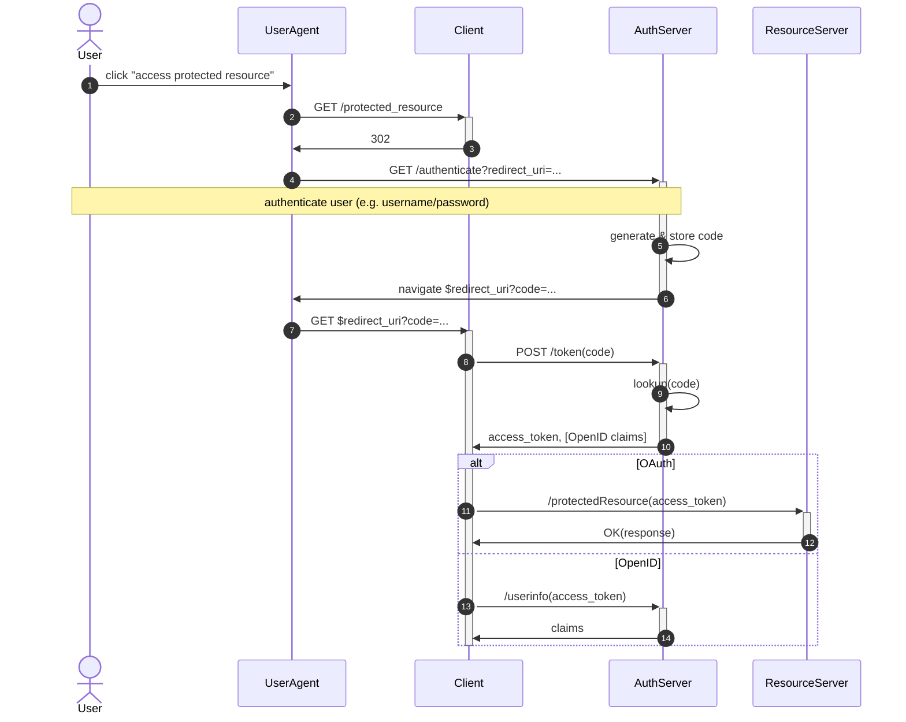
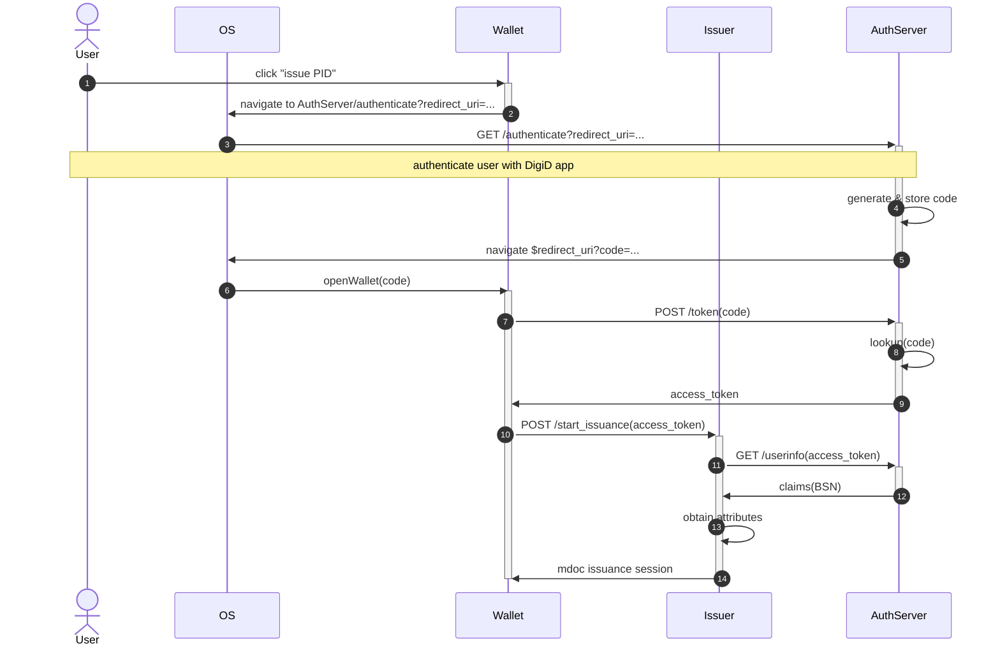
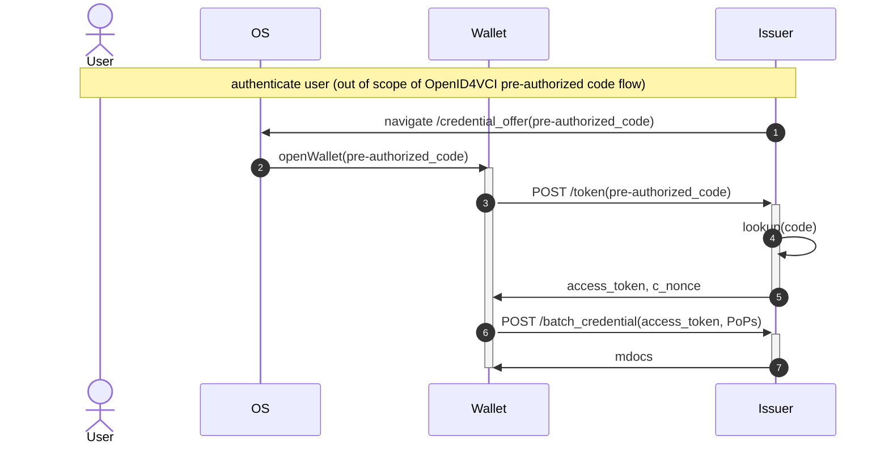
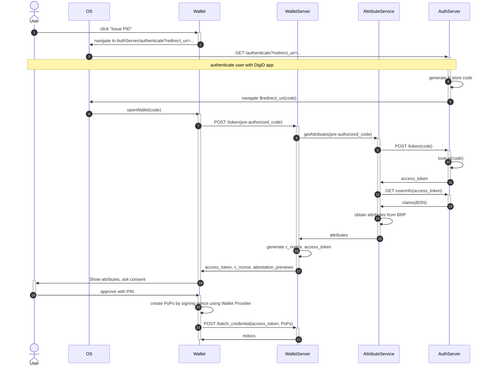
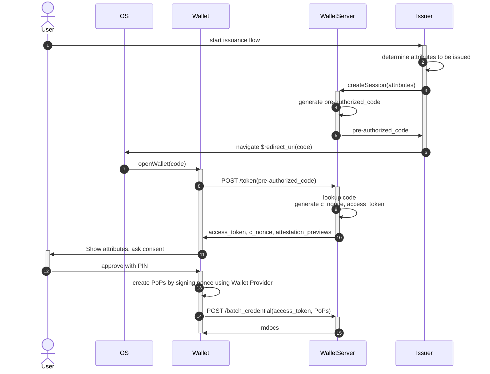

## OAuth/OpenID

Oauth grants an access token to a Client (the backend of e.g. an app or website) that allows the client to access some protected resource. For example, for its GitHub integration Slack could use OAuth to e.g. access issues and pull requests from some GitHub user account.

The code/token indirection prevents the user agent from learning the access token, which is meant only for the Client.

The User Agent is the browser, and the browser only; the protocol works without the JavaScript of the Client's website having to do anything.

## Current mock PID issuance

In this case:
- The AuthServer is in our case the DigiD bridge.
- The Client is the Issuer.
- The UserAgent is now the mobile OS.
- There is another party called the Wallet, that has no equivalent in the diagram above.
- We want to endow not the Client (Issuer) but the Wallet with the access token, since the Wallet is the one who should receive the attestations. So here the wallet directly contacts the AuthServer (DigiD) to obtain the access token.

## OpenID4VCI pre-authorized code flow

The OpenID4VCI pre-authorized code flow does not explicitly distinguish between the issuer and the OAuth Authorization Server that it uses, so the AuthServer and Issuer roles are collapsed onto each other in this diagram. Apart from that, the diagram below is almost a copy of the one above, with the following differences:

- The OpenID protocol that authenticates the user is out of scope.
- The Wallet receives the `c_nonce` with which it must prove possession of its PID attestation public keys along with the `access_token`.
- At the end of the session it receives not a reference to an mdoc issuance session, but the actual signed attestations themselves.
- The `code` is renamed to `pre-authorized_code` (but otherwise it functions in the same way).
- OpenID4VCI and thus this diagram offers no functionality for offering an attestation preview to the user.

## PID issuance with OpenID4VCI

Finally, we turn to how we can implement OpenID4VCI with the pre-authorized code flow in our case. Ideally, we want to modify the AuthServer (rdo-max) as little as possible or not at all.

Note that in our existing mdoc issuance protocol implementation, first DigiD authentication happens, resulting in the attributes to be issued through a BRP query, and only then is the actual mdoc issuance session started. By contrast, in OpenID4VCI the DigiD OpenID protocol execution happens not before but *during* the issuance session: the wallet receives a (pre-authorized) code which then has to be exchanged for the attributes to be issued during the OpenID4VCI protocol execution. We solve this by introducing a new actor in the diagram called the AttributeService, whose responsibility it is to produce the attributes to be issued given the pre-authorized code. In the case of PID issuance it can do this by talking OpenID with the AuthServer. (This actor can be be a library part of the WalletServer, as opposed to a separate HTTP server; we include it as separate actor here to separate responsibilities.)

The protocol works as follows:

- The wallet POSTs the code that it receives after DigiD not to the AuthServer, but as a pre-authorized code to the WalletServer.
- The WalletServer feeds the pre-authorized token to the AttributeService, which forwards the token to the AuthServer by performing a normal OpenID token POST request to it. Using the resulting `access_token` it invokes the `userinfo` endpoint to retrieve the BSN, with which it can do a BRP query, resulting in the attributes to be issued that are returned to the WalletServer. The WalletServer then generates the `c_nonce` and an `access_token` of its own, and returns these to the wallet.
- Along with the `access_token` and `c_nonce` we also return a preview of the attestations, as a custom addition to the OpenID4VCI protocol.
- When the wallet accesses the `batch_credential` endpoint with the `access_token` and a valid set of proofs of possession (signatures over the `c_nonce` validating against the public keys that the wallet wants to have in its PID), the WalletServer generates the mdocs and returns them.

In the implementation, the AttributeService can be a trait with the following implementations:
- One that acts as depicted above, i.e. talking OpenID with the DigiD bridge in the case of PID issuance.
- For generic issuance, we can make an implementation that acts as follows:
  * The issuer feeds it a bunch of to-be-issued attestations (e.g. `Vec<UnsignedMdoc>`) and receives a fresh pre-authorized token in return, which it sends to the wallet using a UL or QR;
  * When the WalletServer calles `getAttributes(pre-authorized_code)` on the AttributeService, it looks up the attributes to be issued using the pre-authorized code and returns them. This case would look like the following diagram.

