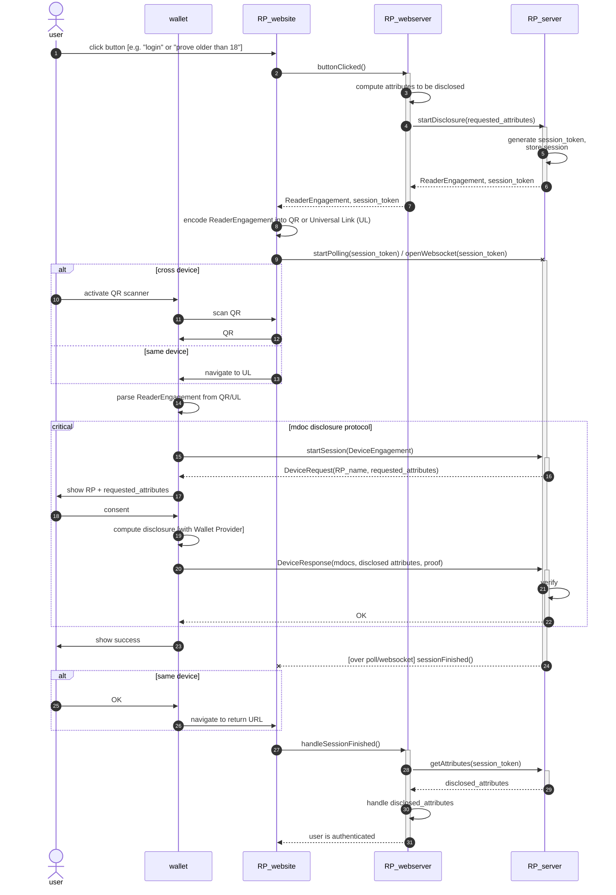
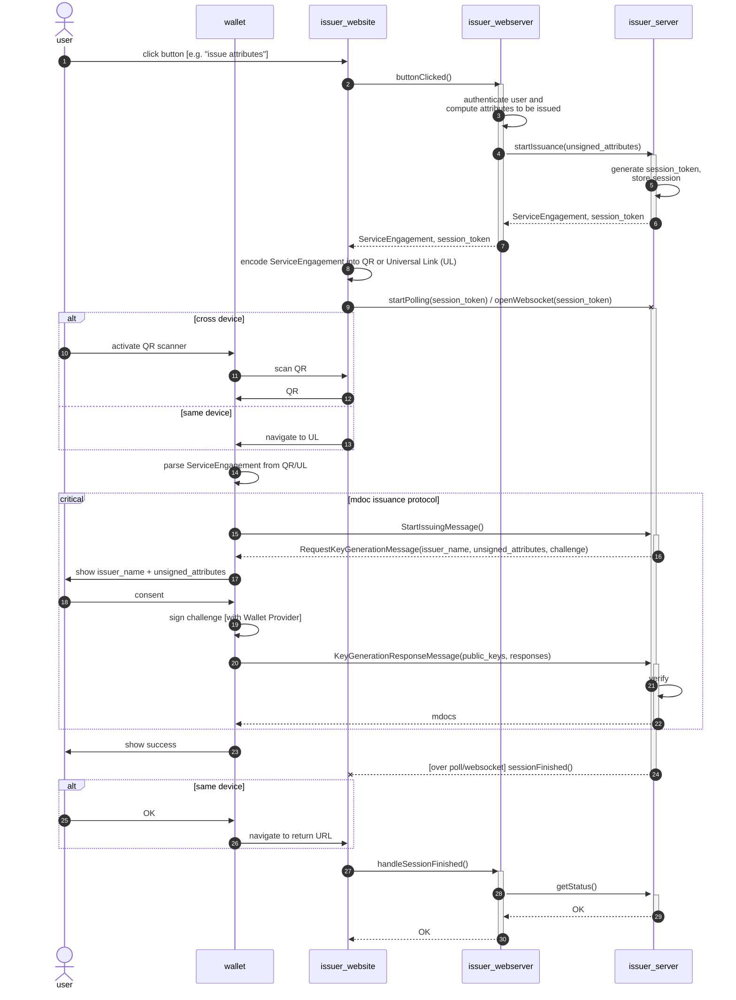

# Session flow

## Disclosure

The following diagram shows a disclosure session from the perspective of the RP, showing in particular all interactions between the different components that the RP must be running:

- The RP runs an `RP_webserver` containing its own business logic.
- The RP has an `RP_website` that the `user` interacts with using their browser. The `RP_webserver` serves as the backend for this website.
- The RP has also deployed an instance of the `RP_server` in its infrastructure, which when instructed to by the `RP_webserver` performs disclosure with the user's `wallet`.

This diagram does not distinguish between the wallet's GUI and its Rust core, and it does not take the Wallet Provider protocol into account. For that, see [here](./disclosure.md). Additionally, this protocol shows only the happy flow in which the user's wallet possesses the attributes requested by the RP, and the user consents to disclose them.

It uses the following mdoc-specific data structure names:
- `ReaderEngagement` (step (6)): contains (among others) the URL at which the wallet can perform the mdoc disclosure protocol with the `RP_server`.
- `DeviceEngagement` (step (15)): requests the following message (`DeviceRequest`) from the `RP_server`.
- `DeviceRequest` (step (16)): contains the attributes that the RP requests from the wallet, as well as the RP authentication (an X.509 certificate containing the RP's name and any other data about the RP that the GUI needs to be able to display (such as the RP's reason for the disclosure), combined with a proof of possession of that certificate).
- `DeviceResponse` (step (20)): contains the attributes disclosed by the wallet, including a cryptographic proof of possession of them so that the RP can verify their authenticity.

N.B. How the wallet determines or obtains the URL to return to in step 26 is yet to be determined.

## Issuance

Attribute issuance is to a large extent very similar to disclosure. Calling the rightmost three agents `issuer_website`, `issuer_webserver` and `issuer_server` respectively, issuance differs from disclosure in the following ways. 

1. Instead of step (3) in the sequence diagram above, the `issuer_webserver` needs to somehow authenticate the user as being a valid recipient for the attributes to be issued, as well as determine the contents of those attributes. The process for this will differ for each issuer. For example, the PID issuer authenticates the user using DigiD and retrieves the attributes to be issued from the BRP. This step is thus part of the business logic of the `issuer_webserver` and the specifics are out of scope here.
1. The protocol messages exchanged are replaced by those of the issuance protocol.
1. At the end of a disclosure session, the RP's application flow generally proceeds to a next part in which it somehow uses the authenticated `disclosed_attributes`. By contrast, at the end of issuance the `issuer_webserver` receives only a status from the `issuer_server` indicating issuance was succesful, and the issuer's application flow generally stops.

The sequence diagram follows. Note that all arrows are the same as in the diagram above; the only differences are in the descriptions above the arrows.

See also [the PID issuance sequence diagrams](./wallet_personalisation.md), which does not distinguish the various issuer components but does takes into account the wallet's GUI and Rust core, as well as the Wallet Provider protocol.

## Combined disclosure and issuance

It is expected that for many future (Q)EAA issuers, the user authentication and attribute retrieval that happens in step
 (3) is done using the PID attributes, which the wallet therefore discloses to the issuer just before issuance. Essentially, in the issuance sequence diagram above step (3) is replaced by the entire disclosure sequence diagram.

In more detail, the following happens.

1. The disclosure flow happens as seen in the first diagram, up and until step (29).
1. In step (30) of the disclosure flow, the `issuer_webserver` start issuance as seen in the second diagram from step (3), using the disclosed attributes to determine the attributes to be issued.
1. In step (20) of the issuance flow, the wallet needs to sign the challenge not only with the private keys of the mdocs that are being issued, but also with the private keys of the mdoc copies out of which it previously disclosed attributes in the disclosure phase. This convinces the issuer that all private keys involved, both those of the existing mdocs and the ones that are being issued, belong to one and the same wallet instance. (This prevents a possible attack vector in which two colluding wallets disclose attributes out of one wallet, and then receive the new mdocs in the other.)
