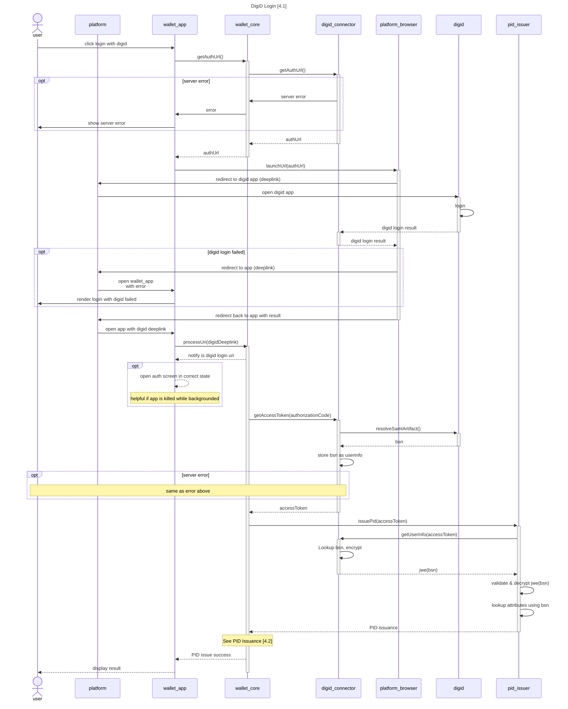
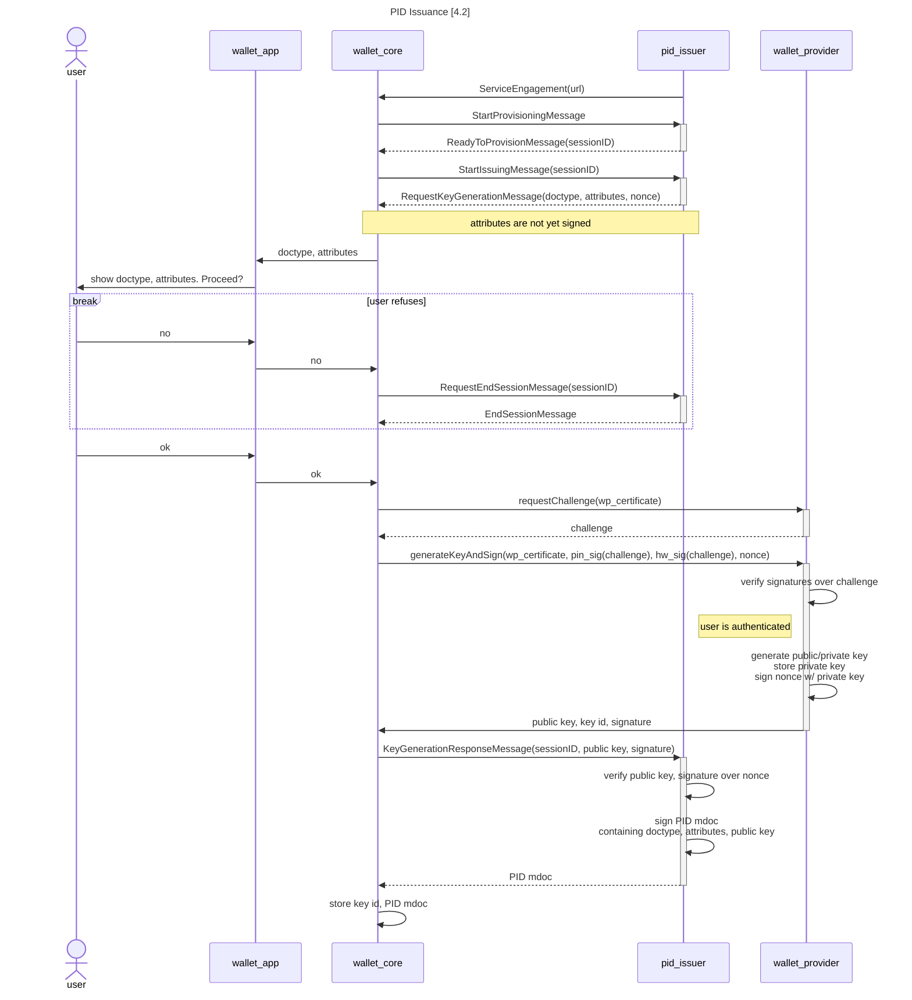

# Wallet personalisation

This document describes the steps of personalising the wallet. This includes login in with [DigiD](#41-personalisation-digid-login) and retrieving the [attestations](#pid-issuance).

## Personalisation (DigiD Login)

During personalisation the user will login with 'DigiD Hoog' to validate its identity. This diagram describes the login flow that leads to the PID.

The actual PID issuance is detailed separately in the diagram below. Also note that in this diagram we assume the `digid_connector` provides an encrypted BSN that only the server can decrypt.

## PID issuance

High level overview of PID issuance using mdoc.

The protocol supports issuance of multiple copies of an mdoc as well as multiple distinct mdocs simultaneously, but for simplicity the diagram assumes issuance of a single mdoc.

