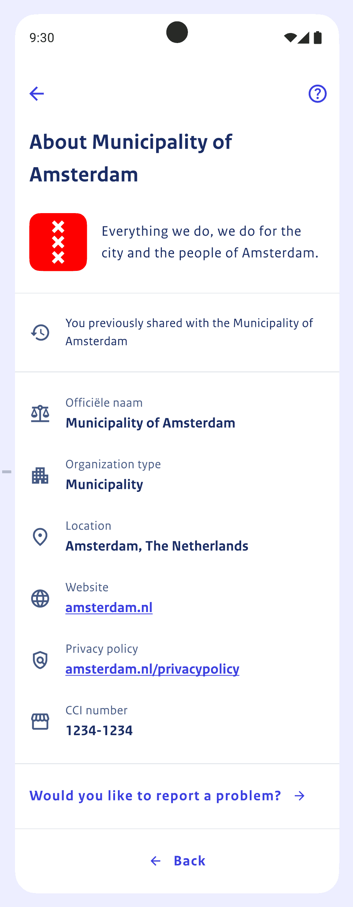

# Introduction

A Relying Party (a verifier of attestations presented by the wallet) will want
to have a global idea of what he/she needs to do when integrating their
application with the wallet environment.

This document aims to provide a global outline of components used, the necessary
decisions, data, certificate(s), and setup of the "Ontvangende Voorziening" plus
integration thereof with their own frontend(s) and backend.

[[_TOC_]]

# Step-by-step

As a relying party you want to verify certain attributes of a natural person
which are contained in the NL wallet. To be able to do so there are a few
things you must do. Roughly these are a couple of onboarding steps and the
actual configuration of the "Ontvangende Voorziening" (which can be translated
as "Receiving Facility", a facility that receives attributes to verify):

  1. Determine which attributes you need to verify
  2. Provide required relying party data
  3. Request a certificate
  4. Configure your OV (Ontvangende Voorziening)
  5. Proof-of-function, test calls
  6. Integrate the OV with your own application

We'll start with an overview of the system architecture, specifically its main
components and where to find more information.

We'll then cover the decisions you need to make regarding which attributes you
need to verify.

We'll list required fields you need to provide us, which we need to construct a
`reader_auth.json` which will become part of your certificate, as a X.509v3
custom extension.

We'll show how you can request your certificate which enables you to talk to the
Wallet, and test connectivity.

Finally, we'll give a high-level overview of what an OV looks like, and what the
disclosure flow looks like, and where you can find the API documentation and
example calls.

# Architecture Overview


In the above diagram, we see the main components involved in a disclosure
session. The main components are:

  * [DigiD][1]: Digitale Identiteit, a digital identification system;
  * [(BSNk) Pseudonym Service][2]: A service that pseudonimizes BSN numbers;
  * [(BRP-V) Authentic Source][3]: A source of attributes, made accessible by
    a so-called Verstrekkende Voorziening (VV);
  * [VV][4]: Verstrekkende Voorziening, the party that issues attributes;
  * [OV][4]: Ontvangende Voorziening, an application that runs on-premises or
    in-cloud of a relying party that can verify attributes;
  * [Relying Party Application][4]: An app running on-premises or in-cloud of
    the relying party that needs to do something with the result of a
    verification of attributes;
  * [Wallet App][5]: The wallet app running on a mobile device;


For the purpose of this document, we won't go into all components mentioned
above, in particular, DigiD and and BSNk are out-of-scope with regards to this
outline.

The Wallet platform largely consists of "Verstrekkende Voorziening(en)", that
can issue attributes and attestations, "Ontvangende Voorziening(en)" that handle
disclosure of attributes sessions, and the Wallet App, which contains attributes
and attestations received through the "Verstrekkende Voorziening(en)", enabling
the Wallet App to disclose them to "Ontvangende Voorziening(en)".

The "Ontvangende Voorziening(en)" are things that relying parties configure and
maintain on their own premises or cloud environments, which they integrate with
their own application, and which interacts with the Wallet app, in order to
verify attributes and attestations for usage in their own application.

This document is about configuring an "Ontvangende Voorziening". To have a
broader view on the Wallet platform, you can have a look at the
[Architecture Documents][5]. Specifically, the Project Start Architecture, the
Solution Architecture Document and the Design Considerations (all of which can
be found at the aforementioned link).

The Wallet platform is fully open-source; you can find the project on GitHub:
[nl-wallet][6] (note: we currently have a dependency on [nl-rdo-max][7] which
is also open-source but lags behind a bit in updates - we're intending on
getting some currently-private changes upstreamed, work in progress).

# Preparations and Onboarding

The subsections below describe the decisions you need to make as a relying
party with regards to attributes you want to verify, what data we require from
you, how to create a certificate request for a certificate (which is configured
for usage within the `wallet_server`), and how to file all of that with us.

## Decisions

Ultimately, as an RP (relying party, an entity that wants to verify attributes)
you need to decide what attributes you want to verify, and communicate the
purpose of the verification. So:

  * Which attribute(s): `birth_date`, `age_over_18`, `gender`, etc
  * What purpose: *describe why you need to verify the attribute(s)*

Attributes in the wallet are grouped in things called attestations and the
wallet app displays these attestations as cards. The attestations are stored in
the `mdoc` format (see [ISO/IEC 18013-5:2021][8] and [ISO/IEC 23220-4][9]).

We currently (as of 2024-04-17) support two `mdoc` doctypes: `PID_DOCTYPE`
and `ADDRESS_DOCTYPE`. An `mdoc` contains one or multiple attributes that you
can verify. For your convenience, we list the attributes for both doctypes here:

### What a PID_DOCTYPE looks like

| Attribute          | Description                                             |
|--------------------|---------------------------------------------------------|
| given_name         | First names (voornamen)                                 |
| family_name_prefix | Prefix (voorvoegsel)                                    |
| family_name        | Surname (achternaam)                                    |
| given_name_birth   | First names at birth (voornamen bij geboorte)           |
| family_name_birth  | Birth name (geboortenaam)                               |
| gender             | Gender (geslacht)                                       |
| birth_date         | Birth date (geboortedatum)                              |
| age_over_18        | Older than 18 (ouder dan 18)                            |
| birth_place        | Place of birth (geboorteplaats) **\***                  |
| birth_city         | City, town or village of birth (geboortestad)           |
| birth_state        | State or province of birth (geboortestaat of -provincie)|
| birth_country      | Country of birth (geboorteland)                         |
| bsn                | Citizen service number (burgerservicenummer)            |
| nationality        | Nationality (nationaliteit)                             |

*\* birth_place is a combination of birth_country, birth_state and birth_city*

### What an ADDRESS_DOCTYPE looks like

| Attribute             | Description                            |
|-----------------------|----------------------------------------|
| resident_address      | Address (adres) **\***                 |
| resident_street       | Street name (straatnaam)               |
| resident_house_number | House number (huisnummer)              |
| resident_postal_code  | Postal code (postcode)                 |
| resident_city         | City, town or village (woonplaats)     |
| resident_state        | State or province (staat of provincie) |
| resident_country      | Country (land)                         |

*\* resident_address is a combination of resident_ street, house_number, postal_code, city, state and country*

Collect the attributes you want to verify and describe the purpose, they are
needed when we file the request later on.

## Required Data

The Wallet needs a bunch of data about you, the relying party which we store as
a part of the certificate in a so-called X.509v3 extension. We use this data to
present a view of the relying party in the wallet app GUI. What we need to know:

**REQUIRED_DATA**

| Attribute                       | Languages | Description                                                                       |
|---------------------------------|-----------|-----------------------------------------------------------------------------------|
| purpose_statement               | nl+en     | For what purpose are you attesting? Login? Age verification? etc.                 |
| retention_policy                | -         | Do you have an intent to retain data? For how long?                               |
| sharing_policy                  | -         | Do you have an intent to share data? With whom?                                   |
| deletion_policy                 | -         | Do you allow users to request deletion of their data, yes/no?                     |
| organization_display_name       | nl+en     | Name of the relying party as shown in the wallet app.                             |
| organization_legal_name         | nl+en     | Legal name of the relying party.                                                  |
| organization_description        | nl+en     | Short one-sentence description or mission statement of the relying party.         |
| organization_web_url            | -         | The home URL of the relying party.                                                |
| organization_city               | nl+en     | The home city of the relying party.                                               |
| organization_category           | nl+en     | Bank, Municipality, Trading, Delivery Service, etc.                               |
| organization_logo               | -         | A logo to display in the wallet app, preferably in SVG format.                    |
| organization_country_code       | -         | Two-letter country code of relying party residence.                               |
| organization_kvk                | -         | Chamber of commerce number of relying party.                                      |
| organization_privacy_policy_url | -         | Link to relying party's privacy policy.                                           |
| return_url_prefix               | -         | URL to which the user's mobile browser redirects after the session has completed. |
| request_origin_base_url         | -         | Where do your requests come from? See [CORS][11].                                 |
| list_of_verifiable_attributes   | -         | List of attributes determined in previous section.                                |

Collect answers to the above, they will be needed once we file the request later
on.

Note: In the `Languages` column where it says `nl+en` for example, please
provide both a dutch and an english answer.

### Example reader_auth.json

To give you an idea with regards to how we format this data, here's an
example of the JSON data (a so-called `reader_auth.json`) we produce from your
answers (this is an example for the municipality of Amsterdam):

```json
{
  "purposeStatement": {
    "nl": "Inloggen",
    "en": "Login"
  },
  "retentionPolicy": {
    "intentToRetain": true,
    "maxDurationInMinutes": 525600
  },
  "sharingPolicy": {
    "intentToShare": false
  },
  "deletionPolicy": {
    "deleteable": false
  },
  "organization": {
    "displayName": {
      "nl": "Gemeente Amsterdam",
      "en": "Municipality of Amsterdam"
    },
    "legalName": {
      "nl": "Gemeente Amsterdam",
      "en": "Municipality of Amsterdam"
    },
    "description": {
      "nl": "Alles wat we doen, doen we voor de stad en de Amsterdammers.",
      "en": "Everything we do, we do for the city and the people of Amsterdam."
    },
    "webUrl": "https://amsterdam.nl",
    "city": {
      "nl": "Amsterdam",
      "en": "Amsterdam"
    },
    "category": {
      "nl": "Gemeente",
      "en": "Municipality"
    },
    "logo": {
      "mimeType": "image/svg+xml",
      "imageData": "<svg width=\"64\" height=\"64\" viewBox=\"0 0 64 64\" fill=\"none\" xmlns=\"http://www.w3.org/2000/svg\"><rect width=\"64\" height=\"64\" rx=\"12\" fill=\"#FF0000\"/><path d=\"M25 53.1823L29.1985 48.9481L25 44.7139L27.8015 41.8886L32 46.1228L36.1985 41.8886L39 44.7139L34.8015 48.9481L39 53.1823L36.191 56L31.9925 51.7658L27.794 56L25 53.1823ZM25 19.2861L29.1985 15.0519L25 10.8253L27.8015 8L32 12.2342L36.191 8L38.9925 10.8253L34.794 15.0595L38.9925 19.2937L36.191 22.1114L31.9925 17.8772L27.794 22.1114L25 19.2861ZM25 36.2455L29.1985 32.0114L25 27.7848L27.8015 24.9594L32 29.1936L36.1985 24.9594L39 27.7848L34.8015 32.0189L39 36.2531L36.191 39.0709L31.9925 34.8367L27.794 39.0709L25 36.2455Z\" fill=\"white\"/></svg>"
    },
    "countryCode": "nl",
    "kvk": "1234-1234",
    "privacyPolicyUrl": "https://amsterdam.nl/privacy"
  },

  "returnUrlPrefix": "${RP_RETURN_URL}",
  "requestOriginBaseUrl": "https://amsterdam.nl",
  "attributes": {
    "com.example.pid": {
      "com.example.pid": {
        "bsn": {}
      }
    }
  }
}
```

### Example Screenshot of reader_auth.json Data Used in Wallet App

The data from `reader_auth.json` is used in various parts of the app. For
illustrational purposes, see below a screenshot of a screen showing details
about the municipality of Amsterdam:



## Certificate Request

You will need a certificate. We currently use our own certificate authority to
sign and trust certificates (in the future we might work with a public CA like
PKI-Overheid).

When you send us your certificate request, we will send you a signed certificate
and a copy of our certificate authority certificate.

Without further ado, let's create a private key, an `openssl` config and a
certificate request:

```sh
# Create a private key (note de-facto default key strength, could also be 3072).
openssl ecparam -name prime256v1 -genkey -noout -out rp.key

# Set organization name to previously specified organization_legal_name.
export ORGANIZATION_NAME="Your legal organization name here"

# Set common name to the hostname of whatever is using the certificate.
export COMMON_NAME="foo.yoursite.com"

# Create an openssl configuration file used to create the request later on.
cat <<EOF > "rp.cfg"
[req]
distinguished_name = req_distinguished_name
req_extensions = v3_req
prompt = no

[req_distinguished_name]
C = NL
ST = Zuid-Holland
L = Den Haag
O = $ORGANIZATION_NAME
CN = $COMMON_NAME

[v3_req]
extendedKeyUsage = clientAuth, serverAuth

[alt_names]
DNS.0 = $COMMON_NAME
EOF

# Create the certificate request.
openssl req -config rp.cfg -new -key rp.key -out rp.csr
```

You should now have three files: `rp.key`, `rp.cfg` and `rp.csr`. Keep the key
safe somewhere, don't share it, not even with us. The certificate request,
`rp.csr`, we will send together with de decided attributes and needed data when
we file the request in the next section.

Note: When we receive the requested data and the certificate request, we will
serialize that as a JSON string and add it to the certificate as an X.509v3
extension with OID 2.1.123.1.

## File Request

Alright, let's review what we've got so far:

  * You've determined the names of the attributes you want to verify;
  * You've written down a description of the purpose of verification;
  * You've collected all the required data attributes requested previously;
  * You've followed the certificate request steps and have an `rp.csr` document;

Put all of the above in the following e-mail template, attach your certificate
request document (`rp.csr`):

```
Dear NL-Wallet,

Please find herein an onboarding request for us as a relying party. Attached
you will find our certificate request and below the answers with regards to
requested data, attributes for verification and descripion of purpose.

Attributes requested for verification:
<fill in list of attributes previously documented>

Description of purpose:
<describe purpose of verification>

Required data:
purpose_statement: For what purpose are you attesting? Login? Age verification? etc.
retention_policy: Do you have an intent to retain data? For how long?
sharing_policy: Do you have an intent to share data? With whom?
deletion_policy: Do you allow users to request deletion of their data, yes/no?
organization_display_name: Name of the relying party as shown in the wallet app.
organization_legal_name: Legal name of the relying party.
organization_description: Short one-sentence description or mission statement of the relying party.
organization_web_url: The home URL of the relying party.
organization_city: The home city of the relying party.
organization_category: Bank, Municipality, Trading, Delivery Service, etc.
organization_logo: A logo to display in the wallet app, preferably in SVG format.
organization_country_code: Two-letter country code of relying party residence.
organization_kvk: Chamber of commerce number of relying party.
organization_privacy_policy_url: Link to relying party's privacy policy.
return_url_prefix: Callback URL (URL we POST to on success/failure of attestation).
request_origin_base_url: Where do your requests come from? See [CORS][11].
list_of_verifiable_attributes: List of attributes determined in previous section.

Kind regards,


<relying party>

<don't forget to attach certificate request>
```

Mail the above to our company/group email address (not published here for the
time being) and we will pick up the request from there. Note that this process
might/will change in the future.

# Background

Now that you can interact with the wallet platform, you are ready to start
working on integration your own application with your "Ontvangende Voorziening".

An "Ontvangende Voorziening" is realized by configuring the `wallet_server`
in "OV" mode, which is a software component developed by the NL wallet team
which you as a relying party run on-premises or within your cloud environment
in order to interact with the wallet platform.

In the following subsections we'll give you a high-level overview of what an
"Ontvangende Voorziening" looks like, how to integrate it with your application
and some directions with regards to the API specifications.

## What a Disclosure Session Looks Like


In the above flow diagram you see the components involved in a disclosure
session. Except for the "PID Issuer (VV)" and the "Wallet App", these run on
premises or within cloud environment(s) of the relying party (i.e., you).

Let's walk through a typical (cross-device, note on same-device flows in
following section) disclosure session (for full details, have a look at the
[VV/OV SAD][4], our detailed illustration of a [disclosure session
flow](diagrams/session_flow.md), and our [component interaction flow for
disclosures](diagrams/disclosure.md)).

Note the possible session states:

  * `CREATED`: *session created*
  * `WAITING_FOR_RESPONSE`: *waiting for user to scan or follow QR/UL*
  * `DONE` *which has substates: `SUCCES`, `FAILED`, `CANCELED`, and `EXPIRED`*

Note the "actors/components" we distinguish between:

  * `user`: *user of the wallet_app, initiating an attribute disclosure session*
  * `wallet_app`: *the wallet app, running on a users' mobile phone*
  * `wallet_server`: *the wallet_server component of the OV*
  * `rp_frontend`: *the (javascript/html/css) frontend of the relying party application*
  * `rp_backend`: *the (server) backend of the relying party application*

In the diagram, the `user` is the small stick-figure at the top, the actor who
initiates some task he/she wants to accomplish. the `wallet_app` is the blue box
on the right. The `wallet_server` is the big block in the middle (shown as
"Verifier Service (Ontvangst Voorziening, OV)" containing the configuration, the
verifier, and the validator components). The `rp_frontend` and `rp_backend` are
represented by the big orange/beige block on the left (shown as "Relying Party
Application").

Overview of a flow for cross device attribute disclosure:

  1. `user` initiates action (i.e., clicks a button on web page of relying party
     in their desktop or mobile webbrowser);
  2. `rp_frontend` receives action, asks `rp_backend` to initiate session;
  3. `rp_backend` in turn calls `wallet_server` with a session initialization
     request, receiving a `session_url`, an `engagement_url`, and a
     `disclosed_attributes_url` as a response. The session initially has a
     `CREATED` status;
  4. `rp_backend` keeps `disclosed_attributes_url` for itself, and returns
     `session_url` and `engagement_url` to `rp_frontend`;
  5. `rp_frontend` encodes a QR/UL (QR Code, universal link) using the
     `engagement_url` and displays this to the `user`;

The `user` can now activate their `wallet_app` QR scanner and scan the QR or
navigate to the universal link (UL). In parallel, `rp_frontend` will poll the
`session_url` which will change status due to action (or inaction) by the `user`
(barring any unforeseen circumstances). So, assuming everything goes fine:

  6. `rp_frontend` polls `session_url` for status. It will re-poll for a
     configured time-limit when receiving a `CREATED` or `WAITING_FOR_RESPONSE`
     status. The poll will terminate on `DONE`;
  7. After `user` completes the scanning of the QR or followed the universal
     link, `wallet_app` parses/extracts the QR/UL and starts a device engagement
     session with `wallet_server`, which in turn returns the relying party
     details and the requested attributes to the `wallet_app`;
  8. The `wallet_app` shows the relying party details and the requested
     attributes to the `user` and gives the `user` the option to consent or
     abort;

The `user` can abort, which will terminate the session with a `CANCELED` status.
The `user` can also wait too long, which would result in an `EXPIRED` status.
The `FAILED` status can occur when other, infrastructural and/or network-related
problems are encountered. Assuming the `user` consented, let's continue:

  9. `wallet_app` sends a device response containing the disclosed
     attributes and proofs_of_possession to the `wallet_server`;
 10. `wallet_server` validates if attributes are authentic and valid and if they
     belong together and returns an indication of success back to the
     `wallet_app`, which in turn confirms the success by displaying a dialog to
     the `user`. `wallet_server` additionally updates the  status of the session
     to `DONE` with the `SUCCESS` substate (assuming validation went fine);
 11. The poll running on the `rp_frontend` will terminate due to the `DONE`
     session state;
 12. The `rp_frontend` returns the result of the session to the `rp_backend`;
 13. The `rp_backend` checks the status of the session. On `DONE` with substate
     `SUCCESS`, it will call the associated `disclosed_attributes_url` which it
     kept around (saved) in step 4 to retrieve the disclosed attributes. When
     substate is not `SUCCESS`, it will not retrieve the disclosed attributes
     but invoke an error_handler of sorts (for example) which displays the error
     condition;
 14. `rp_backend` handles disclosed attributes, returns status to `rp_frontend`
     (for example: user is authenticated, here have a token);

### Cross Device vs. Same Device

Same-device flows differ from cross-device flows in how the QR/UL is encoded.
The `rp_frontend` detects the user-agent and from that determines if a
Cross-device or Same-device flow is appropiate. When it encodes for a
Same-device flow, the resulting Universal link can be directly opened by the
`wallet_app` on the same device, which then starts device engagement towards
the `wallet_server` (see step 7 above).

## Notes on Requirements Applicable to Your Application

Below a list of things to know about the wallet platform and more specifically,
what you need to keep in mind when you integrate the usage of the wallet for
identification or verification of attributes with your application:

* The wallet app presents attestations using the [ISO/IEC 18013-5:2021][8],
  [ISO/IEC 23220-4][9] and [OpenID4VP][10] standards;
* Any disclosure session initiation request must include the reason why the
  relying party is requesting the attributes;
* A relying party **MUST NOT** track, in the broadest sense of the word;
* A relying party needs to adhere to the EU-AVG [GDPR][12];
* It is required to follow accessibility guidelines set forth in the [WCAG][13].

## Integration

If you look at the previous disclosure flow diagram, on the left side, you see
the Relying Party application, which is an application you probably already have
that you want to integrate with functionality the wallet provides (i.e., the
verification of identity and/or certain specific attributes, in order to allow
or disallow usage of (a part of) said application).

To integrate with the "Ontvangende Voorziening", you modify your frontend and
backend application, integrating with the `wallet_server` (the implementation
of the "Ontvangende Voorziening" on your premises or in your cloud environment).

In the disclosure flow diagram, on the right, where the "Relying Party
Application" is shown, you see a four integration/call points: "Configure
Verifier", "Initiate Disclosure Session", "Start Result Poll Loop" and "Retrieve
OV Result":

  * Configuration of the verifier, executed manually by you, a one-time initial
    setup that stores a configuration about your app in the configuration
    component of the OV;
  * Initiation of a disclosure session, executed by your backend application,
    giving you a `session_url`, an `engagement_url`, and a `disclosed_attributes_url`;
  * The status check loop, executed by your frontend application, on the
    previously received `session_url` where we check for a status result, which
    indicates success or failure of the session.
  * Result retrieval, executed by your backend, on the previously received
    `disclosed_attributes_url`, which is a final conditional step dependent on
    a succesful completion status, which contains the disclosed_attributes.

The above is described in more detail in the previous section [detailing an
example disclosure flow](#what-a-disclosure-session-looks-like).

It's worth noting that the NL-Wallet team is currently (as of 2024-04-24)
developing a JavaScript library (called `wallet_web`) that handles the status
check loop and status return for you.

## API Specifications

As of 2024-04-24, we can't specify the specific API used yet as this is
currently subject to change. At a later stage, the detailed API specs will be
referenced here.

## Example calls

A collection of sample calls that illustrate how you interact with the OV.

### Initiate a Disclosure Session

Here's an example of a disclosure session initiation. This is usually executed
by the backend of the relying party application:

```sh
curl --silent --request POST --json '{"usecase":"mijn_amsterdam", "items_requests": [{"docType": "com.example.pid", "nameSpaces": {"com.example.pid": {"given_name": true}}}], "session_type": "cross_device"}' http://localhost:3002/disclosure/sessions
```

Example Response:

```json
{
  "session_url": "http://localhost:3001/disclosure/J3GQDvzGIx0fEYzycTCWhDtrqi4BVtnk/status",
  "engagement_url": "walletdebuginteraction://wallet.edi.rijksoverheid.nl/disclosure/owBjMS4wAYIB2BhYS6QBAiABIVgg7Su1HeFCzCitIsBuE71u4CuFv19MTFOKNd418IETj1MiWCBj11U_fVOsipfduQgGLObdMskHQ6AvcaGH4yVEah4WvAKBgwQBgXhBaHR0cDovL2xvY2FsaG9zdDozMDAxL2Rpc2Nsb3N1cmUvSjNHUUR2ekdJeDBmRVl6eWNUQ1doRHRycWk0QlZ0bms?session_type=cross_device",
  "disclosed_attributes_url": "http://localhost:3002/disclosure/sessions/J3GQDvzGIx0fEYzycTCWhDtrqi4BVtnk/disclosed_attributes"
}
```

### Check Status of Session

Example status check. This is usually executed by the frontend of the relying
party application:

```sh
curl --silent --request GET http://localhost:3001/disclosure/J3GQDvzGIx0fEYzycTCWhDtrqi4BVtnk/status
```

Example response:

```json
{
  "status": "CREATED"
}
```

### Retrieve Disclosure Results

```sh
curl --silent --request GET http://localhost:3002/disclosure/sessions/J3GQDvzGIx0fEYzycTCWhDtrqi4BVtnk/disclosed_attributes
```

Example response:

```json
{ "TODO": true }
```

## References

Below you'll find a collection of links which we reference to through the entire
text. Note that they don't display when rendered within a website, you need to
read the text in a regular text editor or pager to see them.

TODO: Link to VV/OV SAD, which are still in draft and not published yet.

[1]: https://www.logius.nl/domeinen/toegang/digid
[2]: https://www.logius.nl/domeinen/toegang/bsnk-pp
[3]: https://www.rvig.nl/basisregistratie-personen
[4]: link-to-vvov-sad-tbd
[5]: https://edi.pleio.nl/news/view/93f40956-3671-49c9-9c82-2dab636b59bf/psasad-documenten-nl-wallet
[6]: https://github.com/MinBZK/nl-wallet
[7]: https://github.com/minvws/nl-rdo-max
[8]: https://www.iso.org/standard/69084.html
[9]: https://www.iso.org/standard/86785.html
[10]: https://openid.net/specs/openid-4-verifiable-presentations-1_0.html
[11]: https://developer.mozilla.org/en-US/docs/Web/HTTP/CORS
[12]: https://europa.eu/youreurope/business/dealing-with-customers/data-protection/data-protection-gdpr/index_en.htm
[13]: https://www.w3.org/WAI/WCAG21/Understanding/intro
