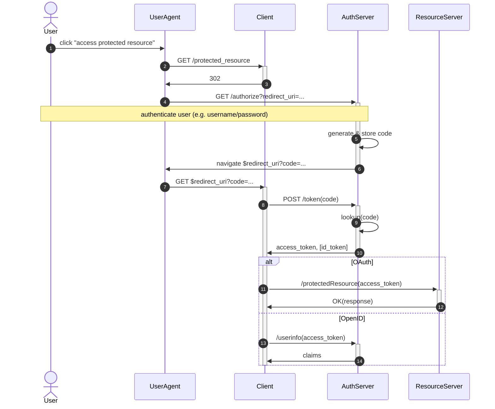

# OAuth/OpenID Connect

Oauth ([RFC 6749](https://www.rfc-editor.org/rfc/rfc6749.html)) grants an access token to a Client (the backend of e.g. an app or website) that allows the client to access some protected resource. For example, for its GitHub integration Slack could use OAuth to e.g. access issues and pull requests from some GitHub user account.

OpenID Connect is an extension of OAuth in which the AuthServer sends alongside or instead of the access token also some identity information about the user, in the form of a JWT called the ID token. Additionally, it defines the `/userinfo` endpoint at which the Client can retrieve additional identity information of the user using the access token as authorization.

Notes:

- The Authorization Code/Access Token indirection prevents the user agent from learning the access token, which is meant only for the Client.
- The User Agent is the browser (and the browser only; the protocol works without the JavaScript of the Client's website having to do anything).
- There are several so-called grant types defined by the OAuth specification. We focus only on the Authorization Code Grant.

For other introductions to OAuth/OpenID Connect, see:
- https://spapas.github.io/2023/11/29/openid-connect-tutorial/
- https://fusionauth.io/articles/identity-basics/what-is-oidc

The OAuth protocol looks as follows.

Some notes on the protocol messages:

- Step 4: the [Authorization Request](https://www.rfc-editor.org/rfc/rfc6749.html#section-4.1.1), sent URL-encoded in the URL to the Authorization Endpoint (normally `/authorize`) of the Authorization Server. The user is redirected by the User Agent to this URL so at this point control of the flow is relinquished to the Authorization Server.
- Step 6: the [Authorization Response](https://www.rfc-editor.org/rfc/rfc6749.html#section-4.1.2), containing the Authorization Code (URL-encoded). At this point the Authorization Server redirects the browser back to the redirect URI of the Client who thus regains control over the flow.
- Step 8: the [Access Token Request](https://www.rfc-editor.org/rfc/rfc6749.html#section-4.1.3) (URL-encoded), sent to the Token Endpoint (normally `/token`) of the Authorization server. Used to request an Access Token given the Authorization Code.
- Step 10: The [Access Token Response](https://www.rfc-editor.org/rfc/rfc6749.html#section-4.1.4), containing the Access Token (JSON-encoded).

There exist numerous extensions of the OAuth protocol, some of which are the following.

- PAR (Pushed Authorization Requests, [RFC 9126](https://datatracker.ietf.org/doc/html/rfc9126)): In this extension, the Authorization Request is not sent by the User Agent by navigating to `GET /authorize` with the parameters encoded into the URL, but instead it is sent by the Client's JavaScript to `POST /as/par` with the parameters sent in the `POST` body (still URL-encoded). The Authorization Server responds with an opaque `request_uri`, which the User Agent then includes in the URL when it navigates to `GET /authorize`. After this the flow proceeds normally. This prevents the Authorization Request from being logged alongside the URL, and from leaking to other websites in the form of the referrer URL. Additionally it prevents problems if the Authorization Request is very large.
- PKCE (Proof Key for Code Exchange, [RFC 7636](https://datatracker.ietf.org/doc/html/rfc7636)): a mechanism preventing authorization code interception attacks, in which the client first sends the hash of a random value along with the Authorization Request, and later when sending the Token Request it authenticates itself as the same client as earlier by including the random value itself.
- DPoP (Demonstrating Proof of Possession, [RFC 9449](https://datatracker.ietf.org/doc/html/rfc9449)): a mechanism for sender-constraining access tokens via a proof-of-possession mechanism, allowing for the detection of replay attacks with access and refresh tokens. This is further explained in the rustdoc of its implementation [here](../src/dpop.rs).
