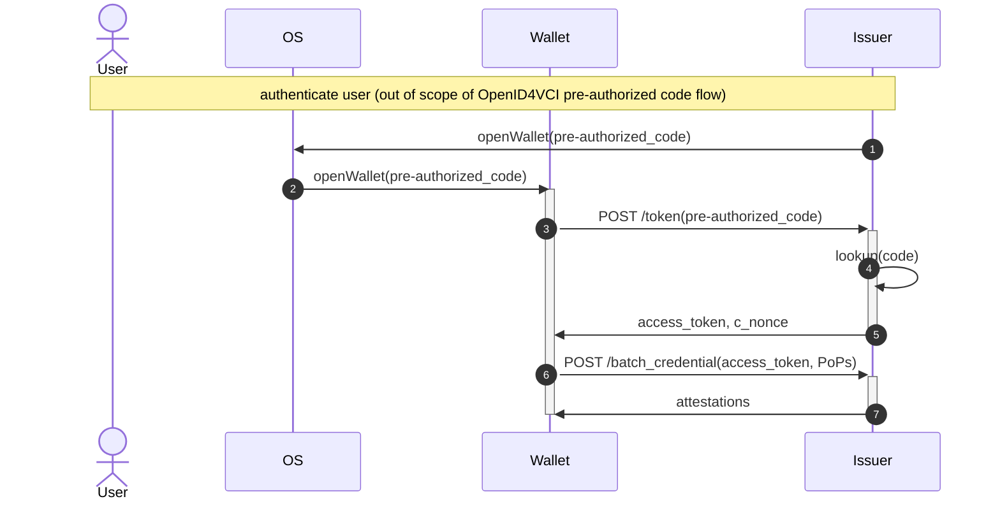

# Introduction to OpenID4VCI

OpenID4VCI is a protocol for issuance of attestations. The version of the specification implemented here may be found [here](https://openid.net/specs/openid-4-verifiable-credential-issuance-1_0-13.html).

It aims to be generic over different attestation formats, such as the mdoc attestation format and [SD-JWT](https://datatracker.ietf.org/doc/draft-ietf-oauth-selective-disclosure-jwt/). The standard therefore only defines protocols (although it includes a number of examples using the mdoc, SD-JWT and JSON-LD VC formats). By contrast, the [ISO mdoc](../../mdoc/documentation/mdoc.md) specifications (ISO 18013-5, 23220-3, 23220-4) define both an attestation format (COSE over `IssuerSigned`) and protocols to issue and verify them with.

A note on terminology: In the OpenID4VCI/OpenID4VP specs, a "Verifiable Credential" and just "credential" is what we call an attestation. Here "Verifiable Credential" must be taken in a broad sense and not to exclusively mean [W3C Verifiable Credentials](https://www.w3.org/TR/vc-data-model/): if it contains a (reference to a) user public key and user data signed by a trusted issuer, then it may be considered a Verifiable Credential.

## Relation to OAuth and OpenID Connect

A short introduction to OAuth/OpenID Connect is given [here](./openid.md).

OpenID4VCI is in terms of protocol messages a superset of OAuth. However, the roles played by the actors in the protocol as well as what protocol message gets sent to whom is slightly different than in OAuth.

By contrast, OpenID Connect is a full superset of OAuth, both in terms of protocol messages and who sends which messages to whom. OpenID4VCI is not modeled as a superset of OpenID, as it issues a Verifiable Credential to the end user instead of an ID token to (the webserver backend of) a Client. Consequentially, in OAuth and OpenID the User Agent (the browser) receives the Authorization Code while the Access Token is sent only to the Client. In OpenID4VCI, instead the Wallet receives both the Authorization Code and the Access Token.

## Protocol flow

The OpenID4VCI protocol has the following phases.
1. The Wallet obtains an Authorization Code in one of the following two ways:
    1. Using the Authorization Code Flow defined in OpenID4VCI, by sending an Authorization Request to the Authorization Endpoint `/authorize` and receiving an Authorization Response as in OAuth 2.0.
    2. Using the Pre-Authorized Code Flow, i.e. in some issuer-specific way not covered by OpenID4VCI (in this case the Authorization Code is called the "Pre-Authorized Code" but it performs the same role).
3. The Wallet exchanges the Authorization Code for an Access Token to the Token Endpoint `/token` using an OAuth Token Request, receiving an OAuth Token Response containing the Access Token. The Token Response also contains the `c_nonce` which the Wallet will have to sign with its attestation private keys (that is, the private keys of which it wants the corresponding public keys to be put in the issued attestations).
4. The Wallet signs the `c_nonce` with its attestation private keys, creating PoPs (Proofs of Possessions) in the form of JWTs, and sends these to an OpenID4VCI-specific endpoint (as `CredentialRequest`/`CredentialRequests` message to `POST /credential` or `POST /batch_credential`). This endpoint is an OAuth 2.0 Protected Resource, i.e., requires the Access Token in the `Authorization` header. The issuer verifies the PoP JWTs and responds with the `CredentialResponse`/`CredentialResponses` message.

A sequence diagram of the pre-authorized code flow looks as follows. In this flow, the `code` is renamed to `pre-authorized_code` (but otherwise it functions in the same way).

Sequence diagrams showing full details of the implementation in this crate can be found [here](../../../wallet_docs/architecture-diagrams/issuance-with-openid4vci.md).

## Comparison with the mdoc issuance protocol

### Similarities

- At its core, the protocol works the same as any attestation issuance protocol necessarily has to work: for each attestation (copy) that is issued, the holder has to sign a random nonce generated by the issuer with the private key whose public key it wants to have in the attestation, thereby proving possession to the issuer of the private key.
- There are as many private keys involved as there are attestation (copies) to be issued, but there is only a single nonce that the holder signs with all private keys.
- The protocol supports issuance of multiple attestations simultaneously (using the `/batch_credential` endpoint).
- The protocol depends on TLS for transport security and confidentiality, and includes no encryption of its own.

### Differences

- An mdoc issuance session uses a session token that is included in the URL. The OpenID4VCI endpoints include no session token; instead the session is identified by either the authorization code or the access token, depending on which endpoint is invoked. These are sent as an HTTP header instead of in the URL.
- The mdoc issuance protocol always sends all data CBOR-encoded in the body of a HTTP POST request or response. In the OpenID4VCI protocol, the HTTP requests are sometimes POST and sometimes GET; data is sent sometimes in the POST body and sometimes in a HTTP header; and data is sometimes JSON-encoded and sometimes URL-encoded. All of this depends on the specific request being done and the data being sent.
- The protocol does not provide a message that informs the holder of the attestations and attribute values it is about to receive, before it actually receives them. Instead, the protocol assumes that the user is informed of this when the issuer has control over the flow when it is authenticating the user.

## Specifics of this implementation
- Since the OpenID4VCI protocol is structured as a superset of OAuth, this implementation is as well; OpenID4VCI-specific extensions to protocol messages are wrapped in `Option` so that the protocol messages can also be used for ordinary OAuth 2.0. Additionally, the protocol messages in this implementation are such that they can be used in both OpenID4VCI servers and OpenID(4VCI)/OAuth clients.
- This implementation currently only supports the Pre-Authorized Code Flow. Supporting the Authorized Code Flow is future work.
- This implementation currently only supports issuance of mdocs. Supporting SD-JWT is future work.
- This implementation uses the DPoP (Demonstrating Proof of Possession, [RFC 9449](https://datatracker.ietf.org/doc/html/rfc9449)) mechanism, which defends against certain replay attacks by making the wallet use an ephemeral ECDSA private key in both calls to the issuer:
    - Just before the wallet sends the pre-authorized code to `/token`, it generates a new ECDSA public/private keypair, and then signs the public key using the private key;
    - When the wallet sends the pre-authorized code to `/token`, it includes the signed public key to make it known to the issuer;
    - when the holder requests the attestations by sending the access token and its signatures over the nonce to `/batch_credential`, it also signs and includes the access token with the ephemeral ECDSA private key. The issuer verifies the signature using the public key from the `/token` invocation.
- Normally in both OAuth and OpenID(4VCI), the user gives user consent when the User Agent has navigated to `/authorize` and the user has authenticated themselves. In OpenID4VCI, it is additionally assumed that at this moment in the flow, i.e. during the issuer-controlled part, that the user is informed of the attribute names and maybe their values that it will receive. In our implementation, this would be during the DigiD app part of the flow. However, in this implementation instead we wish to ask for the user consent in the Wallet App itself, to unify the UX of this experience. Therefore, user consent is implemented here as follows:
	- The issuer-controlled part (in our case the DigiD app part of the flow) is not assumed to inform the user of the attribute values; instead it is only responsible for authenticating the user, as it was already.
	- This implementation adds a custom field called `credential_previews` of type `Vec<CredentialPreview>` to the Token Response (alongside the Access Token and the `c_nonce`), so the Wallet can see the attribute names and values that it will receive.
	- After receiving the Access Token, `c_nonce` and the attestation previews, the Wallet App shows the attestation previews to the user and asks for their consent. Only then does the Wallet app invoke the `/batch_credential` endpoint to obtain the attestations. (By contrast, normally in OAuth/OpenID(4VCI) the Authorization Code / Pre-Authorized Code itself represents the user consent, so that the OAuth 2.0 Potected Resource would be invoked immediately after receiving the Access Token.)
	- The user can reject issuance custom to this implementation by invoking `DELETE /credential` or `DELETE /batch_credential`.
- This implementation is currently not compatible with potential other implementations that are unaware of (and thus don't send) the `attestation_previews` field in the `TokenResponse` message; this is left for later.
- The `CredentialResponses` message that the wallet receives from the `POST /batch_credential` endpoint supports issuance of multiple attestations simultaneously, by having a `Vec` for the attestations. In this implementation, there is an extra level: we wish to support issuance of multiple copies of multiple distinct attestations. Since both our Wallet and the Issuer know in advance using the `copies_per_format` field of the `CredentialPreviewContent` struct how many copies to send and expect, in this implementation we simply flatten all attestation copies into the single `Vec` field of the `CredentialResponses` struct. The same holds for the PoPs in `CredentialRequest` struct. There is [an open issue in OpenID4VCI](https://github.com/openid/OpenID4VCI/issues/93#issuecomment-1805495347) to support mdoc copies at the protocol level.
- In the OAuth/OpenID(4VCI) protocols the Authorization and Token Requests that the client sends are not JSON-encoded but instead URL-encoded (as they are (sometimes) sent as the query parameter in the URL). In this implementation, we deal with those the same as we deal with other (JSON-encoded) protocol messages: they are implemented as a `struct` and are (de)serialized to/from with `serde` (contrary to other implementations with often string-manipulate the URL parameters), using `serde_urlencoded`.
	- NB: Consequentially, missing or incorrect parameters in protocol messages are detected early on by the deserializer and might not result in the appropriate error message.
