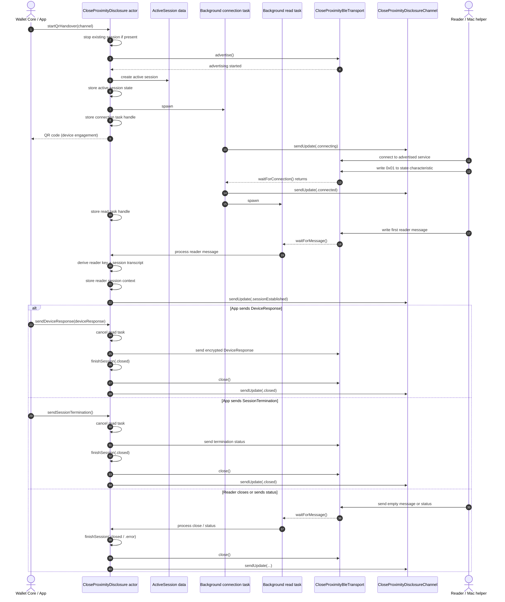

NL-Wallet Platform Support
==========================

This crate allows native Android and iOS functionality to be called from the wallet core.

# Rustdoc

Documentation on the types in this crate can be generated and inspected using the following command:

```bash
cargo doc --open
```

# Components

The functionality is split into multiple parts that are compiled in distinct steps and ultimately combined by the linker when building the app.
As there are slight differences between Android and iOS, they are described separately below.

## Android

The Kotlin implementation is contained within a small Android project `PlatformSupport`. This project contains a single module `platform_support` which produces:
* A shared library (i.e. a `.so` file) that contains the native code.
* Kotlin (binding) code, generated from the UDL files included in the crate through `uniffi-bindgen`.

Singleton classes wrap the initializers that need to be called on app startup (e.g. `initHwKeystore()`), which lets Rust know how to call the native code.
When compiling the main Android project of the app, the `platform_support` module is included as a dependency.

The final process can be visualised as follows:

```
Wallet Android Project --> wallet_core --> platform_support
            |                                 ^
            |                                 | (uniffi)
            \----->  PlatformSupport  -------/
```

### Play Integrity

The Android app supports Play Integrity integration. Currently, this is enabled
unconditionally. The Play Integrity API is throttled, which affects our testing
(our ./connectedAndroidTest task, see below). You will see HTTP 429 (backoff)
responses. This is a known issue and we are currently (as of 2025-02-13) working
to fix this by handling play integrity enablement more intelligently.

## iOS

First, there is the Swift implementation, which is contained within a small Xcode project that produces a static library (i.e. a `.a` file).
This project and static library are called `PlatformSupport`.
When compiling this Xcode project, Swift code will automatically be generated from the UDL files included in the crate through `uniffi-bindgen`.
In Swift, singleton classes wrap the initializers that need to be called on app startup (e.g. `init_hw_keystore()`), which lets Rust know how to call the native code.

Then there is the Rust code that accepts the initializer function calls and allows a consumer of this crate to call to native code.
This also uses `uniffi` during compilation to generate the necessary Rust code from the UDL files.
The `platform_support` crate is included directly in compilation of the `wallet_core` crate, which in turn produces another static library.

The two are combined in the main Xcore project of the app.
The smaller Xcode project mentioned above is included as a dependency of this project, while the `wallet_core` crate is compiled as a build step within this project.
The main project creates instances of the singleton classes on app startup in its `AppDelegate`.
Finally both static libraries that are produced are linked together with the main app binary, causing all of the required symbols to be resolved.

The final process can be visualised as follows:

```
Wallet Xcode Project --> wallet_core --> platform_support
            |                                  ^
            |                                  | (uniffi)
            \----->  PlatformSupport  --------/
```

# Hardware Keystore

Currently the functionality of this module is the following:

* Hardware backed ECDSA private keys can be created
* The derived public keys for these private keys can be retrieved
* Arbitrary payloads can be signed with the private key

This functionality is provided by traits that have multiple concrete implementations.

## Features

The module contains the following features:

* `software`: This compiles a software fallback implementation, which can be used during both testing and local development.
* `integration_test`: This feature is automatically enabled when running integration tests, it contains some helper code.
* `hardware_integration_test`: This should only be enabled when running integration tests from either Android or iOS (see below).

## Integration tests

### Software fallback

The crate contains an integration test for the software fallback, which can be run using `cargo test --features software-integration_test`.
This test simply uses the crate to create a new private key, get its public key, sign a payload and then verify the returned signature using the public key.

### Android

To run the Android integration tests: execute `./gradlew connectedAndroidTest` from the `/wallet_core/wallet/platform_support/android` directory.

Note: if you get an error like the following:

```
AndroidTestApkInstallerPlugin: ErrorName: INSTALL_FAILED_INSUFFICIENT_STORAGE
```

You will usually find that there is enough storage on the (emulated) device. You can start an `adb` shell and clear the temporary storage:

```
adb shell "rm -rf /data/local/tmp/*"
```

Then restart `./gradlew connectedAndroidTest` and you'll find the installation succeed and the tests continue normally.

### iOS

In order to run the same integration test either in the iOS simulator or on actual hardware, a test target is included in the `PlatformSupport` Xcode project.
This test target compiles the `platform_support` crate directly and includes it in a test binary (a step that is normally done by the main app Xcode project).
When run, the test target calls out to Rust code to start running the integration test, which in turn calls the Swift implementation.

This can be visualised as follows:

```
Integration test --> platform_support
      |                      ^
      |                      | (uniffi)
      \--> PlatformSupport --/
```

Note that the attested key integration tests for iOS can only be run on a real device.

## Close proximity disclosure

The close proximity handover starts a BLE peripheral server on the phone and returns a QR code containing the device engagement. The host-side Mac helper then acts as the reader: it scans for the advertised service UUID, connects, writes `0x01` to the state characteristic to start the handover, derives the first reader message from the QR code, and can validate the encrypted `DeviceResponse` in the full-flow test.

### iOS close proximity

The iOS implementation does four things:

1. Starts BLE advertising and returns a QR code with the device engagement.
2. Waits in the background for a reader to connect.
3. Reads the first reader message, derives the session transcript and session encryption, and emits `SessionEstablished`.
4. Either sends an encrypted `DeviceResponse` or a session termination status and then closes the BLE session.

The implementation currently keeps the long-running work off the `startQrHandover()` call path:

- A background connection task waits for BLE connection and emits the connected updates.
- A background read task waits for reader messages and drives session establishment and reader status handling.
- Lifecycle helpers start and stop those tasks.
- Actor-owned session helpers manage active-session ownership, task handles, session establishment state, and teardown.
- Exchange helpers handle inbound reader messages and outbound device messages.
- `CloseProximityDisclosure` owns the mutable runtime state, while `ActiveSession` is now immutable and only carries channel / transport / key material for the current handover.

This split exists so `startQrHandover()` can return the QR code immediately, while later calls such as `sendDeviceResponse()` can explicitly stop the read loop before writing the final response.



Notes:

- `startQrHandover()` must return before a reader connects, so waiting for connection cannot happen inline on that call path.
- The actor stores task handles plus the session-encryption state derived from the first reader message; `ActiveSession` itself remains immutable.
- `sendDeviceResponse()` and `sendSessionTermination()` cancel the read task first so the app does not race its own background message loop while sending the final message.
- Reader-side protocol failures are mapped to ISO 18013-5 status codes before the BLE transport is closed.

The basic manual helper is:

```bash
swift scripts/close_proximity/disclosure_mac_reader.swift
```

To exercise the `SessionEstablished` path manually, use the QR code logged by the test:

```bash
swift scripts/close_proximity/disclosure_mac_reader.swift --qr-code "<logged-qr-code>"
```

There are also host-side wrapper scripts that watch for the QR marker and launch the Mac helper automatically.

For iOS, run from the repository root:

```bash
scripts/close_proximity/run_disclosure_ios_test.py -- \
  xcodebuild test \
    -project wallet_core/wallet/platform_support/ios/PlatformSupport.xcodeproj \
    -scheme PlatformSupport \
    -only-testing:'Integration Tests/CloseProximityDisclosureTests/testCloseProximityDisclosureFullFlowWithMacReader'
```

For Android, run from the repository root:

```bash
scripts/close_proximity/run_disclosure_android_test.py -- \
  ./gradlew connectedDebugAndroidTest \
  -Pandroid.testInstrumentationRunnerArguments.class=nl.rijksoverheid.edi.wallet.platform_support.close_proximity_disclosure.CloseProximityDisclosureBridgeInstrumentedTest#test_close_proximity_disclosure_full_flow_with_mac_reader
```

Before running these tests:

* Connect a physical device
* Enable the corresponding opt-in close proximity test constant in the iOS or Android test file.
* Grant Bluetooth access to the terminal app that runs the Mac helper.
