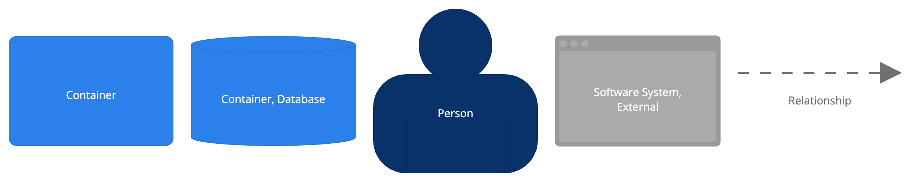

# Software System overview

The container diagram shown in Figure 2 describes all applications and data stores (containers) that are part of the NL-Wallet Software System. External systems that interact with the containers in the NL-Wallet Software System are also shown. (See the Context chapter for description of the External systems.)  

## 1. Wallet app

The Wallet app is a mobile application that  provides the user with an interface to manage stored credentials, retrieve new credentials from issuers and present stored credentials to verifiers. 
Technology: Android/iOS

Relations:

- [I-101] uses the App database to store credentials, configuration and user preferences
- [I-102] uses the Secure Element to generate and store app- and PIN private keys and perform signing operations using those keys
- [I-103] Interacts with WalletBackend for account management and HSM-assisted operations
- [I-104] Uses ConfigurationServer to get runtime configuration
- [I-105] Uses UpdateServer to get update policies
- [I-106] DigiD to start user authentication for onboarding or recovery [E-201]
- [I-107] Receive PID-credential from PID-issuer, for enrollment and recovery [E-101]
- [I-108] Retrieve Status List for revocation status of PID credentials from PID-Issuer [E-103]
- [I-109] Other Issuers, to retrieve other types of (PUB/Q)EAA credentials [E-301]
- [I-110] Retrieve Status List for revocation status of credentials from Other Issuers [E-302]
- [I-111] Verifiers, to present stored credentials [E-401]
- [I-112] Retrieve WUA Status List for revocation status of WUA
- [I-113] Request App Attest attestation from Apple (iOS only) 
## 2. App database
The App database is an on-device store that is used for storing credentials, app configuration and user preferences. 
Technology: sqlite (on Android/iOS)

For a description of the database contained in the App database, please see [Information model](../information-model/information-model.md#App-database)

Relations:
- Wallet app uses the App database [I-101]
## 3. Secure Element
The Secure Element is a tamper-resistant environment that stores cryptographic keys  and can perform actions using the stored cryptographic keys. It prevents the keys from being exposed to the rest of the system.

Technology: Secure Enclave (iOS), Trusted Execution Enivornment (Android)

Relations:
- Wallet app uses the Secure Element [I-102]

## 4. WalletBackend (WP)
WalletBackend provides backend services to support the Wallet app. WalletBackend facilitates account management, Wallet Unit Attestation status management and offers an endpoint to the Wallet app to perform HSM-assisted operations. 

Technology: axum (rust)

Relations:

- Used by Wallet App [I-103]
- [I-401] Reads from and writes to WP database (account data and WUA Status)
- [I-402] Generates and publishes WUA status list
- [I-403] Sends cryptographic instructions to HSM device to generate keys and perform signing operations
- [I-404] Wallet Unit management functions for Wallet User Support
- [I-405] Request app integrity verdict from Google Play Integrity (Android only)
- [I-406] Issue WUA to Wallet on activation

## 5. ConfigurationServer
ConfigurationServer is a content server that serves the Configuration data that is used by the app. Configuration items include: trust roots for issuer and verifier certificates, reference to current update policy, the URLs to components such as the WalletBackend, DigiD and the PID issuer, and more.

Technology: nginx (static)

Relations:
- Serves configuration to Wallet app [I-104]
- Configuration is maintained by Wallet Technical Support

## 6. UpdateServer
UpdateServer is a content server that serves the Update policy data that is used by the app. The update policy instructs the app to display update notifications to the end-user when appropriate.

Technology: nginx (static)

Relations:
•	Serves update policy to Wallet app [I-105]
•	Update policy is maintained by Wallet Technical Support

## 7. WUA status list

The WUA Status list container contains the WUA Status List(s) that provide information about the validity of Wallet Unit Attestations to consumers (Wallet app and PID-issuer). The WUA Status Lists are published by the WalletBackend.

Technology: nginx (static content, Token Status List)

Relations:
- Store Status Lists that are generated by WalletBackend [I-402]
- Status List is consumed by Wallet app [I-112] and PID Issuer [E-202]

## 8. WP database (accounts, WUA status)
The WP database contains user account data, and the statuses for issued Wallet Unit Attestations.

For a description of the database contained in the App database, please see [Information model](../information-model/information-model.md#Wallet-Backend-database)

Technology: postgres
Relations:
- Accessed by WalletBackend  [I-401]

## 9. HSM device
Dedicated cryptographic hardware used to perform issuing of keys and signing operations. 

Technology: (not specified)

Interaction:
- Receives instructions from WalletBackend to perform cryptographic operations (PKCS#11) [I-403]
