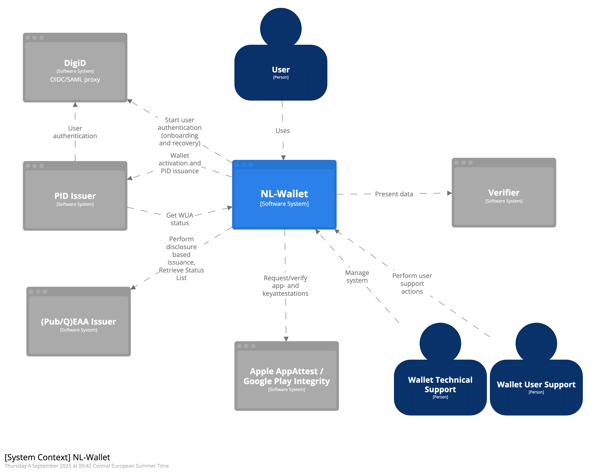

# System Context (C4)

This chapter describes the current architecture (‘IST’) of the NL-Wallet system and the context it operates in. 

## System context diagram

This system context diagram shown in  Figure 1 models the context in which the NL-Wallet operates. It describes the system, all users and other systems that interact with it.

## Users
1.	End-user
User that has installed the NL-Wallet app on his mobile device.
2.	Wallet Technical Support
Actor that performs technical administrative tasks on behalf of the support organization.
3.	Wallet User Support
User that performs support tasks for the end-user on behalf of the support organization.
## External systems
### 1. PID Issuer
The official PID Issuer of the Netherlands is the National Office for Identity Data (or ‘Rijksdienst voor Identiteitsgegevens’, RvIG). They issue Personal Identification Data (PID) of Dutch citizens to the NL Wallet, and revoke their status when necessary.

Relations:

- Issues PID-credential (including PID metadata) to NL-Wallet (authentication token is exchanged here) (OpenID4VCI)
- [E-102] Queries Wallet Unit Attestation (WUA) Status from NL-Wallet. (TSL)
- [E-103] Host Status List for issued credentials, consumed by NL-Wallet
- [E-104] Uses authentication token from Authentication session to retrieve authenticated user information from DigiD (⚠️ not in scope for NL-Wallet, this interaction is between DigiD and PID-issuer) (OIDC)
### 2. DigiD
DigiD is the public eID means of the Netherlands (see digid.nl), operated by Logius (logius.nl). The NL Wallet relies on it to authenticate users at Leval of Assurance High, during onboarding and recovery. NL-Wallet relies on a OIDC/SAML proxy for DigiD connectivity.

Relations:
- [E-201] Start authentication session of the user during onboarding and recovery scenarios (OIDC)
- Provide user identity for authentication token to PID-Issuer [E-104] (this interaction is between DigiD and PID-issuer ) (OIDC)
### 3. (Pub/Q)EAA Issuer
Any issuer of electronic attestations of attributes (EAA) with the appropriate certificates may interact with the NL-wallet to issue EAA, when the user requests it.

Relations:
- [E-301] Issues Credentials (including Credential Metadata) to NL-Wallet. (OpenID4VCI)
- [E-302] Host Status List for issued credentials, consumed by NL-Wallet
### 4. Verifier
Relying Parties receive credentials from digital wallets to provide services to the end-user. Within a wallet context, a Relying Party is called a Verifier.

Relations:
- [E-401] Interacts with NL-Wallet to receive and validate presented data from the user. (OpenID4VP)

### 5. Apple App Attest / Google Play Integrity
Online services that provide security features for iOS and Android. App Attest and Play Integrity are used to prove that an app instance is genuine and to prove that the Wallet-App private keys are stored securely.
Relations:
- [E-501] Used by NL-Wallet for attestations that assure app and key security (using App-attest and Play-Integrity) 
