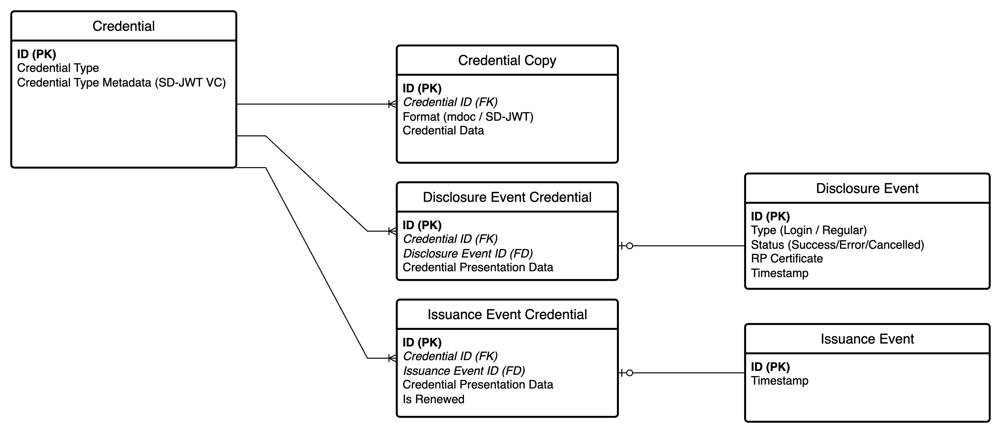
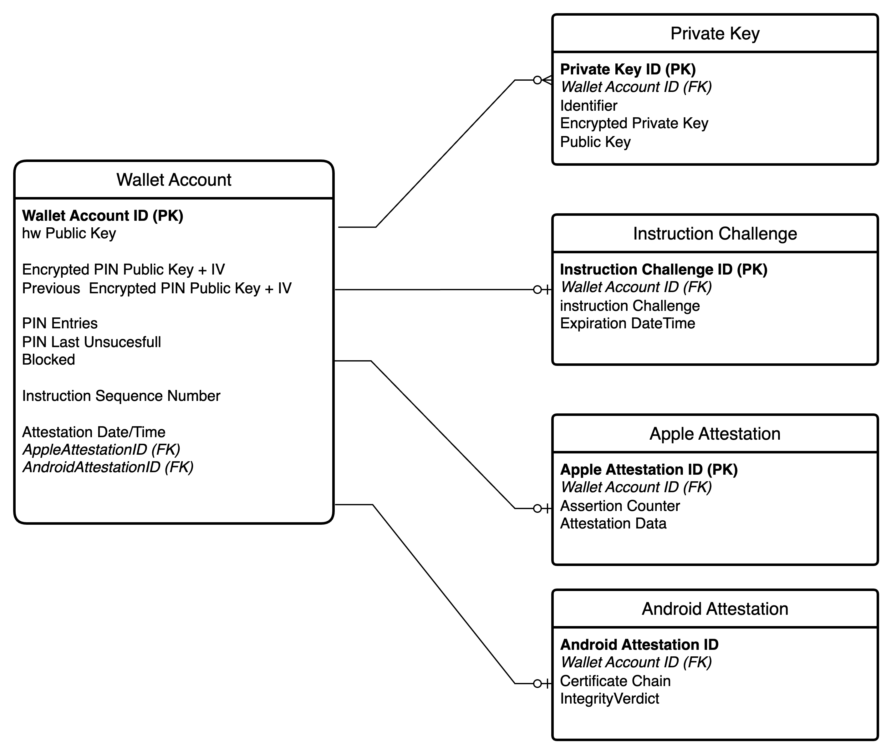

# NL-Wallet information model

This section describes the data that is persisted and processed in the containers from the [Software System](../c4/software-system.md) that contain data. 

## Wallet App database

### Wallet App Data model

#### Credential

A digital credential it's type metadata (SD-JWT VC Type Metadata). The actual credential data is stored as Credential Copy.

#### Credential copy

 Credentials are issued in batches that contain copies of the same information. All copies are stored as Credential copies.

#### Disclosure/Issuance Event Credential

An Event Credential is used for both Disclosure and Issuance Events. 

An Event Credential contains the data that is linked to an issuance or disclosure event. Event Credential data is a format-agnostic extract (from the orginial mdoc or SD-JWT document) of the actual data used in the event and will be displayed to the user next to the Event metadata. 

#### Disclosure Event
An event that relates to (attempted) disclosure of data to a relying party. The X509 certificate of the Relying Party involved is also stored along with the event.

#### Issuance Event
An event that relates to issuance of data from an issuer to the wallet.

## Wallet Backend database

### Wallet Backend Data model

#### Credential
