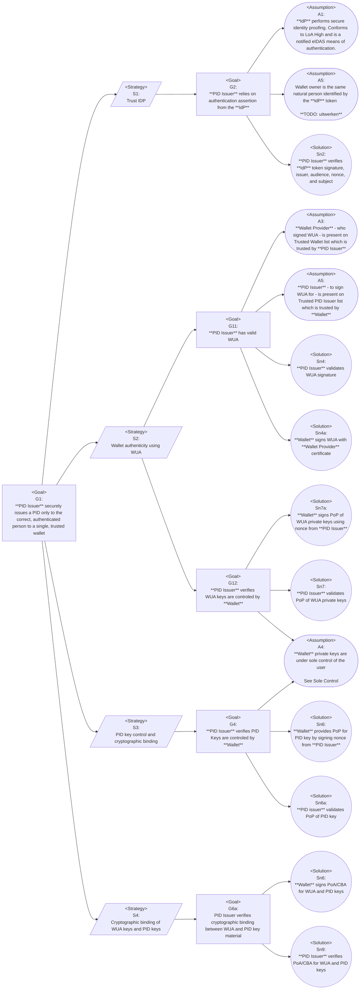

```mermaid
graph LR

    G1[&lt;Goal&gt;<br/>G1:<br/>**PID Issuer** securely issues a PID only to the correct, authenticated person to a single, trusted wallet]

    S1[/&lt;Strategy&gt;<br/>S1:<br/>Trust IDP/]
    S2[/&lt;Strategy&gt;<br/>S2:<br/>Wallet authenticity using WUA/]
    S3[/&lt;Strategy&gt;<br/>S3:<br/>PID key control and cryptographic binding/]
    S4[/&lt;Strategy&gt;<br/>S4:<br/>Cryptographic binding of WUA keys and PID keys/]

    G1 --> S1
    G1 --> S2
    G1 --> S3
    G1 --> S4

    G2[&lt;Goal&gt;<br/>G2:<br/>**PID Issuer** relies on authentication assertion from the **IdP**]
    G4[&lt;Goal&gt;<br/>G4:<br/>**PID Issuer** verifies PID Keys are controled by **Wallet**]

    S1 --> G2


  

    G6a[&lt;Goal&gt;<br/>G6a:<br/>PID Issuer verifies cryptographic binding between WUA and PID key material]
    G11[&lt;Goal&gt;<br/>G11:<br/>**PID Issuer** has valid WUA]
    G12[&lt;Goal&gt;<br/>G12:<br/>**PID Issuer** verifies WUA keys are controled by **Wallet**]

    S4 --> G6a
    S2 --> G11
    S2 --> G12
    S3 --> G4
    %% ---------------------------
    %% Assumptions (stadium)
    %% ---------------------------
    A1([&lt;Assumption&gt;<br/>A1:<br/>**IdP** performs secure identity proofing. Conforms to LoA High and is a notified eIDAS means of authentication.])
    A5([&lt;Assumption&gt;<br/>A5:<br/>Wallet owner is the same natural person identified by the **IdP** token  <br/><br/>**TODO: uitwerken** ])
    A3([&lt;Assumption&gt;<br/>A3:<br/>**Wallet Provider** - who signed WUA - is present on Trusted Wallet list which is trusted by **PID Issuer**])
    A4([&lt;Assumption&gt;<br/>A4:<br/>**Wallet** private keys are under sole control of the user<br/><br/>See Sole Control])
    A6([&lt;Assumption&gt;<br/>A5:<br/>**PID Issuer** - to sign WUA for - is present on Trusted PID Issuer list which is trusted by **Wallet**])

    G2 --> A1
    G2 --> A5
    G11 --> A3
    G11 --> A6
    G4 --> A4

    %% ---------------------------
    %% Solutions (circles)
    %% ---------------------------
    Sln2((&lt;Solution&gt;<br/>Sn2:<br/>**PID Issuer** verifies **IdP** token signature, issuer, audience, nonce, and subject))
    Sln4((&lt;Solution&gt;<br/>Sn4:<br/>**PID Issuer** validates WUA signature))
    Sln4a((&lt;Solution&gt;<br/>Sn4a:<br/>**Wallet** signs WUA with **Wallet Provider** certificate))
    Sln7((&lt;Solution&gt;<br/>Sn7:<br/>**PID Issuer** validates PoP of WUA private keys))
    Sln7a((&lt;Solution&gt;<br/>Sn7a:<br/>**Wallet** signs PoP of WUA private keys using nonce from **PID Issuer**))
    Sln6((&lt;Solution&gt;<br/>Sn6:<br/>**Wallet** provides PoP for PID key by signing nonce from **PID Issuer**))
    Sln6a((&lt;Solution&gt;<br/>Sn6a:<br/>**PID issuer** validates PoP of PID key))
    Sln8((&lt;Solution&gt;<br/>Sn6:<br/>**Wallet** signs PoA/CBA for WUA and PID keys))
    Sln9((&lt;Solution&gt;<br/>Sn9:<br/>**PID Issuer** verifies PoA/CBA for WUA and PID keys))

    G2 --> Sln2
    G4 --> Sln6
    G4 --> Sln6a
    
    G11 --> Sln4
    G11 --> Sln4a
    G12 --> Sln7a
    G12 --> Sln7
    G6a --> Sln8
    G6a --> Sln9
    G12 --> A4

```