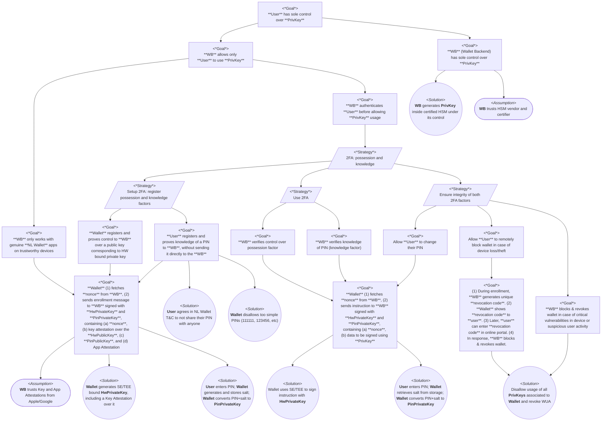

```mermaid
flowchart TD
    SoleControl["&lt;*Goal*&gt;<br>**User** has sole control over **PrivKey**"]
    
    WBAllowsUserControl["&lt;*Goal*&gt;<br>**WB** allows only **User** to use **PrivKey**"]
    SoleControl --> WBAllowsUserControl
    
    WBAllowsUserControl --> WBChecksDevice["&lt;*Goal*&gt;<br>**WB** only works with genuine **NL Wallet** apps on trustworthy devices"]

    WBAuthenticatesUser["&lt;*Goal*&gt;<br>**WB** authenticates **User** before allowing **PrivKey** usage"]
    WBAllowsUserControl --> WBAuthenticatesUser

    UserAuthStrategy[/"&lt;*Strategy*&gt;<br>2FA: possession and knowledge"/]
    WBAuthenticatesUser --> UserAuthStrategy

    WBSoleControl["&lt;*Goal*&gt;<br>**WB** (Wallet Backend) has sole control over **PrivKey**"]
    SoleControl --> WBSoleControl

    WBusesHSM@{shape: circle, label: "&lt;*Solution*&gt;<br>**WB** generates **PrivKey** inside certified HSM under its control"}
    WBSoleControl --> WBusesHSM

    TrustHSMCertififier@{shape: stadium, label: "&lt;*Assumption*&gt;<br>**WB** trusts HSM vendor and certifier"}
    WBSoleControl --> TrustHSMCertififier

    %%%%

    Setup2FA[/"&lt;*Strategy*&gt;<br>Setup 2FA: register possession and knowledge factors"/]
    UserAuthStrategy --> Setup2FA

    SetupPossessionFactor["&lt;*Goal*&gt;<br>**Wallet** registers and proves control to **WB** over a public key corresponding to HW bound private key"]
    Setup2FA --> SetupPossessionFactor

    SetupKnowledgeFactor["&lt;*Goal*&gt;<br>**User** registers and proves knowledge of a PIN to **WB**, without sending it directly to the **WB**"]
    Setup2FA --> SetupKnowledgeFactor

    WalletSendsEnrollmentMessage["&lt;*Goal*&gt;<br>**Wallet** (1) fetches **nonce** from **WB**, (2) sends enrollment message to **WB** signed with **HwPrivateKey** and **PinPrivateKey**, containing (a) **nonce**, (b) key attestation over the **HwPublicKey**, (c) **PinPublicKey**, and (d) App Attestation"]
    SetupPossessionFactor --> WalletSendsEnrollmentMessage
    SetupKnowledgeFactor --> WalletSendsEnrollmentMessage
    WBChecksDevice --> WalletSendsEnrollmentMessage

    SetupKnowledgeFactor --> PINSecrecy@{shape: circle, label: "&lt;*Solution*&gt;<br>**User** agrees in NL Wallet T&C to not share their PIN with anyone"}
    SetupKnowledgeFactor --> PINComplexity@{shape: circle, label: "&lt;*Solution*&gt;<br>**Wallet** disallows too simple PINs (111111, 123456, etc)"}
    
    WalletSendsEnrollmentMessage --> TrustAppleGoogle@{shape: stadium, label: "&lt;*Assumption*&gt;<br>**WB** trusts Key and App Attestations from Apple/Google"}
    WalletSendsEnrollmentMessage --> KeyAttestation@{shape: circle, label: "&lt;*Solution*&gt;<br>**Wallet** generates SE/TEE bound **HwPrivateKey**, including a Key Attestation over it"}
    WalletSendsEnrollmentMessage --> RegisterPINKey@{shape: circle, label: "&lt;*Solution*&gt;<br>**User** enters PIN; **Wallet** generates and stores salt; **Wallet** converts PIN+salt to **PinPrivateKey**"}

    %%%%

    Use2FA[/"&lt;*Strategy*&gt;<br>Use 2FA"/]
    UserAuthStrategy --> Use2FA

    UsePossessionFactor["&lt;*Goal*&gt;<br>**WB** verifies control over possession factor"]
    Use2FA --> UsePossessionFactor

    UseKnowledgeFactor["&lt;*Goal*&gt;<br>**WB** verifies knowledge of PIN (knowledge factor)"]
    Use2FA --> UseKnowledgeFactor

    WalletSendsInstruction["&lt;*Goal*&gt;<br>**Wallet** (1) fetches **nonce** from **WB**, (2) sends instruction to **WB** signed with **HwPrivateKey** and **PinPrivateKey**, containing (a) **nonce**, (b) data to be signed using **PrivKey**"]
    UsePossessionFactor --> WalletSendsInstruction
    UseKnowledgeFactor --> WalletSendsInstruction

    UsePINKey@{shape: circle, label: "&lt;*Solution*&gt;<br>**User** enters PIN; **Wallet** retrieves salt from storage; **Wallet** converts PIN+salt to **PinPrivateKey**"}
    SignWithHwKey@{shape: circle, label: "&lt;*Solution*&gt;<br>Wallet uses SE/TEE to sign instruction with **HwPrivateKey**"}
    WalletSendsInstruction --> SignWithHwKey
    WalletSendsInstruction --> UsePINKey

    %%%%

    Manage2FA[/"&lt;*Strategy*&gt;<br>Ensure integrity of both 2FA factors"/]
    UserAuthStrategy --> Manage2FA
    Manage2FA --> ChangePIN[&lt;*Goal*&gt;<br>Allow **User** to change their PIN]
    ChangePIN --> WalletSendsInstruction
    
    BlockIfDeviceLost[&lt;*Goal*&gt;<br>Allow **User** to remotely block wallet in case of device loss/theft]
    Manage2FA --> BlockIfDeviceLost

    BlockIfDeviceLost --> BlockWithRevocationCode["&lt;*Goal*&gt;<br>(1) During enrollment, **WB** generates unique **revocation code**. (2) **Wallet** shows **revocation code** to **user**. (3) Later, **user** can enter **revocation code** in online portal. (4) In response, **WB** blocks & revokes wallet."]
    
    BlockIfDeviceVulnerable["&lt;*Goal*&gt;<br>**WB** blocks & revokes wallet in case of critical vulnerabilities in device or suspicious user activity"]
    Manage2FA --> BlockIfDeviceVulnerable

    BlockKeysAndWUA@{shape: circle, label: "&lt;*Solution*&gt;<br>Disallow usage of all **PrivKeys** associated to **Wallet** and revoke WUA"}
    BlockIfDeviceVulnerable --> BlockKeysAndWUA
    BlockWithRevocationCode --> BlockKeysAndWUA

    %% Goal["&lt;*Goal*&gt;<br>"]
    %% Strategy[/"&lt;*Strategy*&gt;<br>"/]
    %% Context@{ shape: hex, label: "&lt;*Context*&gt;<br>" }
    %% Solution@{shape: circle, label: "&lt;*Solution*&gt;<br>"}
    %% Assumption@{shape: stadium, label: "&lt;*Assumption*&gt;<br>"}
    %% Justification@{shape: stadium, label: "&lt;*Justification*&gt;<br>"}
```
