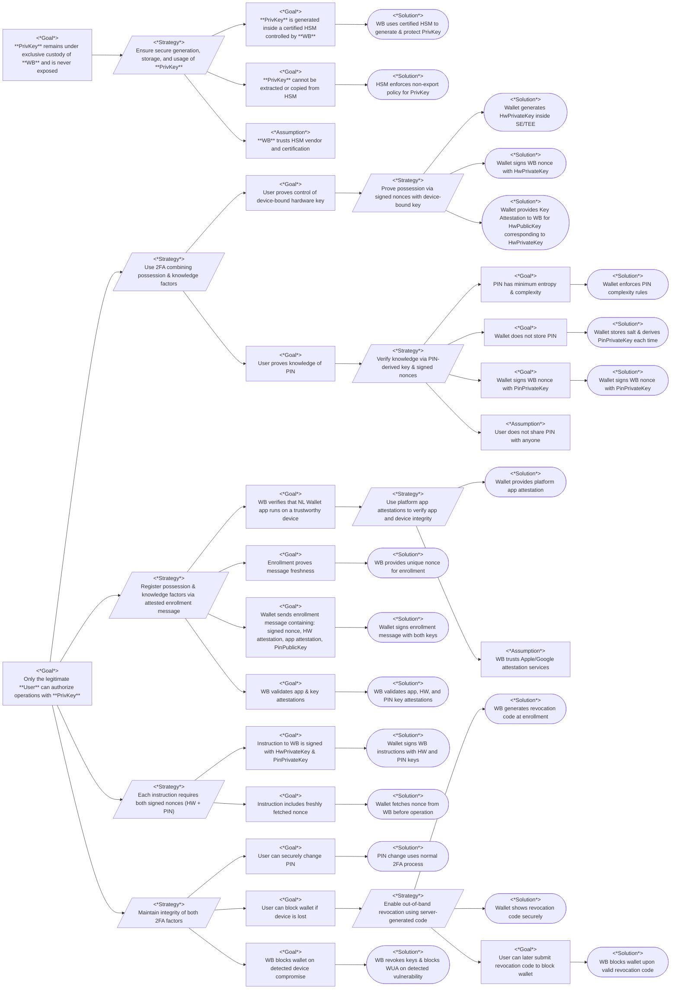

```mermaid
flowchart LR
 
%% =======================
%% TOP-LEVEL SYSTEM GOALS
%% =======================
 
G_UserAuthorization["<*Goal*><br>Only the legitimate **User** can authorize operations with **PrivKey**"]
G_KeyCustody["<*Goal*><br>**PrivKey** remains under exclusive custody of **WB** and is never exposed"]
 
%% Link top-level
G_UserAuthorization --> S_UserAuthorization
G_KeyCustody --> S_KeyCustody
 
%% =======================
%% KEY CUSTODY ARGUMENT
%% =======================
 
S_KeyCustody[/"<*Strategy*><br>Ensure secure generation, storage, and usage of **PrivKey**"/]
 
G_KeyGenHSM["<*Goal*><br>**PrivKey** is generated inside a certified HSM controlled by **WB**"]
G_PrivKeyNonExport["<*Goal*><br>**PrivKey** cannot be extracted or copied from HSM"]
G_TrustedHSMVendor["<*Assumption*><br>**WB** trusts HSM vendor and certification"]
 
S_KeyCustody --> G_KeyGenHSM
S_KeyCustody --> G_PrivKeyNonExport
S_KeyCustody --> G_TrustedHSMVendor
 
Sol_HSM(["<*Solution*><br>WB uses certified HSM to generate & protect PrivKey"])
G_KeyGenHSM --> Sol_HSM
 
Sol_HSM_NonExport(["<*Solution*><br>HSM enforces non-export policy for PrivKey"])
G_PrivKeyNonExport --> Sol_HSM_NonExport
 
%% =======================
%% USER AUTHORIZATION
%% =======================
 
S_UserAuthorization[/"<*Strategy*><br>Use 2FA combining possession & knowledge factors"/]
 
G_PossessionFactor["<*Goal*><br>User proves control of device-bound hardware key"]
G_KnowledgeFactor["<*Goal*><br>User proves knowledge of PIN"]
G_DeviceIntegrity["<*Goal*><br>WB verifies that NL Wallet app runs on a trustworthy device"]
 
S_UserAuthorization --> G_PossessionFactor
S_UserAuthorization --> G_KnowledgeFactor
 
%% =======================
%% DEVICE INTEGRITY
%% =======================
 
S_DeviceIntegrity[/"<*Strategy*><br>Use platform app attestations to verify app and device integrity"/]
G_DeviceIntegrity --> S_DeviceIntegrity
 
S_DeviceIntegrity --> Sol_AppAttest
S_DeviceIntegrity --> A_AttestationTrust["<*Assumption*><br>WB trusts Apple/Google attestation services"]

Sol_AppAttest(["<*Solution*><br>Wallet provides platform app attestation"])
 
 
%% =======================
%% POSSESSION FACTOR
%% =======================
 
S_Possession[/"<*Strategy*><br>Prove possession via signed nonces with device-bound key"/]
G_PossessionFactor --> S_Possession
 
S_Possession --> Sol_HWKeyGeneration(["<*Solution*><br>Wallet generates HwPrivateKey inside SE/TEE"])
S_Possession --> Sol_SignedNonce_HW(["<*Solution*><br>Wallet signs WB nonce with HwPrivateKey"])
S_Possession --> Sol_KeyAttestation(["<*Solution*><br>Wallet provides Key Attestation to WB for HwPublicKey corresponding to HwPrivateKey"])
 
%% =======================
%% KNOWLEDGE FACTOR
%% =======================
 
S_PIN[/"<*Strategy*><br>Verify knowledge via PIN-derived key & signed nonces"/]
G_KnowledgeFactor --> S_PIN
 
G_PINStrength["<*Goal*><br>PIN has minimum entropy & complexity"]
G_PINDerivation["<*Goal*><br>Wallet does not store PIN"]
G_SignedNonce_PIN["<*Goal*><br>Wallet signs WB nonce with PinPrivateKey"]

S_PIN --> G_PINStrength
S_PIN --> G_PINDerivation
S_PIN --> G_SignedNonce_PIN

G_PINStrength --> Sol_PINComplexity(["<*Solution*><br>Wallet enforces PIN complexity rules"])
G_PINDerivation --> Sol_PINKeyDerive(["<*Solution*><br>Wallet stores salt & derives PinPrivateKey each time"])
G_SignedNonce_PIN --> Sol_SignPINNonce(["<*Solution*><br>Wallet signs WB nonce with PinPrivateKey"])

A_UserKeepsPINSecret["<*Assumption*><br>User does not share PIN with anyone"]
S_PIN --> A_UserKeepsPINSecret
 
%% =======================
%% 2FA ENROLLMENT
%% =======================
 
S_Enrollment[/"<*Strategy*><br>Register possession & knowledge factors via attested enrollment message"/]
 
G_UserAuthorization --> S_Enrollment
 
G_NonceFreshness["<*Goal*><br>Enrollment proves message freshness"]
G_EnrollmentMessage["<*Goal*><br>Wallet sends enrollment message containing: signed nonce, HW attestation, app attestation, PinPublicKey"]
G_AttestationValidity["<*Goal*><br>WB validates app & key attestations"]
 
S_Enrollment --> G_DeviceIntegrity
S_Enrollment --> G_NonceFreshness
S_Enrollment --> G_EnrollmentMessage
S_Enrollment --> G_AttestationValidity
 
Sol_Nonce(["<*Solution*><br>WB provides unique nonce for enrollment"])
G_NonceFreshness --> Sol_Nonce
 
Sol_EnrollMsg(["<*Solution*><br>Wallet signs enrollment message with both keys"])
G_EnrollmentMessage --> Sol_EnrollMsg
 
Sol_ValidateAttest(["<*Solution*><br>WB validates app, HW, and PIN key attestations"])
G_AttestationValidity --> Sol_ValidateAttest
 
%% =======================
%% 2FA USAGE
%% =======================
 
S_Use2FA[/"<*Strategy*><br>Each instruction requires both signed nonces (HW + PIN)"/]
G_UserAuthorization --> S_Use2FA
 
G_InstructionSigned["<*Goal*><br>Instruction to WB is signed with HwPrivateKey & PinPrivateKey"]
G_InstructionFresh["<*Goal*><br>Instruction includes freshly fetched nonce"]
S_Use2FA --> G_InstructionSigned
S_Use2FA --> G_InstructionFresh
 
Sol_SignInstruction(["<*Solution*><br>Wallet signs WB instructions with HW and PIN keys"])
Sol_GetNonce(["<*Solution*><br>Wallet fetches nonce from WB before operation"])
 
G_InstructionSigned --> Sol_SignInstruction
G_InstructionFresh --> Sol_GetNonce
 
%% =======================
%% FACTOR MANAGEMENT
%% =======================
 
S_Manage2FA[/"<*Strategy*><br>Maintain integrity of both 2FA factors"/]
G_UserAuthorization --> S_Manage2FA
 
G_ChangePIN["<*Goal*><br>User can securely change PIN"]
G_BlockDeviceLost["<*Goal*><br>User can block wallet if device is lost"]
G_BlockVulnerableDevice["<*Goal*><br>WB blocks wallet on detected device compromise"]
 
S_Manage2FA --> G_ChangePIN
S_Manage2FA --> G_BlockDeviceLost
S_Manage2FA --> G_BlockVulnerableDevice
 
Sol_PINChange(["<*Solution*><br>PIN change uses normal 2FA process"])
G_ChangePIN --> Sol_PINChange
 
%% Revocation code
S_Revocation[/"<*Strategy*><br>Enable out-of-band revocation using server-generated code"/]
G_BlockDeviceLost --> S_Revocation
 
G_RevCodeUse["<*Goal*><br>User can later submit revocation code to block wallet"]
 
S_Revocation --> Sol_CodeGen(["<*Solution*><br>WB generates revocation code at enrollment"])
S_Revocation --> Sol_CodeDisplay(["<*Solution*><br>Wallet shows revocation code securely"])
S_Revocation --> G_RevCodeUse 
G_RevCodeUse --> Sol_CodeBlock(["<*Solution*><br>WB blocks wallet upon valid revocation code"])
 
%% Device-vulnerability blocking
Sol_BlockVulnerable(["<*Solution*><br>WB revokes keys & blocks WUA on detected vulnerability"])
G_BlockVulnerableDevice --> Sol_BlockVulnerable
```
