# Create a Verifier

You want to verify certain attributes of a natural person which can be disclosed
to you by the NL Wallet.

A verifier (also known as a "relying party" or an "ontvangde voorziening",
essentially an entity that wants to verify attestations presented by the
NL Wallet) will want to have a global idea of what they needs to do when
integrating their application with the NL Wallet environment.

This document provides a global outline of components used, the necessary
decisions, data, and certificate(s), and guides the setup of a so-called
verifier/relying-party/ontvangende-voorziening plus integration thereof with
their own frontend and backend.

<div class="admonition note"><p class="title">Open-source software</p>
Did you know that the NL Wallet platform is fully open-source? You can find
[the project on GitHub][6].
</div>

```{contents}
:backlinks: none
:depth: 5
:local:
```

## What we're going to cover

We'll start with an overview of the system architecture, specifically its main
components, and where to find more information.

We'll then cover the decisions you need to make regarding which attributes you
want to verify.

We'll list required fields you need to construct a `reader_auth.json` which will
become part of your reader certificate, as a X.509v3 custom extension, and we'll
show you how to create a reader certificate which contains the reader
authentication JSON document.

We'll then guide you in setting up your own `verification_server`, and how to
utilize the previously created reader certificate within a so-called use-case.

Finally, we'll show you how you can know that the things you've configured are
actually working correctly and give you guidance on how to integrate with your
own application.

<div class="admonition note"><p class="title">A note about names</p>
<p>Due to how we build upon existing standards, and due to terminology used in
other guidelines and architectures, a `verifier` is known by various other
names. Verifier, Relying Party, Reception Service, Ontvangende Voorziening and
their acronyms RP, OV, etc, by and large reference the same thing.</p>
<p>In this document we use the name `verifier` primarily, unless we know that a
document we reference uses one of these other names.</p>
</div>

## Architecture overview


In the above diagram, we see the main components involved in a disclosure
session. The main components described in the diagram are:

- [DigiD][1]: Digitale Identiteit, a digital identification system;
- [Pseudonym Service][2]: A service that pseudonimizes BSN numbers;
- [(BRP-V) Authentic Source][3]: A source of attributes, made accessible by a
  so-called Verstrekkende Voorziening (VV);
- VV: Verstrekkende Voorziening, an issuer, a party that issues attributes;
- OV: Ontvangende Voorziening, a verifier, a party that wants to verify
  attested attributes;
- Relying Party Application: An app running on-premises or in-cloud of the
  verifier that needs to do something with the result of a verification of
  attributes;
- [Wallet App][18]: The NL Wallet app running on a mobile device;

Missing from the above diagram, but worth mentioning:

- [Wallet Web][14] The frontend helper JavaScript/TypeScript library which helps
  verifiers integrate their application with the NL Wallet platform.

<div class="admonition seealso"><p class="title">Architecture documentation</p>
This document is about setting up a verifier. To have a broader view of the
NL Wallet platform as a whole, you can have a look at the [Architecture
Documents][5].
</div>

### Plaform components overview

The NL Wallet platform consists of:

  * **Issuers**: (also known as Verstrekkende Voorzieningen), which can issue
    attested attributes;
  * **Verifiers**: (also known as Ontvangende Voorzieningen or Relying Parties),
    which can verify attested attributes they are interested in, and which this
    document is mainly about;
  * **Backend**: services that run in the NL Wallet datacenter(s) or cloud that
    facilitate various functions for the mobile app (usually not interacted with
    directly, by either Issuers or Verifiers);
  * **App**: the NL Wallet mobile app, which contains attested attributes,
    received from Issuers, and which it can disclose to Verifiers.

Verifiers configure and maintain a `verification_server` on their own premises
or cloud environments, which they integrate with their own application, and which
interacts with the NL Wallet app, in order to verify attested attributes.

## Creating a reader authentication document

The subsections below describe the decisions you need to make as a verifier with
regards to attributes you want to verify, what data we require from you, how to
create a reader certificate for your usecase (which is configured for usage
within the `verification_server`).

In this guide, we assume you have [onboarded succesfully][11] - i.e., you are
running your own CA and the public key of that CA has been shared with the
operations team who will need to add your CA public key to the trust anchors of
the app.

<div class="admonition note"><p class="title">Onboarding optional</p>
Do note that onboarding is not strictly necessary - you *can* follow all steps
in this guide and observe things working in a local development environment -
but when you want to test your verifier with the NL Wallet platform (i.e., our
backend and mobile apps in our acceptance and pre-production environments), you
do need to be onboarded to get access to those environments.
</div>

### Decide on required metadata

A reader certificate contains a bunch of metadata, which we store as a part
of the certificate in a so-called X.509v3 extension. We use this data to know
which attested attribute you want to verify, and to present a view of you, the
verifier in the NL Wallet app GUI.

**REQUIRED_DATA**

| Key                             | Languages | Description                                                          |
| ------------------------------- | --------- | -------------------------------------------------------------------- |
| `purposeStatement`              | `nl+en`   | For what purpose are you attesting? Login? Age verification? etc.    |
| `retentionPolicy`               | -         | Do you have an intent to retain data? For how long?                  |
| `sharingPolicy`                 | -         | Do you have an intent to share data? With whom?                      |
| `deletionPolicy`                | -         | Do you allow users to request deletion of their data, yes/no?        |
| `organization.displayName`      | `nl+en`   | Name of the verifier as shown in the app app.                        |
| `organization.legalName`        | `nl+en`   | Legal name of the verifier.                                          |
| `organization.description`      | `nl+en`   | Short one-sentence description or mission statement of the verifier. |
| `organization.webUrl`           | -         | The home URL of the verifier.                                        |
| `organization.city`             | `nl+en`   | The home city of the verifier.                                       |
| `organization.category`         | `nl+en`   | Bank, Municipality, Trading, Delivery Service, etc.                  |
| `organization.logo.mimeType`    | -         | Logo mimetype, can be image/svg+xml, image/png or image/jpeg         |
| `organization.logo.imageData`   | -         | Logo image data. When SVG, an escaped XML string, else base64        |
| `organization.countryCode`      | -         | Two-letter country code of verifier residence.                       |
| `organization.kvk`              | -         | Chamber of commerce number of verifier.                              |
| `organization.privacyPolicyUrl` | -         | Link to verifier's privacy policy.                                   |
| `authorizedAttributes`          | -         | List of attributes you want to verify.                               |

Note: In the `Languages` column where it says `nl+en` for example, please
provide both a dutch and an english answer.

### Decide on attributes you want to verify

You can verify any attribute provided by any issuer on the plaform, but since
we don't have an issuer registry yet, you would need to know or otherwise get
your hands on the JSON documents that define the claim paths that belong to a
given `vct` (a Verifiable Credential Type).

For our own issuer(s), you can use the `jq` utility to query our supported
attribute names:

```shell
git clone https://github.com/MinBZK/nl-wallet
cd nl-wallet/wallet_core/lib/sd_jwt_vc_metadata/example
jq -r '(select(.vct | startswith("urn:")) | .vct) + ": " + (.claims[].path | join("."))' *.json | sort -u
```

The above `jq` command will output a sorted unique list of namespaces and the
attribute name that namespace supports. You will need one or more of those to
configure the `authorizedAttributes` object in `reader_auth.json`.

For example, suppose you want to verify `age_over_18` and `address.country`,
then your `authorizedAttributes` object would look as follows:

```json
"authorizedAttributes": {
    "urn:eudi:pid:nl:1": [["urn:eudi:pid:nl:1", "age_over_18"]],
    "urn:eudi:pid-address:nl:1": [["urn:eudi:pid-address:nl:1", "address.country"]],
}
```

<div class="admonition note"><p class="title">A little more background</p>
<p>In the `verification_server` we have the concept of `usecases`, which
encapsulate what you want to use a disclosure for, for example to verify a legal
age or to login to a website. Every usecase requires a reader certificate with
an X.509v3 embedded `reader_auth.json`. The `verification_server` can support
multiple `usecases`.</p>
<p>In this guide we're creating a single reader certificate (so, for a single
`usecase`), but there's nothing stopping you from creating multiple reader
certificates for different `usecases`.</p>
</div>

### Creating the JSON document

When you've collected all the required metadata, you are ready to create the
`reader_auth.json` file. For illustrative purposes, here is an example for the
municipality of Amsterdam:

```json
{
    "purposeStatement": {
        "nl": "Inloggen",
        "en": "Login"
    },
    "retentionPolicy": {
        "intentToRetain": true,
        "maxDurationInMinutes": 525600
    },
    "sharingPolicy": {
        "intentToShare": false
    },
    "deletionPolicy": {
        "deleteable": false
    },
    "organization": {
        "displayName": {
            "nl": "Gemeente Amsterdam",
            "en": "City of Amsterdam"
        },
        "legalName": {
            "nl": "Gemeente Amsterdam",
            "en": "City of Amsterdam"
        },
        "description": {
            "nl": "Alles wat we doen, doen we voor de stad en de Amsterdammers.",
            "en": "Everything we do, we do for the city and the people of Amsterdam."
        },
        "webUrl": "https://www.amsterdam.nl",
        "city": {
            "nl": "Amsterdam",
            "en": "Amsterdam"
        },
        "category": {
            "nl": "Gemeente",
            "en": "Municipality"
        },
        "logo": {
            "mimeType": "image/svg+xml",
            "imageData": "<svg width=\"64\" height=\"64\" viewBox=\"0 0 64 64\" fill=\"none\" xmlns=\"http://www.w3.org/2000/svg\"><rect width=\"64\" height=\"64\" rx=\"12\" fill=\"#FF0000\"/><path d=\"M25 53.1823L29.1985 48.9481L25 44.7139L27.8015 41.8886L32 46.1228L36.1985 41.8886L39 44.7139L34.8015 48.9481L39 53.1823L36.191 56L31.9925 51.7658L27.794 56L25 53.1823ZM25 19.2861L29.1985 15.0519L25 10.8253L27.8015 8L32 12.2342L36.191 8L38.9925 10.8253L34.794 15.0595L38.9925 19.2937L36.191 22.1114L31.9925 17.8772L27.794 22.1114L25 19.2861ZM25 36.2455L29.1985 32.0114L25 27.7848L27.8015 24.9594L32 29.1936L36.1985 24.9594L39 27.7848L34.8015 32.0189L39 36.2531L36.191 39.0709L31.9925 34.8367L27.794 39.0709L25 36.2455Z\" fill=\"white\"/></svg>"
        },
        "countryCode": "nl",
        "kvk": "34366966",
        "privacyPolicyUrl": "https://www.amsterdam.nl/privacy"
    },
    "requestOriginBaseUrl": "https://www.amsterdam.nl",
    "authorizedAttributes": {
        "urn:eudi:pid:nl:1": [["urn:eudi:pid:nl:1", "bsn"]]
    }
}
```

Take the above example, make sure you've read the previous sections which
explain what the different key/values mean, and construct your own
`reader_auth.json` file. When we're creating the reader certificate in the next
sections, we're going to need it.

<div class="admonition note">
<p class="title">Screenshot showing how reader_auth.json data is displayed</p>
<p>The data from `reader_auth.json` is used in various parts of the app. For
illustrative purposes, see below a screenshot of a screen showing details
about the municipality of Amsterdam:</p>

</div>

## Creating a reader certificate

Let's create the reader certificate. We're going to clone the NL Wallet
repository, enter its directory, set a target directory and specify an
identifier (this identifies your organization, and should be in lowercase
characters a-z, can end with numbers but may not begin with them).

We then make sure the target directory exists, and invoke `cargo` (rust's build
tool) to in turn invoke `wallet_ca` which creates the reader certificate and
key.

Finally, we invoke `openssl` to convert our PEM certificate and key into DER
format.

<div class="admonition caution">
<p class="title">Do you have a working toolchain?</p>
Make sure you have a working toolchain as documented in our GitHub project root
`README.md` [here][19]. Specifically, you need to have `rust` and `openssl`
installed and working.
</div>

<div class="admonition caution">
<p class="title">Did you create a reader_auth.json?</p>
You need a valid `reader_auth.json`, which you can base on the example shown in
the [previous section](#creating-the-json-document).
</div>

<div class="admonition caution">
<p class="title">Did you create your own CA?</p>
You need a CA certificate and key. By default, when you're running locally, the
`setup-devenv.sh` script will have created these for you. You can also opt to
create your own custom self-signed CA certificate and key, which is documented
in the [Create a CA][27] document, and which is required if you need to
participate in the NL Wallet community platform.
</div>

<div class="admonition caution">
<p class="title">Do you intend to test your verifier on the NL Wallet platform?</p>
You can test your verifier locally (more or less exactly like we do with our
`mock-relying-party` app) for which you don't need anything except the code in
our git repository. But if you want to test your verifier with the NL Wallet
platform (i.e., the NL Wallet apps on our Test Flight and Play Store Beta
environments plus backends), you will need to have succesfully completed the
[onboarding](../community/onboarding) process.
</div>

```shell
# Git clone and enter the nl-wallet repository if you haven't already done so.
git clone https://github.com/MinBZK/nl-wallet
cd nl-wallet

# Set and create target directory, identifier for your certificates.
export TARGET_DIR=target/ca-cert
export IDENTIFIER=foocorp
mkdir -p "${TARGET_DIR}"

# Create the reader certificate using wallet_ca.
cargo run --manifest-path "wallet_core/Cargo.toml" --bin "wallet_ca" reader \
    --ca-key-file "${TARGET_DIR}/ca.${IDENTIFIER}.key.pem" \
    --ca-crt-file "${TARGET_DIR}/ca.${IDENTIFIER}.crt.pem" \
    --common-name "reader.${IDENTIFIER}" \
    --reader-auth-file "reader_auth.json" \
    --file-prefix "${TARGET_DIR}/reader.${IDENTIFIER}"

# Convert certificate PEM to DER.
openssl x509 \
    -in "${TARGET_DIR}/reader.${IDENTIFIER}.crt.pem" -inform PEM \
    -out "${TARGET_DIR}/reader.${IDENTIFIER}.crt.der" -outform DER

# Convert key PEM to DER.
openssl pkcs8 -topk8 -nocrypt \
    -in "${TARGET_DIR}/reader.${IDENTIFIER}.key.pem" -inform PEM \
    -out "${TARGET_DIR}/reader.${IDENTIFIER}.key.der" -outform DER
```

The used CA public certificate (referenced in the previous `wallet_ca` command)
needs to be in the list of various so-called trust anchors. Specifically,
issuers and the NL Wallet app itself need to know if this CA is a trusted CA,
and our software "knows" that by checking its trust anchors.

When you run locally, when using `setup-devenv.sh` and `start-devenv.sh`, the
generated CA certificate is automatically added to the trust anchors within the
configuration files of pid_issuer, demo_issuer, and the NL Wallet app config.

When you [create your own CA][27], you need to make sure the public key of your
CA is in the relevant trust anchor configuration settings. When you are a
member of the [NL Wallet community][11], and so using NL Wallet managed backend
services and mobile apps, this is done for you (i.e., you just need to sign
your reader certificate with your CA, which the `wallet_ca` utility invocation
above did for you, and during the NL Wallet community [onboarding][11] process
you shared your CA certificate with the operations team who ensure your CA is
in the various trust anchor lists).

When you run locally, but with a manually created CA, you need to add the CA
public certificate to your services and wallet app config yourself. We will
cover how to do that in this guide.

## Verification server setup

After you have created a reader certificate following the previously documented
steps, you are ready to setup and configure your `verification_server`.

### Obtaining the software

The `verification_server` binary can be obtained by downloading a pre-compiled
binary from our [releases][20] page, or by compiling from source. To compile
from source, make sure you have our git repository checked out and make sure
you've [configured your local development environment][19]. Then:

```shell
cd nl-wallet
cargo build \
  --manifest-path wallet_core/Cargo.toml \
  --package verification_server \
  --bin verification_server \
  --locked --release
```

The above command creates `wallet_core/target/release/verification_server`,
which is a release binary for the platform you're running on.

<div class="admonition note">
<p class="title">About default feature flags</p>
Note that since we don't specify a `--features` argument in the above `cargo`
command, the default feature flags apply. For `verification_server`, this
happens to be just `postgres`. When you build for local development, the build
script enables another feature flag called `allow_insecure_url`, which would
allow a `verification_server`'s `request_uri` field to contain an
(insecure) `http://` URL in addition to a `https://` URL.
</div>

<div class="admonition danger">
<p class="title">Don't allow insecure URLs on production-like environments</p>
Don't enable `allow_insecure_url` on anything remotely production-like. To have
an idea about why, have a look at the [disclosure flow diagram][21]. Where you
see `request_uri` mentioned, is where you would potentially communicate without
encryption, should you inadvertently have enabled this feature flag.
</div>

### Using a database backend (optional)

The `verification_server`, when compiled with the `postgres` feature flag
(which is the default), can use a PostgreSQL database backend to store state.
This is done by configuring a `postgres://` storage URL in the
`verification_server.toml` configuration file. In this section, we'll create a
PostgreSQL database, configure credentials and configure the schema
(tables, columns).

<div class="admonition tip">
<p class="title">You can also run without a database backend</p>
Note that you can run `verification_server` with a storage URL `memory://`
(which is the default and makes the server store session state in memory).
**When using in-memory session state, on server shutdown or crash, any session
state will be lost.**
</div>

#### Setting up PostgreSQL

You might already have a PostgreSQL database running, in which case you need the
credentials of a database user with `createdb` and `createrole` role attributes,
and the hostname of the system running the PostgreSQL database (can be localhost
or any fully-qualified domain name).

When you don't have a PostgreSQL database service running, you can create one
following the [installation instructions][22] or you can use something like
[docker][23] to run a containerized PostgreSQL service, which we'll document
here.

<div class="admonition note">
<p class="title">Use correct credentials and hostname in commands below</p>
When you decide to use your own previously configured PostgreSQL database
service, make sure you don't execute the `docker run` command which creates
a new PostgreSQL database service, and make sure you use the correct hostname,
username an password values.
</div>

```shell
# Specify database hostname, superuser name and password for PostgreSQL itself
# (change these if you're using you own previously created database service):
export PGHOST=localhost
export PGPORT=5432
export PGUSER=postgres
export PGPASSWORD="$(openssl rand -base64 12)"

# Specify database hostname, verification_server database name, user name and
# password for verification_server:
export DB_NAME=verification_server
export DB_USERNAME=wallet
export DB_PASSWORD="$(openssl rand -base64 12)"
```

Let's use Docker to run PostgreSQL, using a volume named `postgres` for the
database storage. We'll run in the background (the `--detach` option) and
auto-clean up the running container after stop (`--rm`). We're using the
previously declared environment variables for hostname, user and password
values:

```shell
# Run a Docker image named postgres, set superuser password to $PGPASSWORD.
docker run --name postgres --volume postgres:/var/lib/postgresql/data \
--rm  --detach --publish $PGPORT:5432 --env POSTGRES_PASSWORD="$PGPASSWORD" postgres
```

#### Create user and database

Next, we'll create a user for the database and the database itself:

```shell
# Below psql commands use PGHOST, PGPORT, PGUSER and PGPASSWORD to execute.
psql -c "create user $DB_USERNAME with password '$DB_PASSWORD';"
psql -c "create database $DB_NAME owner $DB_USERNAME;"
```

#### Apply database schema

To initialize the `verification_server` database schema, we will utilize the
migration tool helper:

<div class="admonition danger">
<p class="title">Applying the database schema using fresh is destructive</p>
Applying the `verification_server` database schema using the `fresh` argument is
destructive! Any tables are cleared, data will be destroyed. Be sure you don't
run this on a currently operational production copy of `verification_server`.
The migration tool also supports an ostensibly non-destructive argument `up`
which would not re-initialize the entire database, but as of this writing
(2025-09-09) we don't yet guarantee that our database initialization scripts
are non-changing, and hence, `up` might not work as intended.
</div>

```shell
cd nl-wallet
DATABASE_URL="postgres://$DB_USERNAME:$DB_PASSWORD@$PGHOST:$PGPORT/$DB_NAME" \
cargo run \
  --manifest-path wallet_core/wallet_server/server_utils/migrations/Cargo.toml \
  --bin verification_server_migrations -- fresh
```

You can show the configuration by issuing the following (might be a good idea
to keep this safe somewhere):

```shell
echo -e "\npostgres.host: '$PGHOST'\npostgres.port: '$PGPORT'\npostgres.user: '$PGUSER'\npostgres.pass: '$PGPASSWORD'\ndatabase.name: '$DB_NAME'\ndatabase.user: '$DB_USERNAME'\ndatabase.pass: '$DB_PASSWORD'\n"
```

### Creating a configuration

Alright, you have a reader certificate, you have might have configured a
database (optional), so you are now ready to create a `verification_server.toml`
configuration file.

<div class="admonition note">
<p class="title">Example configuration file</p>
For reference, we have an annotated [example configuration file][24] which you
can check for the various settings you can configure. We cover most (all?) of
them here.
</div>

In the following sections we'll create environment variables and configuration
file parts for specific settings, which we will use later to construct the
configuration file itself. In all code blocks we assume you are working within
the `nl-wallet` git repository (i,e., the `cd nl-wallet` is mostly informative).

The order of the following sections is equal to how these settings are written
in the resulting [verification_server.toml](#writing-the-configuration-file).

#### Logging settings (optional)

To configure request logging and specify if we want the log output in the JSON
format, we set the following:

```shell
cd nl-wallet
export TARGET_DIR=target/vs-config && mkdir -p "$TARGET_DIR/parts"
cat <<EOF > "$TARGET_DIR/parts/01-logging-settings.toml"
log_requests = true
structured_logging = false
EOF
```

<div class="admonition note">
<p class="title">Optional runtime logging using env_logger</p>
In addition to the above, the NL Wallet uses [env_logger][17], which means you
can use the `RUST_LOG` environment variable when running `verification_server`
later on. For example, to run with debug log output, you can prefix the command
with the `RUST_LOG` environment variable: `RUST_LOG=debug ./verification_server`
</div>

#### The ephemeral ID secret

The ephemeral ID secret is used for (rotating) QR code generation, and
configured once in the `verification_server.toml`:

```shell
cd nl-wallet
export TARGET_DIR=target/vs-config && mkdir -p "$TARGET_DIR/parts"
cat <<EOF > "$TARGET_DIR/parts/02-ephemeral-id-secret.toml"
ephemeral_id_secret = "$(dd if=/dev/urandom bs=64 count=1 | xxd -p | tr -d '\n')"
EOF
```

#### Configuring trust anchors

When you [created a reader certificate](#creating-a-reader-certificate), you
signed that certificate using a CA, either generated by the development setup
script or specifically [created by you][27] as part of the (optional)
[community onboarding process][11].

The verification server distinguishes two kinds of trust anchors:

  * `issuer_trust_anchors` - a string array of CA certificates which are
    considered trusted to sign issuer certificates, in DER format, base64
    encoded;
  * `reader_trust_anchors` - a string array of CA certificates which are
    considered trusted to sign reader certificates, in DER format, base64
    encoded;

The trust anchor arrays tell the verification server which certificates it can
trust. If a verification server is presented with certificates signed by a CA
that is not in its trust anchor arrays, operations will fail (by design).

We need to trust our own CA, whether it is created by the development setup
scripts or explicitly by you. The development scripts create a separate CA for
issuers and readers (usually at `scripts/devenv/target/ca.issuer.crt.der` and
`scripts/devenv/target/ca.reader.crt.der`). When you create and use your own
CA for community development purposes as [documented here][27], you can use that
CA generally for signing both issueance and reader certificates, and hence, add
it to both the issuer and reader trust anchors.

The below code block will initialize the issuer and reader trust anchor
environment variables with the CA certificates it can find, both generated by
development scripts and any you created yourself, provided you [followed the CA
creation instructions to the letter][27] and used the naming convention
documented there which means you would have a `target/ca-cert` directory with
your CA certificates in DER format there. The code block assumes you have the
`nl-wallet` git repository checked out.

```shell
cd nl-wallet
export VS_ISSUER_TRUST_ANCHORS=()
export VS_READER_TRUST_ANCHORS=()
for i in scripts/devenv/target/ca.issuer.crt.der target/ca-cert/ca.*.crt.der; do \
    [[ -f $i ]] && VS_ISSUER_TRUST_ANCHORS+=($(openssl base64 -e -A -in $i)); done
for r in scripts/devenv/target/ca.reader.crt.der target/ca-cert/ca.*.crt.der; do \
    [[ -f $r ]] && VS_READER_TRUST_ANCHORS+=($(openssl base64 -e -A -in $r)); done

export TARGET_DIR=target/vs-config && mkdir -p "$TARGET_DIR/parts"
cat <<EOF > "$TARGET_DIR/parts/03-trust-anchors.toml"
issuer_trust_anchors = [$(printf '"%s",' "${VS_ISSUER_TRUST_ANCHORS[@]}" | sed 's/,$//')]
reader_trust_anchors = [$(printf '"%s",' "${VS_READER_TRUST_ANCHORS[@]}" | sed 's/,$//')]
EOF
unset VS_ISSUER_TRUST_ANCHORS VS_READER_TRUST_ANCHORS
```

#### Determine public URL

The `public_url` is the URL that is used by the NL Wallet app to reach the
public address and port of the `verification_server`:

```shell
export TARGET_DIR=target/vs-config && mkdir -p "$TARGET_DIR/parts"
cat <<EOF > "$TARGET_DIR/parts/04-public-url.toml"
public_url = "https://verify.example.com/"
EOF
```

<div class="admonition note">
<p class="title">Use a valid domain name here</p>
In the above, we use `verify.example.com` as the fully-qualified domain name.
Technically, this domain needs not be world-reachable, but it does need to DNS
resolve for the NL Wallet app and the verification server. Make sure you use a
domain that is yours and that you control.
</div>

<div class="admonition warning">
<p class="title">A note about allowed public URL schemes</p>
When you [built or otherwise obtained](#obtaining-the-software) the verification
server software, you did not specify the `allow_insecure_url` feature flag. This
means you would *need* to specify an `https://` url here.
</div>

#### Universal link base URL

The `verification_server` uses the universal link base URL to construct the
correct environment-specific universal link. A universal link is used to to
associate a specific domain name and/or part of an URL with a specific app on
the mobile device. In our case, it results in the link provided by the
`verification_server` being handled by the NL Wallet app when a user clicks
on the link or scans the QR code.

A universal link base URL is usually associated with a specific backend
environment like pre-production or testing. When you're integrating with the
NL Wallet platform, you would use a universal link base URL that was provided
to you as part of our community [onboarding][11] process.

```shell
cd nl-wallet
export TARGET_DIR=target/vs-config && mkdir -p "$TARGET_DIR/parts"
cat <<EOF > "$TARGET_DIR/parts/05-universal-link-base-url.toml"
universal_link_base_url = "https://app.example.com/ul/"
EOF
```

<div class="admonition warning">
<p class="title">Make sure your domain is configured correctly</p>
You as the owner of the domain (`example.com` in the above example setting)
need to make sure the domain is configured correctly for universal links to
work correctly. On Apple iOS devices this is done with [associated domains][25].
On Google Android this is configured using [app links][26].
</div>

#### Access restriction settings (optional)

There are various settings related to access restriction available. You can set
an `api_key` to authenticate access to the requester API, you can configure
cross-origin-resource-sharing (CORS) settings using the `allow_origins` option,
and you can restrict which wallets are allowed to talk to you by configuring
`wallet_client_ids`.

<div class="admonition note">
<p class="title">Not mandatory, but nonetheless wise to configure</p>
These settings are not mandatory, but it is wise to configure these. Note that
`api_key` *is* required when you don't configure a requester interface. see the
[configuring listener addresses and ports](#configuring-listener-addresses-and-ports)
section for more information about configuring listeners.
</div>

In the following sections, we document each of these access restriction
settings.

##### Configuring allowed client IDs

You can restrict which NL Wallet apps are accepted by the verification server
by configuring a `wallet_client_ids` array. The entries of this array would
contain the `client_id` value of a wallet implementation. This allows you to
allow-list groups of wallet apps based on their `client_id` value. For example,
for allowing apps that have `https://wallet.edi.rijksoverheid.nl` configured as
`client_id`:

```shell
cd nl-wallet
export VS_WALLET_CLIENT_IDS=("https://wallet.edi.rijksoverheid.nl")
export TARGET_DIR=target/vs-config && mkdir -p "$TARGET_DIR/parts"
cat <<EOF > "$TARGET_DIR/parts/06-wallet-client-ids.toml"
wallet_client_ids = [$(printf '"%s",' "${VS_WALLET_CLIENT_IDS[@]}" | sed 's/,$//')]
EOF
unset VS_WALLET_CLIENT_IDS
```

##### Configuring cross-origin resource sharing

To configure CORS, you need to add an `allow_origins` array with a list of all
the origin URLs you want to allow. For example:

```shell
cd nl-wallet
export VS_ALLOW_ORIGINS=("https://example.com/")
export TARGET_DIR=target/vs-config && mkdir -p "$TARGET_DIR/parts"
cat <<EOF > "$TARGET_DIR/parts/07-allow-origins.toml"
allow_origins = [$(printf '"%s",' "${VS_ALLOW_ORIGINS[@]}" | sed 's/,$//')]
EOF
unset VS_ALLOW_ORIGINS
```

##### Configuring an API key

When you configure an `api_key`, requests to the requester API will need an
`Authorization` HTTP header containing a bearer token which looks like this:
`Bearer your_secret_key`.

For example, to configure a random 32 character string as an api key:

```shell
cd nl-wallet
export TARGET_DIR=target/vs-config && mkdir -p "$TARGET_DIR/parts"
cat <<EOF > "$TARGET_DIR/parts/08-requester-api-key.toml"

[requester_server.authentication]
api_key = "$(tr -dc A-Za-z0-9 </dev/urandom | head -c 32)"
EOF
```

#### Configuring listener addresses and ports

The server can be configured to listen on a single IP address and port, or with
a separate private (requester) and public (wallet) IP address and port. The
private address can be internal and should be reachable to the application that
integrates with the verifier. The public address needs to be reachable by apps
like the NL Wallet mobile app.

In our case, we'll configure separate addresses and ports for the private and
public interfaces:

```shell
cd nl-wallet
export TARGET_DIR=target/vs-config && mkdir -p "$TARGET_DIR/parts"
cat <<EOF > "$TARGET_DIR/parts/09-listener-addresses-and-ports.toml"

[requester_server]
ip = "10.11.12.13"
port = 8002

[wallet_server]
ip = "0.0.0.0"
port = 8001
EOF
```

<div class="admonition warning">
<p class="title">Configure a correct and secure private IP address</p>
In the above configuration settings, we set `10.11.12.13` as the private address
on which `verification_server` will host its so-called "requester" interface.
Make sure this is a valid address for your networking environment, and that it
is hosted securely, and reachable by the application that needs to integrate
with the verifier. Do not configure `0.0.0.0` as the private address, or if you
have to, set an `api_key` so the private interface API is protected from
unauthorized access.
</div>

<div class="admonition warning">
<p class="title">Configure an API key when you use a single address and port</p>
<p>In the above settings, we configure a separate private and public interface.
Your application talks to the private address and port and the "outside" world
talks to the public address and port.</p>
<p>If you need to configure `verification_server` to listen on a *single*
address and port, you only configure the `[wallet_server]` section of the config
file and leave out the `[requester_server]` section. In that case, you are
*required* to configure an `api_key` under the `[requester_server.authentication]`
section (note that API key configuration is optional when you have a separate
private address and port configured). We cover configuration of an API key in
the [Configuring an API key](#configuring-an-api-key) section.</p>
</div>

#### The storage settings (optional)

The default storage settings URL is `memory://`, which causes the server to
store session state in-memory, which is ephemeral - i.e., on server crash or
shutdown, any existing session state is lost. If you don't have a `[storage]`
section in your configuration, then `memory://` is used.

##### Using in-memory session state

```shell
cd nl-wallet
export TARGET_DIR=target/vs-config && mkdir -p "$TARGET_DIR/parts"
cat <<EOF > "$TARGET_DIR/parts/10-storage-settings.toml"

[storage]
url = "memory://"
EOF
```

##### Using database persisted session state

```shell
cd nl-wallet
export TARGET_DIR=target/vs-config && mkdir -p "$TARGET_DIR/parts"
cat <<EOF > "$TARGET_DIR/parts/10-storage-settings.toml"

[storage]
url = "postgres://$DB_USERNAME:$DB_PASSWORD@$PGHOST:$PGPORT/$DB_NAME"
EOF
```

<div class="admonition warning">
<p class="title">Make sure database setting environment variables are set</p>
When you use the `postgres://` URL, you tell the server to store session state
in a PostgreSQL database. In the above, we assume you still have the environment
variables configured like we documented in the database configuration section
(i.e., [Using a database backend](#setting-up-postgresql)).
</div>

#### Configuring a hardware security module (optional)

You can opt to use a hardware security module (HSM) to store private keys for
use cases. To do so we need to configure a few things:

```shell
cd nl-wallet
export TARGET_DIR=target/vs-config && mkdir -p "$TARGET_DIR/parts"
cat <<EOF > "$TARGET_DIR/parts/11-hardware-security-module.toml"

[hsm]
library_path = "/path/to/some/pkcs11-compatible/library.so"
user_pin = "12345678"
max_sessions = 3
max_session_lifetime_in_sec = 900
EOF
```

<div class="admonition note">
<p class="title">Make sure you specify a correct library path</p>
The HSM functionality depends on a PKCS#11 compatible shared library which will
have been provided by your HSM vendor. Technically you can also use any PKCS#11
implementation here. For development purposes we test with the [softhsm2][28]
library, which is usually called something like `libsofthsm2.so` (the path
location and filename extension differs per operating system and/or packaging
environment).
</div>

<div class="admonition note">
<p class="title">Private key field needs to be a key label when using HSM type</p>
<p>When using a hardware security module, the `private_key` field of the use
case needs to be the HSM key label.</p>
<p>It is possible to use *both* hardware *and* software private keys in the same
verification server instance. Simply make sure you set `private_key_type` to
`hsm` for HSM managed keys and to `software` when using base64 encoded DER
strings in the `private_key` field. </p>
</div>

#### Configuring a use case

In the [Creating a reader certificate](#creating-a-reader-certificate) section
we've created a reader certificate for your use case.

We'll assume your use case certificate is in the `DER` format, stored under
`target/ca-cert` and named matching `reader.*.{crt,key}.der` (which it will be
if you followed this guide to create them).

You'll have to come up with some name for your use case. In the settings below,
we set the name `login-mijn-amsterdam`, which is in line with earlier examples
used during the creation of the reader certificate. Note that the name is only
used as an identifier, it can be freely chosen.

```shell
cd nl-wallet
export TARGET_DIR=target/vs-config && mkdir -p "$TARGET_DIR/parts"
cat <<EOF > "$TARGET_DIR/parts/12-use-case.toml"

[usecases.login-mijn-amsterdam]
session_type_return_url = "samedevice"
certificate = "$(cat target/ca-cert/reader.*.crt.der | openssl base64 -e -A)"
private_key = "$(cat target/ca-cert/reader.*.key.der | openssl base64 -e -A)"
private_key_type = "software"
EOF
```

#### Writing the configuration file

In the previous sections, you've created a bunch of partial configuration blocks
which we will use in this section to generate our `verification_server.toml`
configuration file. To generate our configuration file, issue the following
command:

```shell
cd nl-wallet
export TARGET_DIR=target/vs-config && mkdir -p "$TARGET_DIR/parts"
cat "$TARGET_DIR"/parts/*.toml > "$TARGET_DIR/verification_server.toml"
```

You should now have a configuration file in the `$TARGET` directory called
`verification_server.toml`. Feel free to check the file to see if everything
looks like you'd expect.

### Running the server for the first time

In section [Obtaining the software](#obtaining-the-software) we have described
how you can obtain the software. In this section, we assume you have a Linux
AMD64 static executable called `verification_server` that you can run. Make sure
the configuration file `verification_server.toml` is in the same directory as
the binary and run it in the foreground as follows:

```shell
./verification_server
```

If all went well, the server is now running and ready to serve requests. To test
the service, you can send session initiation and status requests to it (check
out the [API specifications](#verifier-api-specifications) section for how to do
that).

Make sure to consider your [logging settings](#logging-settings-optional) if you
need to troubleshoot.

### Validating your setup

During startup, the `verification_server` performs some checks on the
configuration to prevent common configuration problems. Most notably the
following checks are performed:

- Verify all use-case certificates are valid;
- Verify all use-case certificates are signed by any of the
  `reader_trust_anchors`;
- Verify all use-case certificates are reader-certificates, and contain the
  necessary Extended Key Usages and the `reader_auth.json`;
- Verify all use-case key-pairs are valid, i.e., the public and private keys
  should belong together;

If this process discovers any configuration errors, the application will report
an error and abort. For more insights into this process,
[enable logging](#logging-settings-optional).

## Verifier API specifications

The API specifications for the [private][15] (also known as the `requester`) and
[public][16] (also known as the `wallet`) endpoints are available in the
`wallet_docs/openapi` part of of the git repository.

Have a look at the [OpenAPI Specifications][30] section to learn how to open and
use these.


## How disclosure sessions work

Now that you can interact with the NL Wallet platform, you are ready to start
working on integrating your own application.

The previously configured `verification_server`, is a software component
developed by the NL Wallet team which you as a verifier run on-premises or
within your cloud environment in order to interact with the NL Wallet platform.

In the following subsections we'll give you a high-level overview of what a
verifier looks like, how to integrate it with your application and some
directions with regards to API specifications.

### What a disclosure session looks Like



In the above flow diagram you see the components involved in a disclosure
session. Except for the "PID Issuer (VV)" and the "Wallet App", these run on
premises or within cloud environment(s) of the verifier (i.e., you).

Let's walk through a typical (cross-device, note on same-device flows in
following section) disclosure session (for full details, have a look at the
VV/OV SAD and our [component interaction flow for disclosures](../architecture/use-cases/disclosure-with-openid4vp)).

Note the possible session states:

- `CREATED`: _session created_
- `WAITING_FOR_RESPONSE`: _waiting for user to scan or follow QR/UL_
- `DONE` _which has substates: `SUCCES`, `FAILED`, `CANCELED`, and `EXPIRED`_

Note the "actors/components" we distinguish between:

- `user`: _user of the app, initiating an attribute disclosure session_
- `wallet_app`: _the NL Wallet app, running on a users' mobile phone_
- `verification_server`: _the verification_server component of the OV_
- `rp_frontend`: _the (JavaScript/HTML/CSS) frontend of the verifier app_
  _can be-or-use previously mentioned `wallet_web` JavaScript helper library_
- `rp_backend`: _the (server) backend of the verifier application_

In the diagram, the `user` is the small stick-figure at the top, the actor who
initiates some task they wants to accomplish. the `wallet_app` is the blue box
on the right. The `verification_server` is the big block in the middle (shown as
"Verifier Service (Ontvangende Voorziening, OV)" containing the configuration,
the verifier, and the validator components). The `rp_frontend` and `rp_backend`
are represented by the big orange/beige block on the left (shown as "Relying
Party Application").

Overview of a flow for cross device attribute disclosure:

1. `user` initiates action (i.e., clicks a button on web page of verifier
   in their desktop or mobile webbrowser);
2. `rp_frontend` receives action, asks `rp_backend` to initiate session;
3. `rp_backend` in turn calls `verification_server` with a session
   initialization request, receiving a `session_url`, an `engagement_url`, and a
   `disclosed_attributes_url` as a response. The session initially has a
   `CREATED` status;
4. `rp_backend` keeps `disclosed_attributes_url` for itself, and returns
   `session_url` and `engagement_url` to `rp_frontend`;
5. `rp_frontend` encodes a QR/UL (QR Code, universal link) using the
   `engagement_url` and displays this to the `user`;

The `user` can now activate their `wallet_app` QR scanner and scan the QR or
navigate to the universal link (UL). In parallel, `rp_frontend` will poll the
`session_url` which will change status due to action (or inaction) by the
`user`. So, assuming everything goes fine:

6. `rp_frontend` polls `session_url` for status. It will re-poll for a
   configured time-limit when receiving a `CREATED` or `WAITING_FOR_RESPONSE`
   status. The poll will terminate on `DONE`;
7. After `user` completes the scanning of the QR or followed the universal link,
   `wallet_app` parses/extracts the QR/UL and starts a device engagement session
   with `verification_server`, which in turn returns the verifier details
   and the requested attributes to the `wallet_app`;
8. The `wallet_app` shows the verifier details and the requested attributes
   to the `user` and gives the `user` the option to consent or abort;

The `user` can abort, which will terminate the session with a `CANCELED` status.
The `user` can also wait too long, which would result in an `EXPIRED` status.
The `FAILED` status can occur when other, infrastructural and/or network-related
problems are encountered. Assuming the `user` consented, let's continue:

9. `wallet_app` sends a device response containing the disclosed attributes and
   proofs_of_possession to the `verification_server`;
10. `verification_server` validates if attributes are authentic and valid and if
    they belong together and returns an indication of success back to the
    `wallet_app`, which in turn confirms the success by displaying a dialog to
    the `user`. `verification_server` additionally updates the status of the
    session to `DONE` with the `SUCCESS` substate (assuming validation went
    fine);
11. The poll running on the `rp_frontend` will terminate due to the `DONE`
    session state;
12. The `rp_frontend` returns the result of the session to the `rp_backend`;
13. The `rp_backend` checks the status of the session. On `DONE` with substate
    `SUCCESS`, it will call the associated `disclosed_attributes_url` which it
    kept around (saved) in step 4 to retrieve the disclosed attributes. When
    substate is not `SUCCESS`, it will not retrieve the disclosed attributes but
    invoke an error_handler of sorts (for example) which displays the error
    condition;
14. `rp_backend` handles disclosed attributes, returns status to `rp_frontend`
    (for example: user is authenticated, here have a token);

### Cross device vs. same device flows

Same-device flows differ from cross-device flows in how the QR/UL is encoded.
The `rp_frontend` detects the user-agent and from that determines if a
Cross-device or Same-device flow is appropiate. When it encodes for a
Same-device flow, the resulting Universal link can be directly opened by the
`wallet_app` on the same device, which then starts device engagement towards the
`verification_server` (see step 7 above).

## Requirements applicable to your application

Below you'll find a list of things to know about the NL Wallet platform and more
specifically, what you need to keep in mind when you integrate the usage of the
app for identification or verification of attributes with your application:

- The NL Wallet app presents attestations using the [OpenID4VP][10] protocol
  standard using either the [SD-JWT][29] or the [ISO/IEC 18013-5:2021 MDOC][8]
  credential format;
- Any disclosure session initiation request must include the reason why the
  verifier is requesting the attributes;
- A verifier **MUST NOT** track, in the broadest sense of the word;
- A verifier needs to adhere to the EU-GDPR (Nederlands: EU-AVG)
  [GDPR][12];
- It is required to follow accessibility guidelines set forth in the [WCAG][13];
- It is expected that you use the `wallet_web` frontend helper library;
- The standard buttons for login and sharing should be used, but one can use
  custom button text (within reason);
- Button styling and call-to-action can be customized by verifier;
- The text "NL Wallet" should always be visible in the call-to-action;
- Logo of "NL Wallet" should be visible next to the call-to-action.

## Integrating your app with your verification server

If you look at the previous disclosure flow diagram, on the left side, you see
the "Relying Party Application", which is an application you probably already
have that you want to integrate with functionality the app provides (i.e., the
verification of identity and/or certain specific attributes, in order to allow
or disallow usage of (a part of) said application).

To integrate with the verifier, you modify your frontend and backend app, using
the `wallet_web` frontend library, integrating with your previously configured
`verification_server`.

In the disclosure flow diagram, on the right, where the "Relying Party
Application" is shown, you see a four integration/call points: "Configure
Verifier", "Initiate Disclosure Session", "Start Result Poll Loop" and "Retrieve
OV Result":

- Configuration of the verifier, executed manually by you, a one-time initial
  setup which is documented in this guide;
- Initiation of a disclosure session, executed by your backend application;
- The status check loop, executed by your frontend application, where we check
  for a status result, which indicates success or failure of the session.
- Result retrieval, executed by your backend, which is a final conditional step
  dependent on a succesful completion status, which contains the
  disclosed_attributes.

The above is described in more detail in the previous section
[detailing an example disclosure flow](#what-a-disclosure-session-looks-like).

It's worth noting that the NL Wallet team has developed a JavaScript library
(called `wallet_web`) that handles the status check loop and status return for
you.

## References

Below you'll find a collection of links which we reference to through the
entire text. Note that they don't display when rendered within a website, you
need to read the text in a regular text editor or pager to see them.

[1]: https://www.logius.nl/onze-dienstverlening/toegang/digid
[2]: https://www.logius.nl/onze-dienstverlening/toegang/voorzieningen/bsnk-pp
[3]: https://www.rvig.nl/basisregistratie-personen
[4]: link-to-vvov-sad-tbd
[5]: https://edi.pleio.nl/news/view/93f40956-3671-49c9-9c82-2dab636b59bf/psasad-documenten-nl-wallet
[6]: https://github.com/MinBZK/nl-wallet
[7]: https://github.com/minvws/nl-rdo-max
[8]: https://www.iso.org/standard/69084.html
[9]: https://www.iso.org/standard/86785.html
[10]: https://openid.net/specs/openid-4-verifiable-presentations-1_0.html
[11]: ../community/onboarding
[12]: https://europa.eu/youreurope/business/dealing-with-customers/data-protection/data-protection-gdpr/index_en.htm
[13]: https://www.w3.org/WAI/WCAG21/Understanding/intro
[14]: https://github.com/MinBZK/nl-wallet/tree/main/wallet_web
[15]: ../openapi/wallet-disclosure-private.openapi.yaml
[16]: ../openapi/wallet-disclosure-public.openapi.yaml
[17]: https://docs.rs/env_logger/latest/env_logger/#enabling-logging
[18]: https://github.com/MinBZK/nl-wallet/tree/main/wallet_app
[19]: https://github.com/MinBZK/nl-wallet#user-content-development-requirements
[20]: https://github.com/MinBZK/nl-wallet/releases
[21]: ../architecture/use-cases/disclosure-with-openid4vp
[22]: https://www.postgresql.org/download/
[23]: https://www.docker.com/
[24]: https://github.com/MinBZK/nl-wallet/blob/main/wallet_core/wallet_server/verification_server/verification_server.example.toml
[25]: https://developer.apple.com/documentation/xcode/supporting-associated-domains
[26]: https://developer.android.com/training/app-links
[27]: ../community/create-a-ca
[28]: https://github.com/softhsm/SoftHSMv2
[29]: https://datatracker.ietf.org/doc/draft-ietf-oauth-selective-disclosure-jwt/
[30]: ../development/openapi-specifications
