# Create a Verifier

## Introduction

A verifier (also known as a "relying party" or an "ontvangde voorziening",
essentially an entity that wants to verify attestations presented by the
NL-Wallet) will want to have a global idea of what they needs to do when
integrating their application with the NL-Wallet environment.

This document provides a global outline of components used, the necessary
decisions, data, and certificate(s), and guides the setup of a so-called
verifier/relying-party/ontvangende-voorziening plus integration thereof with
their own frontend and backend.

## About names

Due to how we build upon existing standards, and due to terminology used in
other guidelines and architectures we adhere to, we use various other names
interchangably for a verifier. These things all reference the same thing:

  * Verifier
  * Relying Party
  * Reception Service
  * Ontvangende Voorziening

In this document we use the name "Verifier" primarily, unless we know that a
document we reference uses one of these other names.

## What we're going to cover

You want to verify certain attributes of a natural person which are contained in
the NL-Wallet. To be able to do so there are a few things you must do. Roughly,
these are a couple of onboarding steps, and the actual configuration of the
on-premises `verification_server`. What we need to do:

0. Architecture and component overview
1. Determine which attributes you want to verify
2. Collect required metadata
3. Create a reader certificate
4. Configure your `verification_server`
5. Proof-of-function, test calls
6. Integrate with your own application

We'll start with an overview of the system architecture, specifically its main
components and where to find more information.

We'll then cover the decisions you need to make regarding which attributes you
need to verify.

We'll list required fields you need to construct a `reader_auth.json` which will
become part of your reader certificate, as a X.509v3 custom extension, and we'll
show you how to create the reader certificate.

Finally, we'll give a high-level overview of what a verifier looks like, and
what the disclosure flow looks like.

## Architecture overview


In the above diagram, we see the main components involved in a disclosure
session. The main components described in the diagram are:

- [DigiD][1]: Digitale Identiteit, a digital identification system;
- [Pseudonym Service][2]: A service that pseudonimizes BSN numbers;
- [(BRP-V) Authentic Source][3]: A source of attributes, made accessible by a
  so-called Verstrekkende Voorziening (VV);
- VV: Verstrekkende Voorziening, an issuer, the party that issues attributes;
- OV: Ontvangende Voorziening, a verifier, the party that want to verify
  attested attributes;
- Relying Party Application: An app running on-premises or in-cloud of the
  verifier that needs to do something with the result of a verification of
  attributes;
- [Wallet App][5]: The NL-Wallet app running on a mobile device;

Missing from the above diagram, but worth mentioning:

- [Wallet Web][14] The frontend helper JavaScript/TypeScript library which helps
  verifiers integrate their application with the NL-Wallet platform.

For the purpose of this document, we won't go into all components mentioned
above, in particular, "DigiD" and "Pseudonym Service" are out-of-scope with
regards to this outline.

## Component overview

The NL-Wallet platform largely consists of:

  * **issuers**: (also known as Verstrekkende Voorzieningen), which can issue
    attested attributes;
  * **verifiers**: (also known as Ontvangende Voorzieningen or Relying Parties),
    which can verify attested attributes they are interested in;
  * **backend**: services that run in the NL-Wallet datacenter(s) or cloud that
    facilitate various functions for the mobile app (usually not interacted with
    directly, by either issuers or verifiers);
  * **app**: the NL-Wallet mobile app, which contains attested attributes,
    received from issuers, and which it can disclose to verifiers.

Verifiers configure and maintain a `verification_server` on their own premises
or cloud environments, which they integrate with their own application, and which
interacts with the NL-Wallet app, in order to verify attested attributes.

This document is about configuring and integrating a `verification_server`. To
have a broader view on the NL-Wallet platform as a whole, you can have a look at
the [Architecture Documents][5]. Specifically, the Project Start Architecture,
the Solution Architecture Document and the Design Considerations (all of which
can be found at the aforementioned link).

The NL-Wallet platform is fully open-source; you can find the project on GitHub:
[nl-wallet][6] (do note that we have a dependency on [nl-rdo-max][7] to talk to
[DigiD][1], but this is specifically for the `pid_issuer` and irrelevant to you
as a third-party developing a verifier).

## Preparations

The subsections below describe the decisions you need to make as a verifier with
regards to attested attributes you want to verify, what data we require from
you, how to create a reader certificate for your usecase (which is configured
for usage within the `verification_server`).

It is assumed you have [onboarded succesfully][11] - i.e., you are running your
own CA and the public key of that CA has been shared with the operations team
who will need to add your CA public key to the trust anchors of the app.

## Decide what you want to verify

TODO Update the decision section for generic issuance

You need to decide which attested attributes you want to verify, and consider
the purpose of the verification. So:

- Which attribute(s): `birth_date`, `age_over_18`, `gender`, etc
- What purpose: _describe why you need to verify the attribute(s)_

Attributes in are grouped in things called attestations and the app displays
these attestations as cards. The attestations are stored in the `mdoc` format
(see [ISO/IEC 18013-5:2021][8] and [ISO/IEC 23220-4][9]).

In the `verification_server` we have the concept of `usecases`, which
encapsulate what you want to use a disclosure for, for example to verify a legal
age or to login to a website. Essentially, every reader certificate that you
create to be able to verify attested attributes for some purpose, represent a
certificate/key-pair, and the `verification_server` can support multiple
`usecases`. In this guide we will be creating a single certificate (so, for a
single `usecase`), but there's nothing stopping you from creating multiple
reader certificates for different `usecases`.

We currently (as of 2024-08-08) support two `mdoc` doctypes: `PID_DOCTYPE` and
`ADDRESS_DOCTYPE`. An `mdoc` contains one or multiple attributes that you can
verify. For your convenience, we list the attributes for both doctypes here:

### What a PID_DOCTYPE looks like

TODO Update the PID_DOCTYPE section for generic issuance

| Attribute           | Item         | Source        | Description                                              |
| ------------------- | ------------ | ------------- | -------------------------------------------------------- |
| `given_name`        | 10210        | haal_centraal | First names (voornamen)                                  |
| `family_name`       | 10230, 10240 | haal_centraal | Prefix (voorvoegsel) and surname (achternaam)            |
| `given_name_birth`  |              | unimplemented | First names at birth (voornamen bij geboorte)            |
| `family_name_birth` |              | unimplemented | Birth name (geboortenaam)                                |
| `gender`            |              | unimplemented | Gender (geslacht)                                        |
| `birth_date`        | 10310        | haal_centraal | Birth date (geboortedatum)                               |
| `age_over_18`       |              | derived       | Older than 18 (ouder dan 18)                             |
| `birth_place`       |              | unimplemented | Place of birth (geboorteplaats) **\***                   |
| `birth_city`        |              | unimplemented | City, town or village of birth (geboortestad)            |
| `birth_state`       |              | unimplemented | State or province of birth (geboortestaat of -provincie) |
| `birth_country`     |              | unimplemented | Country of birth (geboorteland)                          |
| `bsn`               | 10120        | haal_centraal | Citizen service number (burgerservicenummer)             |

_\* `birth_place` is a combination of `birth_country`, `birth_state` and
`birth_city_`

### What an ADDRESS_DOCTYPE looks like

TODO Update the ADDRESS_DOCTYPE section for generic issuance

| Attribute               | Item                | Source        | Description                                                           |
| ----------------------- | ------------------- | ------------- | --------------------------------------------------------------------- |
| `resident_address`      |                     | unimplemented | Address (adres) **\***                                                |
| `resident_street`       | 81115, 81110        | haal_centraal | Named public space (naam openbare ruimte) or street name (straatnaam) |
| `resident_house_number` | 81120, 81130, 81140 | haal_centraal | House number (huisnummer)                                             |
| `resident_postal_code`  | 81160               | haal_centraal | Postal code (postcode)                                                |
| `resident_city`         | 81170               | haal_centraal | City, town or village (woonplaats)                                    |
| `resident_state`        |                     | unimplemented | State or province (staat of provincie)                                |
| `resident_country`      |                     | unimplemented | Country (land)                                                        |

_\* `resident_address` is a combination of `resident_street`, `house_number`,
`postal_code`, `city`, `state` and `country_`

Collect the attributes you want to verify and describe the purpose, they are
needed when we file the request later on.

## Required metadata

TODO Update the required metadata section for generic issuance

A reader certificate contains a bunch of metadata, which we store as a part
of the certificate in a so-called X.509v3 extension. We use this data to know
which attested attribute you want to verify, and to present a view of you, the
verifier in the NL-Wallet app GUI. What we need to know:

**REQUIRED_DATA**

| Attribute                         | Languages | Description                                                                  |
| --------------------------------- | --------- | ---------------------------------------------------------------------------- |
| `purpose_statement`               | `nl+en`   | For what purpose are you attesting? Login? Age verification? etc.            |
| `retention_policy`                | -         | Do you have an intent to retain data? For how long?                          |
| `sharing_policy`                  | -         | Do you have an intent to share data? With whom?                              |
| `deletion_policy`                 | -         | Do you allow users to request deletion of their data, yes/no?                |
| `organization_display_name`       | `nl+en`   | Name of the verifier as shown in the app app.                        |
| `organization_legal_name`         | `nl+en`   | Legal name of the verifier.                                             |
| `organization_description`        | `nl+en`   | Short one-sentence description or mission statement of the verifier.    |
| `organization_web_url`            | -         | The home URL of the verifier.                                           |
| `organization_city`               | `nl+en`   | The home city of the verifier.                                          |
| `organization_category`           | `nl+en`   | Bank, Municipality, Trading, Delivery Service, etc.                          |
| `organization_logo`               | -         | A logo to display in the app, preferably in SVG format.               |
| `organization_country_code`       | -         | Two-letter country code of verifier residence.                          |
| `organization_kvk`                | -         | Chamber of commerce number of verifier.                                 |
| `organization_privacy_policy_url` | -         | Link to verifier's privacy policy.                                      |
| `request_origin_base_url`         | -         | What is the URL the user sees in the address bar when they start disclosure? |
| `list_of_verifiable_attributes`   | -         | List of attributes determined in previous section.                           |

Note: In the `Languages` column where it says `nl+en` for example, please
provide both a dutch and an english answer.

### Create reader authentication JSON

TODO Update the reader_auth.json creation section for generic issuance

When you've collected all the required metadata, you are ready to create the
`reader_auth.json` file. For illustrative purposes, here is an example for the
municipality of Amsterdam:

```json
{
    "purposeStatement": {
        "nl": "Inloggen",
        "en": "Login"
    },
    "retentionPolicy": {
        "intentToRetain": true,
        "maxDurationInMinutes": 525600
    },
    "sharingPolicy": {
        "intentToShare": false
    },
    "deletionPolicy": {
        "deleteable": false
    },
    "organization": {
        "displayName": {
            "nl": "Gemeente Amsterdam",
            "en": "City of Amsterdam"
        },
        "legalName": {
            "nl": "Gemeente Amsterdam",
            "en": "City of Amsterdam"
        },
        "description": {
            "nl": "Alles wat we doen, doen we voor de stad en de Amsterdammers.",
            "en": "Everything we do, we do for the city and the people of Amsterdam."
        },
        "webUrl": "https://www.amsterdam.nl",
        "city": {
            "nl": "Amsterdam",
            "en": "Amsterdam"
        },
        "category": {
            "nl": "Gemeente",
            "en": "Municipality"
        },
        "logo": {
            "mimeType": "image/svg+xml",
            "imageData": "<svg width=\"64\" height=\"64\" viewBox=\"0 0 64 64\" fill=\"none\" xmlns=\"http://www.w3.org/2000/svg\"><rect width=\"64\" height=\"64\" rx=\"12\" fill=\"#FF0000\"/><path d=\"M25 53.1823L29.1985 48.9481L25 44.7139L27.8015 41.8886L32 46.1228L36.1985 41.8886L39 44.7139L34.8015 48.9481L39 53.1823L36.191 56L31.9925 51.7658L27.794 56L25 53.1823ZM25 19.2861L29.1985 15.0519L25 10.8253L27.8015 8L32 12.2342L36.191 8L38.9925 10.8253L34.794 15.0595L38.9925 19.2937L36.191 22.1114L31.9925 17.8772L27.794 22.1114L25 19.2861ZM25 36.2455L29.1985 32.0114L25 27.7848L27.8015 24.9594L32 29.1936L36.1985 24.9594L39 27.7848L34.8015 32.0189L39 36.2531L36.191 39.0709L31.9925 34.8367L27.794 39.0709L25 36.2455Z\" fill=\"white\"/></svg>"
        },
        "countryCode": "nl",
        "kvk": "34366966",
        "privacyPolicyUrl": "https://www.amsterdam.nl/privacy"
    },
    "requestOriginBaseUrl": "https://www.amsterdam.nl",
    "authorizedAttributes": {
        "urn:eudi:pid:nl:1": [["urn:eudi:pid:nl:1", "bsn"]]
    }
}
```

### Example screenshot of reader authentication metadata used in the app

The data from `reader_auth.json` is used in various parts of the app. For
illustrative purposes, see below a screenshot of a screen showing details
about the municipality of Amsterdam:


## Creating a reader certificate

In the following code block, we clone the nl-wallet repository, enter its directory,
set a target directory and specify an identifier (this identifier resembles your
organization, lowercase characters a-z, can end with numbers but not begin with
them).

We then make sure the target directory exists, and invoke `cargo` (rust's build
tool) to in turn invoke `wallet_ca` which creates the reader certificate and
key.

Finally, we invoke `openssl` to convert our PEM certificate and key into DER
format.

Note: You need a `reader_auth.json`, which you can base on the example shown in the
[previous section](#create-reader-authentication-json).

Note: You will need to have [onboarded](onboarding.md), which means you have
[created your own CA](onboarding.md#create-a-ca).


```shell
# Git clone and enter the nl-wallet repository if you haven't already done so.
git clone https://github.com/MinBZK/nl-wallet
cd nl-wallet

# Set and create target directory, identifier for your certificates.
export TARGET_DIR=../ca-target
export IDENTIFIER=foocorp
mkdir -p "${TARGET_DIR}"

# Create the reader certificate using wallet_ca.
cargo run --manifest-path "wallet_core/Cargo.toml" --bin "wallet_ca" reader \
    --ca-key-file "${TARGET_DIR}/ca.${IDENTIFIER}.key.pem" \
    --ca-crt-file "${TARGET_DIR}/ca.${IDENTIFIER}.crt.pem" \
    --common-name "reader.${IDENTIFIER}" \
    --reader-auth-file "reader_auth.json" \
    --file-prefix "${TARGET_DIR}/reader.${IDENTIFIER}"

# Convert certificate PEM to DER.
openssl x509 \
    -in "${TARGET_DIR}/reader.${IDENTIFIER}.crt.pem" -inform PEM \
    -out "${TARGET_DIR}/reader.${IDENTIFIER}.crt.der" -outform DER

# Convert key PEM to DER.
openssl pkcs8 -topk8 -nocrypt \
    -in "${TARGET_DIR}/reader.${IDENTIFIER}.key.pem" -inform PEM \
    -out "${TARGET_DIR}/reader.${IDENTIFIER}.key.der" -outform DER
```

## Verification server installation

TODO Update verification_server install section for generic issuance

After you have obtained a certificate for your `usecase`, following the
previously documented steps, you are ready to setup and configure your
`verification_server`.

### Obtaining the software

The `verification_server` binary can be obtained by compiling the Rust code from
our [repository][6], or be provided to you. As of this writing (2024-08-08) we
do not yet make binaries available automatically (work-in-progress). And so you
can either compile the source code (possible, but not supported as of yet) or
ask us for a binary. In the short-term, especially in light of the coming shared
testing cases, we will provide binaries to relying parties manually.

### Creating a database backend (optional)

This section is optional; You can run the `verification_server` with a storage
URL `memory://`, which is the default, which will make it store session state in
memory (which will be bound to a specific instance of a `verification_server`).
When using in-memory session state, on server shutdown or crash, any session
state will be lost. When using a `postgres://` storage URL in the
`verification_server.toml` configuration file, it causes the server to store its
session state in a PostgreSQL database.

In this section we'll assume you don't have a PostgreSQL database server yet,
and set that up using docker (although you could set it up bare-metal also,
which is left as an exercise to the reader in case such a configuration is
preferred). We'll then create a database, configure credentials and configure
the schema (tables, columns).

### Create a database server

Since we'll be using Docker, we'll run the latest version of PostgreSQL (version
16.3 as of this writing), using a Docker volume named `postgres` for the
database storage. We'll run in the background (the `--detach` option) and
auto-clean up the running container after stop (`--rm`). We create two random 16
character strings for the `postgres` and `wallet` users:

```shell
# Create a random password for the postgres user.
export PGPASSWORD="$(openssl rand -base64 12)"
# Run a Docker image named postgres.
docker run --name postgres --volume postgres:/var/lib/postgresql/data \
--rm  --detach --publish 5432:5432 --env POSTGRES_PASSWORD="$PGPASSWORD" postgres
```

### Create user and database itself:

Next, we'll create a user for the database and the database itself:

```shell
# Create a random password for the wallet user.
export WAPASSWORD="$(openssl rand -base64 12)"
# Note that the below commands use PGPASSWORD to execute.
psql -h localhost -U postgres -c "create user wallet with password '$WAPASSWORD';"
psql -h localhost -U postgres -c "create database verification_server owner wallet;"
```

### Apply database schema:

Finally, we'll create a `verification_server_schema.sql` file and run that:

```shell
cat <<EOF > "verification_server_schema.sql"
SET statement_timeout = 0;
SET lock_timeout = 0;
SET idle_in_transaction_session_timeout = 0;
SET client_encoding = 'UTF8';
SET standard_conforming_strings = on;
SET check_function_bodies = false;
SET client_min_messages = warning;
SET row_security = off;
SET default_tablespace = '';
SET default_table_access_method = heap;

-- Create table.
CREATE TABLE IF NOT EXISTS public.session_state (
  type character varying NOT NULL,
  token character varying NOT NULL,
  data json NOT NULL,
  status character varying NOT NULL,
  last_active_date_time timestamp with time zone NOT NULL
);

-- Set owner.
ALTER TABLE public.session_state OWNER TO wallet;

-- Add constraint.
DO \$\$
BEGIN
  ALTER TABLE ONLY public.session_state
    ADD CONSTRAINT session_state_pkey PRIMARY KEY (type, token);
EXCEPTION
  WHEN duplicate_table THEN  -- Catch on PostgreSQL <= 9.6
  WHEN duplicate_object THEN -- Catch on PostgreSQL >= 9.6 and <= 10.1
  WHEN invalid_table_definition THEN -- Catch on PostgreSQL >= 11.9
    RAISE WARNING 'Constraint already exists, skipping';
END;
\$\$;

-- Create index.
CREATE INDEX IF NOT EXISTS session_state_type_status_last_active_date_time_idx
  ON public.session_state USING btree (type, status, last_active_date_time);
EOF
psql -h localhost -U postgres -d verification_server -f "verification_server_schema.sql"
```

You now have a database server running, with an admin user named `postgres` and
a regular user named `wallet` for which you can see the passwords by issuing:
`echo -e "postgres: $PGPASSWORD\n  wallet: $WAPASSWORD\n"`. Take a moment to
store them somewhere, because you'll need them later on.

The database in the server is called `verification_server`, and contains the
above default schema (i.e., a `session_state` table with a primary key
constraint and an index on `last_active_date_time`).

### Creating a configuration

In the following sections we'll create environment variables for specific
settings, which we will finally use to construct a configuration file.

#### The storage settings

The default storage settings URL is `memory://` which causes the server to store
session state in-memory, which is ephemeral. I.e., on server crash or shutdown,
any existing session state is lost. When you use the `postgres://` URL, you tell
the server to store session state in a PostgreSQL database (see previous
optional section on setting up the database).

#### Using in-memory session state

```shell
export WASTORAGEURL="memory://"
```

#### Using database persisted session state (optional)

```shell
export WAUSERNAME="wallet"
# Note: We assume that you still have $WAPASSWORD set in your environment.
#       See previous section documenting how to set up a database backend.
export WADBHOST="localhost"
export WADBPORT=5432
export WADATABASE="verification_server"
export WASTORAGEURL="postgres://$WAUSERNAME:$WAPASSWORD@$WADBHOST:$WADBPORT/$WADATABASE"
```

### Determine public URL

The `public_url` is the URL that is used to reach the public interface of the
`verification_server` from the internet.

For example, internally, you might host your server on a machine called
`verification.internal.root.lan`, whilst you've set-up a load balancer or
reverse proxy which serves `verify.example.com`, which is the name you use on
the internet to reach this internally hosted service (i.e., via the load
balancer or reverse proxy).

In this document, we've previously used "Mijn Amsterdam" as an example, so lets
configure a plausible example URL:

```shell
export WAPUBLICURL="https://verify.example.com/"
```

### Universal link base URL

The universal link base URL is used to configure the `verification_server` to
communicate the correct environment-specific universal link to the the mobile
operating system which is running the NL-Wallet app. It is used to trigger the
mobile operating system to start the NL-Wallet app when clicking the link or
scanning the QR code.

You should have received the universal link base URL as part of the
[onboarding][11] process.

For illustrative purposes, if you want to configure your `verification_server`
for usage with a Wallet App built for an acceptance environment, you would
configure it as follows (note that `example.com` is a fake domain):

```shell
export WAULBASEURL="https://app.example.com/ul/"
```

### The ephemeral ID secret

The ephemeral ID secret is used for (rotating) QR code generation, and
configured once in the `verification_server.toml`:

```shell
export WAEPHEMERALIDSECRET="$(dd if=/dev/urandom bs=64 count=1 | xxd -p | tr -d '\n')"
```

### Configuring the trustanchor and the usecase

In the [Creating a reader certificate](#creating-a-reader-certificate) section
we've created a reader certificate for your `usecase`.

We'll assume your `usecase` certificate is in the `DER` format and named
`rp.crt`, your key is named `rp.key`, and finally you have two trust anchor (ca)
certificates called `issuer_ta.crt` and `reader_ta.crt`. The `issuer_ta.crt`
file contains the root certificate for issuer certificates and the
`reader_ta.crt` file contains the root certificate for reader certificates.

Finally, you'll have to come up with some name for your `usecase`; in the
settings below, we assume the name `login-mijn-amsterdam`. Note that the name is
only used as an identifier, it can be freely chosen.

```shell
export WAUSECASENAME="login-mijn-amsterdam"
export WAUSECASECERT="$(cat rp.crt | openssl base64 -e -A)"
export WAUSECASEKEY="$(cat rp.key | openssl base64 -e -A)"
export WAISSUERTRUSTANCHOR="$(cat issuer_ta.crt | openssl base64 -e -A)"
export WAREADERTRUSTANCHOR="$(cat reader_ta.crt | openssl base64 -e -A)"
```

### Creating the configuration file

In the previous sections, you've set a bunch of environment variables which we
will use in this section to generate our `verification_server.toml`
configuration file (i.e., you need to run the following commands in the same
place where you previously typed the `export` commands). To generate our
configuration file, issue the following command:

```shell
cat <<EOF > "verification_server.toml"
public_url = '$WAPUBLICURL'
universal_link_base_url = '$WAULBASEURL'
issuer_trust_anchors = [
    "$WAISSUERTRUSTANCHOR",
]
reader_trust_anchors = [
    "$WAREADERTRUSTANCHOR",
]

[storage]
url = '$WASTORAGEURL'

[wallet_server]
ip = '0.0.0.0'
port = 8001

[requester_server]
ip = '0.0.0.0'
port = 8002

ephemeral_id_secret = '$WAEPHEMERALIDSECRET'

[usecases.$WAUSECASENAME]
certificate = '$WAUSECASECERT'
private_key = '$WAUSECASEKEY'
EOF
```

Note: when using an HSM key, the `private_key` field of the usecase should be
the HSM key label, and the configuration must contain an `[hsm]` section, with
the following structure.

```toml
[hsm]
library_path = "${HSM_LIBRARY_PATH}"
user_pin = "${HSM_USER_PIN}"
max_sessions ="${HSM_MAX_SESSIONS}"
max_session_lifetime_in_sec = "${HSM_SESSION_LIFETIME}"
```

It is possible to use both hardware and software private keys in the same
verification server instance. When the `private_key` contains a Base64 DER-
encoded private key, it's used as software key, otherwise it will use the value
of `private_key` as the HSM key label. The configuration is verified at startup,
so invalid (key) configuration will be reported immediately.

You should now have a configuration file in the current directory called
`verification_server.toml`. Feel free to check the file to see if everything
looks like you'd expect.

### Configuring an API key (optional)

In our configuration, the `verification_server` is configured with a separate
port for the public (wallet) and private (requester) endpoints. The private
endpoint can additionally be configured to require an API key, which needs to
be passed with a request as an `Authorization` header containing a string
`Bearer your_secret_key`.

To configure the usage of an API key, you need to add a section as follows to
the configuration file (choose a better key than `your_secret_key`):

```toml
[requester_server.authentication]
api_key = "your_secret_key"
```

### Configuring cross-origin resource sharing (optional)

Cross-Origin Resource Sharing (CORS) can be configured on `verification_server`
when the application is hosted on a different URL than the `verification_server`
itself.

To configure CORS, you need to add `allow_origins` to the `[verifier]` section
with a list of all the URLs you need. Replace `"https://example.com"` in
the following snippet with a comma separated list of the required urls.

```toml
[verifier]
allow_origins = ["https://example.com"]
```

## Running the server for the first time

TODO Update verification_server running section for generic issuance

In section [Obtaining the software](#obtaining-the-software) we have described
how you can obtain the software. In this section, we assume you have a Linux
AMD64 static executable called `verification_server` that you can run. Make sure
the configuration file `verification_server.toml` is in the same directory as
the binary and run it in the foreground as follows:

```shell
./verification_server
```

## Server logging

Logging can be configured using the environment variable [`RUST_LOG`][17]. For
example, to run the server with debug logging, use the following command.

```shell
RUST_LOG=debug ./verification_server
```

In addition the `verification_server.toml` contains the following options:

```toml
log_requests = false          # whether HTTP requests/responses should be logged
structured_logging = false    # if `true` logging is done in JSON
```

## Validating the configuration

TODO Update verification_server validation section for generic issuance

During startup, the `verification_server` performs some checks on the
configuration to prevent common configuration problems. Most notably the
following checks are performed:

- Verify all use-case certificates are valid
- Verify all use-case certificates are signed by any of the
  `reader_trust_anchors`
- Verify all use-case certificates are reader-certificates, and contain the
  necessary Extended Key Usages and the `reader_auth.json`
- Verify all use-case key-pairs are valid, i.e. the public and private keys
  should belong together

If this process discovers any configuration errors, the application will report
an error and abort. For more insights into this process, enable debug logging.

If all went well, the server is now running and ready to serve requests. To test
the service, you can send session initiation requests and status requests to it.

Check out the [Example calls](#example-calls) section for how to do that. For
example, when you
[initiate a disclosure session](#initiate-a-disclosure-session), you will see
something like the following output from the `verification_server`:

```
2024-08-09T14:30:55.016412Z  INFO openid4vc::verifier: create verifier session: some_usecase
2024-08-09T14:30:55.019806Z  INFO openid4vc::verifier: Session(XH32jw4jRSnQsLNiJxryDCqArmWfv5Fi): session created
```

For further information about how to construct calls to the endpoints, check out
the [API specifications](#api-specifications) section.

## Background

TODO Update background section for generic issuance

Now that you can interact with the NL-Wallet platform, you are ready to start
working on integrating your own application.

The previously configured `verification_server`, is a software component
developed by the NL-Wallet team which you as a verifier run on-premises or
within your cloud environment in order to interact with the NL-Wallet platform.

In the following subsections we'll give you a high-level overview of what a
verifier looks like, how to integrate it with your application and some
directions with regards to API specifications.

### What a disclosure session looks Like



In the above flow diagram you see the components involved in a disclosure
session. Except for the "PID Issuer (VV)" and the "Wallet App", these run on
premises or within cloud environment(s) of the verifier (i.e., you).

Let's walk through a typical (cross-device, note on same-device flows in
following section) disclosure session (for full details, have a look at the
VV/OV SAD and our [component interaction flow for disclosures](/architecture/disclosure-with-openid4vp.md)).

Note the possible session states:

- `CREATED`: _session created_
- `WAITING_FOR_RESPONSE`: _waiting for user to scan or follow QR/UL_
- `DONE` _which has substates: `SUCCES`, `FAILED`, `CANCELED`, and `EXPIRED`_

Note the "actors/components" we distinguish between:

- `user`: _user of the app, initiating an attribute disclosure session_
- `wallet_app`: _the NL-Wallet app, running on a users' mobile phone_
- `verification_server`: _the verification_server component of the OV_
- `rp_frontend`: _the (JavaScript/HTML/CSS) frontend of the verifier app_
  _can be-or-use previously mentioned `wallet_web` JavaScript helper library_
- `rp_backend`: _the (server) backend of the verifier application_

In the diagram, the `user` is the small stick-figure at the top, the actor who
initiates some task they wants to accomplish. the `wallet_app` is the blue box
on the right. The `verification_server` is the big block in the middle (shown as
"Verifier Service (Ontvangende Voorziening, OV)" containing the configuration,
the verifier, and the validator components). The `rp_frontend` and `rp_backend`
are represented by the big orange/beige block on the left (shown as "Relying
Party Application").

Overview of a flow for cross device attribute disclosure:

1. `user` initiates action (i.e., clicks a button on web page of verifier
   in their desktop or mobile webbrowser);
2. `rp_frontend` receives action, asks `rp_backend` to initiate session;
3. `rp_backend` in turn calls `verification_server` with a session
   initialization request, receiving a `session_url`, an `engagement_url`, and a
   `disclosed_attributes_url` as a response. The session initially has a
   `CREATED` status;
4. `rp_backend` keeps `disclosed_attributes_url` for itself, and returns
   `session_url` and `engagement_url` to `rp_frontend`;
5. `rp_frontend` encodes a QR/UL (QR Code, universal link) using the
   `engagement_url` and displays this to the `user`;

The `user` can now activate their `wallet_app` QR scanner and scan the QR or
navigate to the universal link (UL). In parallel, `rp_frontend` will poll the
`session_url` which will change status due to action (or inaction) by the
`user`. So, assuming everything goes fine:

6. `rp_frontend` polls `session_url` for status. It will re-poll for a
   configured time-limit when receiving a `CREATED` or `WAITING_FOR_RESPONSE`
   status. The poll will terminate on `DONE`;
7. After `user` completes the scanning of the QR or followed the universal link,
   `wallet_app` parses/extracts the QR/UL and starts a device engagement session
   with `verification_server`, which in turn returns the verifier details
   and the requested attributes to the `wallet_app`;
8. The `wallet_app` shows the verifier details and the requested attributes
   to the `user` and gives the `user` the option to consent or abort;

The `user` can abort, which will terminate the session with a `CANCELED` status.
The `user` can also wait too long, which would result in an `EXPIRED` status.
The `FAILED` status can occur when other, infrastructural and/or network-related
problems are encountered. Assuming the `user` consented, let's continue:

9. `wallet_app` sends a device response containing the disclosed attributes and
   proofs_of_possession to the `verification_server`;
10. `verification_server` validates if attributes are authentic and valid and if
    they belong together and returns an indication of success back to the
    `wallet_app`, which in turn confirms the success by displaying a dialog to
    the `user`. `verification_server` additionally updates the status of the
    session to `DONE` with the `SUCCESS` substate (assuming validation went
    fine);
11. The poll running on the `rp_frontend` will terminate due to the `DONE`
    session state;
12. The `rp_frontend` returns the result of the session to the `rp_backend`;
13. The `rp_backend` checks the status of the session. On `DONE` with substate
    `SUCCESS`, it will call the associated `disclosed_attributes_url` which it
    kept around (saved) in step 4 to retrieve the disclosed attributes. When
    substate is not `SUCCESS`, it will not retrieve the disclosed attributes but
    invoke an error_handler of sorts (for example) which displays the error
    condition;
14. `rp_backend` handles disclosed attributes, returns status to `rp_frontend`
    (for example: user is authenticated, here have a token);

### Cross device vs. same device

Same-device flows differ from cross-device flows in how the QR/UL is encoded.
The `rp_frontend` detects the user-agent and from that determines if a
Cross-device or Same-device flow is appropiate. When it encodes for a
Same-device flow, the resulting Universal link can be directly opened by the
`wallet_app` on the same device, which then starts device engagement towards the
`verification_server` (see step 7 above).

## Notes on requirements applicable to your application

TODO Update applicable requirements section for generic issuance

Below you'll find a list of things to know about the NL-Wallet platform and more
specifically, what you need to keep in mind when you integrate the usage of the
app for identification or verification of attributes with your application:

- The NL-Wallet app presents attestations using the [OpenID4VP][10] protocol
  standard using the [ISO/IEC 18013-5:2021][8] mdoc credential format;
- Any disclosure session initiation request must include the reason why the
  verifier is requesting the attributes;
- A verifier **MUST NOT** track, in the broadest sense of the word;
- A verifier needs to adhere to the EU-GDPR (Nederlands: EU-AVG)
  [GDPR][12];
- It is required to follow accessibility guidelines set forth in the [WCAG][13];
- It is expected that you use the `wallet_web` frontend helper library;
- The standard buttons for login and sharing should be used, but one can use
  custom button text (within reason);
- Button styling and call-to-action can be customized by verifier;
- The text "NL-Wallet" should always be visible in the call-to-action;
- Logo of "NL-Wallet" should be visible next to the call-to-action.

## Integration

TODO Update integration section for generic issuance

If you look at the previous disclosure flow diagram, on the left side, you see
the "Relying Party Application", which is an application you probably already
have that you want to integrate with functionality the app provides (i.e., the
verification of identity and/or certain specific attributes, in order to allow
or disallow usage of (a part of) said application).

To integrate with the verifier, you modify your frontend and backend app, using
the `wallet_web` frontend library, integrating with your previously configured
`verification_server`.

In the disclosure flow diagram, on the right, where the "Relying Party
Application" is shown, you see a four integration/call points: "Configure
Verifier", "Initiate Disclosure Session", "Start Result Poll Loop" and "Retrieve
OV Result":

- Configuration of the verifier, executed manually by you, a one-time initial
  setup which is documented in this guide;
- Initiation of a disclosure session, executed by your backend application;
- The status check loop, executed by your frontend application, where we check
  for a status result, which indicates success or failure of the session.
- Result retrieval, executed by your backend, which is a final conditional step
  dependent on a succesful completion status, which contains the
  disclosed_attributes.

The above is described in more detail in the previous section
[detailing an example disclosure flow](#what-a-disclosure-session-looks-like).

It's worth noting that the NL-Wallet team has developed a JavaScript library
(called `wallet_web`) that handles the status check loop and status return for
you.

## API specifications

TODO Update api section for generic issuance

The API specifications for the [private][15] (also known as the `requester`) and
[public][16] (also known as the `wallet`) endpoints are available in the
`/wallet_docs` part of of the git repository.

## Example calls

The `verification_server` has two ports: a "wallet server" port, which is a a
"public" endpoint that can be queried for session status, usually running on TCP
port `8001`, and a so-called "requester port" which is a "private" endpoint that
can optionally be configured to have authentication mechanisms (or otherwise
bind to a private/trusted/internal network), used to initiate sessions and
retrieve sensitive data, usually running on TCP port `8002`.

Following is a collection of sample calls that illustrate how you interact with
the verifier. Note that we're using `localhost`, in your case it might be
another hostname, FQDN or IP address, depending on how you've set-up
`verification_server`:

### Initiate a disclosure session

```shell
curl --silent --request POST --json '{
  "usecase": "mijn_amsterdam",
  "dcql_query": {
    "credentials": [
      {
        "id": "my_pid",
        "format": "mso_mdoc",
        "meta": { "doctype_value": "com.example.pid" },
        "claims": [
            { "path": ["com.example.pid", "given_name"], "intent_to_retain": true },
            { "path": ["com.example.pid", "family_name"], "intent_to_retain": true },
            { "path": ["com.example.pid", "birthdate"], "intent_to_retain": true }
        ]
      }
    ]
  },
  "return_url_template": "https://verifier/return"
}' 'http://localhost:8001/disclosure/sessions'
```

Example response:

```json
{
    "session_token": "387f8vMgeE1NunRPqn55Tha1761EC54i"
}
```

### Check status of session

```shell
curl --silent --request GET 'http://localhost:8001/disclosure/sessions/387f8vMgeE1NunRPqn55Tha1761EC54i?session_type=same_device'
```

Example responses:

```json
{
    "status": "CREATED",
    "ul": "walletdebuginteraction://wallet.edi.rijksoverheid.nl/disclosure/sessions?request_uri=http%3A%2F%2Flocalhost%3A33245%2Fdisclosure%2Fsessions%2F387f8vMgeE1NunRPqn55Tha1761EC54i%2Frequest_uri%3Fsession_type%3Dsame_device%26ephemeral_id%3D6f169a2e10b9733d2fd5d83acb169753506a37d6a49b0abcc6790ba23300ed74%26time%3D2024-07-20T14%253A00%253A58.471204138Z&request_uri_method=post&client_id=mijn.amsterdam.nl"
}
```

_(note that in the above response you see a `ul` universal link value with the_
_scheme `walletdebuginteraction://`. In acceptance and (pre)production_
_environments, you see a universal link based on the `universal_link_base_url`_
_setting in the `verification_server` configuration file.)_

```json
{
    "status": "WAITING_FOR_RESPONSE"
}
```

```json
{
    "status": "DONE"
}
```

### Retrieve disclosure results

```shell
curl --silent --request GET 'http://localhost:8002/disclosure/sessions/387f8vMgeE1NunRPqn55Tha1761EC54i/disclosed_attributes'
```

and with (required, see error response below too) `nonce` query parameter:

```shell
curl --silent --request GET' http://localhost:8002/disclosure/sessions/387f8vMgeE1NunRPqn55Tha1761EC54i/disclosed_attributes?nonce=rcofnse1SThIdSYAqXhnJNOTk9EmBweT'
```

Example responses:

```json
{
    "type": "session_state",
    "title": "Session is not in the required state",
    "status": 400,
    "detail": "disclosed attributes requested for disclosure session with status other than 'Done'"
}
```

```json
{
    "type": "nonce",
    "title": "Redirect URI nonce incorrect or missing",
    "status": 401,
    "detail": "missing nonce in redirect URI"
}
```

```json
[
    {
        "attestationType": "com.example.pid",
        "attributes": {
            "com.example.pid": {
                "family_name": "De Bruijn",
                "own_family_name": "Molenaar",
                "given_name": "Willeke Liselotte"
            }
        },
        "issuer": "pid.example.com",
        "ca": "ca.example.com",
        "validityInfo": {
            "signed": "2024-07-20T14:00:58Z",
            "validFrom": "2024-07-20T14:00:58Z",
            "validUntil": "2025-07-20T14:00:58Z"
        }
    }
]
```

## References

Below you'll find a collection of links which we reference to through the entire
text. Note that they don't display when rendered within a website, you need to
read the text in a regular text editor or pager to see them.

[1]: https://www.logius.nl/onze-dienstverlening/toegang/digid
[2]: https://www.logius.nl/onze-dienstverlening/toegang/voorzieningen/bsnk-pp
[3]: https://www.rvig.nl/basisregistratie-personen
[4]: link-to-vvov-sad-tbd
[5]: https://edi.pleio.nl/news/view/93f40956-3671-49c9-9c82-2dab636b59bf/psasad-documenten-nl-wallet
[6]: https://github.com/MinBZK/nl-wallet
[7]: https://github.com/minvws/nl-rdo-max
[8]: https://www.iso.org/standard/69084.html
[9]: https://www.iso.org/standard/86785.html
[10]: https://openid.net/specs/openid-4-verifiable-presentations-1_0.html
[11]: onboarding.md
[12]: https://europa.eu/youreurope/business/dealing-with-customers/data-protection/data-protection-gdpr/index_en.htm
[13]: https://www.w3.org/WAI/WCAG21/Understanding/intro
[14]: https://github.com/MinBZK/nl-wallet/tree/main/wallet_web
[15]: ../openapi/wallet-disclosure-private.openapi.yaml
[16]: ../openapi/wallet-disclosure-public.openapi.yaml
[17]: https://docs.rs/env_logger/latest/env_logger/#enabling-logging
